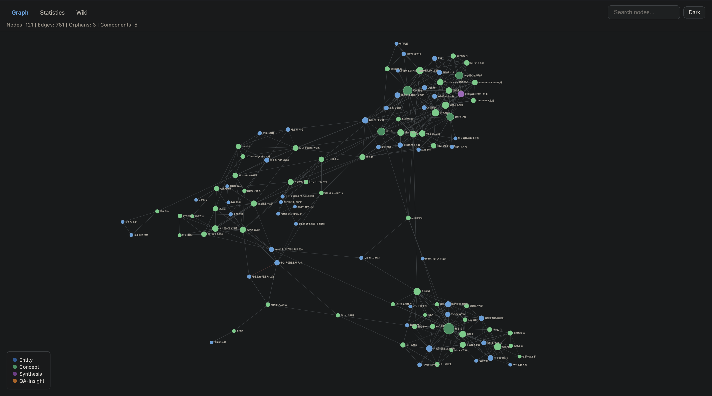
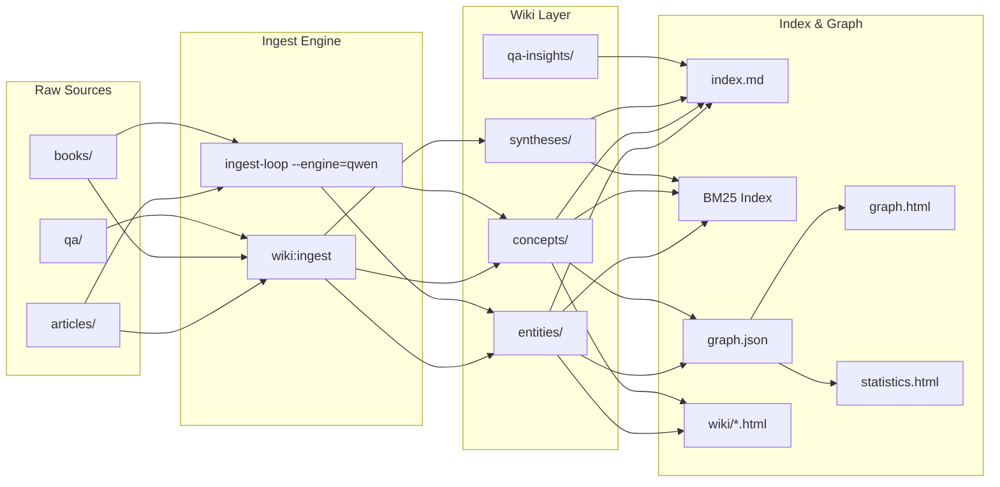
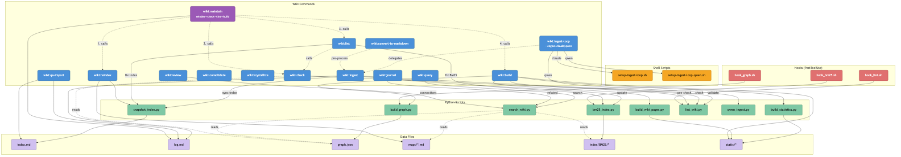

<h1 align="center">LLM Wiki Plugin</h1>

<p align="center"><strong>AI-powered personal knowledge operating system for Obsidian</strong></p>

<p align="center">
  
  
  
  
</p>

<p align="center"></p>

---

## Architecture



## Features

| Feature | Description |
|---------|-------------|
| **BM25 Search** | 中文分词 + BM25 全文检索，离线索引，毫秒级查询 |
| **Qwen Batch Ingest** | 基于通义千问 API 的批量 ingest，无需 Claude 上下文 |
| **Ralph-Loop** | 自动化循环 ingest，逐文件处理整个目录 |
| **D3.js Knowledge Graph** | 交互式力导向图，支持 GitHub Pages 部署 |
| **Statistics Dashboard** | Chart.js 统计看板：类型分布、置信度、标签频率、增长时间线 |
| **Static Wiki Viewer** | Wiki 页面 HTML 化，支持搜索、导航、元数据卡片 |
| **Hook System** | ingest 后自动触发 BM25 重建、图谱更新、lint 检查 |
| **Unified Search** | BM25 + maps topic expansion + graph traversal with RRF fusion |
| **Format Conversion** | markitdown 批量转换 PDF/DOCX/PPTX/XLSX → markdown |
| **Index Integrity** | snapshot_index.py 验证 index.md 完整性，防止条目丢失 |
| **4-Layer Memory** | Working → Episodic → Semantic → Procedural 知识生命周期 |
| **QA Integration** | QA 对话数据批量导入，自动提取洞见并双向链接 |
| **CI/CD** | GitHub Actions 自动部署 graph + statistics + wiki 到 GitHub Pages |

## Quick Start

### Prerequisites

- Python 3.10+
- [Obsidian](https://obsidian.md/) desktop app
- [Claude Code](https://docs.anthropic.com/en/docs/claude-code) CLI (`npm install -g @anthropic-ai/claude-code`)
- (Optional) `DASHSCOPE_API_KEY` for Qwen batch ingest

### Setup

```bash
# 1. Clone the repo
git clone https://github.com/1998x-stack/llm-wiki-plugin.git
cd llm-wiki-plugin

# 2. Install Python dependencies
pip install -r requirements.txt

# 3. Open vault/ as an Obsidian vault
#    Obsidian → Open folder as vault → select vault/

# 4. Start Claude Code in the vault directory
cd vault
claude

# 5. Ingest your first source file
/wiki:ingest raw/articles/your-file.md

# 6. (Optional) Start auto-ingest loop
bash scripts/setup-ingest-loop.sh raw/articles/

# 7. (Optional) Build knowledge graph
python3 scripts/build_graph.py
```

## Commands

All commands are invoked via Claude Code's `wiki:` prefix (e.g. `/wiki:ingest`).

<p align="center"></p>

| Command | Usage | Description |
|---------|-------|-------------|
| `ingest` | `/wiki:ingest <path>` | 源材料 → wiki 页面，更新 index/log |
| `query` | `/wiki:query <question>` | BM25 + maps + graph 统一搜索并综合回答 |
| `check` | `/wiki:check` | 只读健康诊断（不修改文件） |
| `lint` | `/wiki:lint` | 健康检查 + 自动修复（调用 check 后修复） |
| `consolidate` | `/wiki:consolidate` | 记忆晋升 + 置信度衰减 |
| `crystallize` | `/wiki:crystallize` | 会话探索 → 结构化摘要 |
| `journal` | `/wiki:journal <type>` | 写日记（daily/reflection/judgment） |
| `review` | `/wiki:review <scope>` | 分形回顾（weekly/monthly/quarterly） |
| `qa-import` | `/wiki:qa-import <path>` | QA 数据批量导入 |
| `ingest-loop` | `/wiki:ingest-loop <dir> [--engine=qwen]` | Ralph-loop 批量 ingest（默认 Claude，--engine=qwen 用 Qwen API） |
| `build` | `/wiki:build` | 构建所有静态产出: graph + statistics + wiki HTML |
| `reindex` | `/wiki:reindex` | 验证 index 完整性 + 生成主题 maps |
| `maintain` | `/wiki:maintain` | 一键维护: reindex → check → lint → build |
| `convert-to-markdown` | `/wiki:convert-to-markdown [dir]` | markitdown 批量转换 PDF/DOCX → markdown |

## Vault Structure

```
vault/
├── .claude/commands/wiki/   # 14 Claude Code commands
├── .obsidian/               # Obsidian settings
├── _schema/                 # 系统规则 (CLAUDE.md + 类型定义)
│   ├── CLAUDE.md            # Master schema
│   ├── entity-types.md      # 实体类型定义
│   ├── relationship-types.md # 关系类型定义
│   └── quality-rules.md     # 质量规则
├── _memory/                 # 4-layer memory system
│   ├── working/             # 当前会话观察
│   ├── episodic/            # 会话摘要
│   ├── semantic/            # 跨会话事实
│   └── procedural/          # 工作流与模式
├── raw/                     # 不可变源材料 (LLM read-only)
│   ├── articles/            # 文章、论文、分析
│   ├── books/               # 书籍章节
│   └── qa/                  # QA 对话数据
├── wiki/                    # LLM 生成的知识页面
│   ├── entities/            # 人物、工具、项目
│   ├── concepts/            # 概念、理论、方法
│   ├── syntheses/           # 跨领域综合分析
│   └── qa-insights/         # QA 提取的洞见
├── journal/                 # 个人日记系统
│   ├── daily/               # 每日笔记
│   ├── reflections/         # 反思
│   ├── judgments/            # 判断记录
│   └── growth/              # 成长追踪
├── qa/                      # QA 数据存放
├── index/BM25/              # BM25 搜索索引
├── templates/               # 5 套模板
├── maps/                    # 主题分类索引
├── scripts/                 # Python & Shell 自动化脚本
├── index.md                 # 内容目录
├── log.md                   # 操作日志
├── log.hook.md              # Hook 执行日志
├── graph.json               # 知识图谱数据
└── dashboard.md             # 仪表盘
```

## Static Site

Three interconnected pages deployed to GitHub Pages:

| Page | Description |
|------|-------------|
| [**graph.html**](https://1998x-stack.github.io/llm-wiki-plugin/graph.html) | Interactive D3.js force-directed knowledge graph |
| [**statistics.html**](https://1998x-stack.github.io/llm-wiki-plugin/statistics.html) | Chart.js dashboard (type distribution, confidence, tags, growth) |
| [**wiki/index.html**](https://1998x-stack.github.io/llm-wiki-plugin/wiki/index.html) | Searchable wiki page viewer with metadata cards |

Build locally:

```bash
cd vault
python3 scripts/build_graph.py --output ../static/graph.json --full
# Serves graph.json, graph-statistics.json, and wiki/*.html
python3 -m http.server 8080 --directory ../static
```

## Documentation

| Document | Description |
|----------|-------------|
| [USERGUIDE.md](USERGUIDE.md) | 完整用户指南（中文） |
| [docs/wiki.md](docs/wiki.md) | Wiki 系统技术文档 |
| [docs/CHANGELOG.md](docs/CHANGELOG.md) | 版本变更记录 |
| [llm-wiki-v1.md](docs/references/llm-wiki-v1.md) | LLM Wiki v1 设计文档 (Karpathy) |
| [llm-wiki-v2.md](docs/references/llm-wiki-v2.md) | LLM Wiki v2 设计文档 (agentmemory) |

## Contributing

1. Fork the repository
2. Create your feature branch (`git checkout -b feature/your-feature`)
3. Commit your changes (`git commit -m 'Add your feature'`)
4. Push to the branch (`git push origin feature/your-feature`)
5. Open a Pull Request

For bug reports and feature requests, please use [GitHub Issues](https://github.com/1998x-stack/llm-wiki-plugin/issues).

## License

This project is licensed under the MIT License. See [LICENSE](LICENSE) for details.
