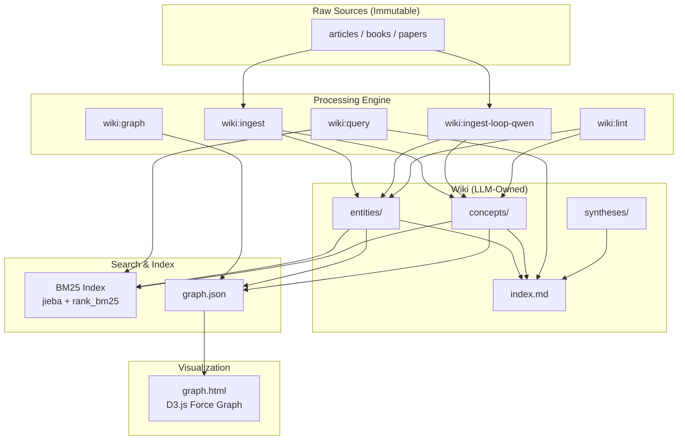

# Wiki System V2 Implementation Plan

> **For agentic workers:** REQUIRED SUB-SKILL: Use superpowers:subagent-driven-development (recommended) or superpowers:executing-plans to implement this plan task-by-task. Steps use checkbox (`- [ ]`) syntax for tracking.

**Goal:** Upgrade the LLM Wiki plugin with BM25 search, Qwen API ingestion, ralph-loop batch processing, D3.js knowledge graph visualization, automated hooks, and professional documentation.

**Architecture:** Python scripts in `vault/scripts/` provide CLI tools (BM25 index, Qwen ingest, graph builder, linter). Claude Code commands in `.claude/commands/wiki/` orchestrate these scripts. PostToolUse hooks auto-trigger index/lint/graph updates on every wiki write. GitHub Actions deploys a D3.js visualization to GitHub Pages.

**Tech Stack:** Python 3.10+ (jieba, rank_bm25, pyyaml, openai), D3.js v7, GitHub Actions, Claude Code hooks

---

## File Structure

### New Files

| File | Responsibility |
|------|---------------|
| `vault/scripts/bm25_index.py` | BM25 index build/update/query/remove CLI |
| `vault/scripts/qwen_ingest.py` | Qwen API-powered wiki page extraction |
| `vault/scripts/build_graph.py` | Scan wiki/ and emit graph.json |
| `vault/scripts/lint_wiki.py` | Standalone lint checks with JSON output |
| `vault/scripts/setup-ingest-loop.sh` | Setup ralph-loop state for ingest-loop |
| `vault/scripts/setup-ingest-loop-qwen.sh` | Setup ralph-loop state for ingest-loop-qwen |
| `vault/scripts/hook_lint.sh` | PostToolUse hook: lint single file |
| `vault/scripts/hook_bm25.sh` | PostToolUse hook: BM25 update single file |
| `vault/scripts/hook_graph.sh` | PostToolUse hook: rebuild graph.json |
| `vault/.claude/commands/wiki/ingest-loop.md` | Ralph-loop batch ingest command |
| `vault/.claude/commands/wiki/ingest-loop-qwen.md` | Ralph-loop + Qwen batch ingest command |
| `vault/.claude/commands/wiki/graph.md` | Knowledge graph build command |
| `vault/log.hook.md` | Hook execution log (append-only) |
| `vault/index/BM25/.gitkeep` | BM25 index directory placeholder |
| `vault/qa/.gitkeep` | QA output directory placeholder |
| `requirements.txt` | Python dependencies |
| `docs/wiki.md` | Wiki command reference documentation |
| `USERGUIDE.md` | Detailed user guide |
| `static/graph.html` | D3.js knowledge graph visualization |
| `.github/workflows/deploy.yml` | GitHub Actions CI/CD |

### Modified Files

| File | Changes |
|------|---------|
| `vault/.claude/commands/wiki/ingest.md` | Add BM25 update step, lint verification, tighten language |
| `vault/.claude/commands/wiki/query.md` | Add BM25 search, QA file write, auto qa-import |
| `vault/.claude/commands/wiki/lint.md` | Add BM25/graph/template checks, severity levels |
| `vault/.claude/settings.local.json` | Add PostToolUse hooks |
| `vault/templates/wiki-page.md` | Stricter constraints, example content |
| `vault/templates/daily.md` | Time slots, link requirements |
| `vault/templates/reflection.md` | Depth targets, confidence field |
| `vault/templates/judgment.md` | Evidence structure, revisit_date |
| `vault/templates/weekly-review.md` | Metrics, previous week link |
| `CLAUDE.md` | Add scripts, hooks, BM25 docs |
| `vault/CLAUDE.md` | Add qa/, BM25/, graph.json, hooks docs |
| `README.md` | Professional overhaul with mermaid, badges |
| `docs/CHANGELOG.md` | Append v2 changes |

---

## Task 1: Create requirements.txt

**Files:**
- Create: `requirements.txt`

- [ ] **Step 1: Create requirements.txt**

```
jieba>=0.42
rank_bm25>=0.2.2
pyyaml>=6.0
openai>=1.0.0
```

- [ ] **Step 2: Install dependencies**

Run: `pip install -r requirements.txt`
Expected: All packages install successfully

- [ ] **Step 3: Create index and qa directories**

Run: `mkdir -p vault/index/BM25 vault/qa`
Then create gitkeep files:
```
touch vault/index/BM25/.gitkeep vault/qa/.gitkeep
```

- [ ] **Step 4: Commit**

```bash
git add requirements.txt vault/index/BM25/.gitkeep vault/qa/.gitkeep
git commit -m "chore: add Python dependencies and index/qa directories"
```

---

## Task 2: Build `bm25_index.py`

**Files:**
- Create: `vault/scripts/bm25_index.py`

- [ ] **Step 1: Write bm25_index.py**

```python
#!/usr/bin/env python3
"""BM25 index manager for wiki/ pages.

Usage:
    python3 scripts/bm25_index.py build                 # Full rebuild
    python3 scripts/bm25_index.py update <file.md>       # Incremental update
    python3 scripts/bm25_index.py query "搜索词" -n 10   # Search
    python3 scripts/bm25_index.py remove <file.md>       # Remove from index
"""

import argparse
import json
import os
import pickle
import re
import sys
from pathlib import Path

import jieba
from rank_bm25 import BM25Okapi

# Resolve vault root: script is in vault/scripts/
SCRIPT_DIR = Path(__file__).resolve().parent
VAULT_DIR = SCRIPT_DIR.parent
WIKI_DIR = VAULT_DIR / "wiki"
INDEX_DIR = VAULT_DIR / "index" / "BM25"

CORPUS_PATH = INDEX_DIR / "corpus.pkl"
INDEX_PATH = INDEX_DIR / "index.pkl"
DOCMAP_PATH = INDEX_DIR / "docmap.json"

# Chinese + English stop words
STOP_WORDS = set([
    "的", "了", "在", "是", "我", "有", "和", "就", "不", "人", "都", "一",
    "一个", "上", "也", "很", "到", "说", "要", "去", "你", "会", "着",
    "没有", "看", "好", "自己", "这", "他", "她", "它", "们", "那", "些",
    "什么", "可以", "这个", "那个", "如果", "因为", "所以", "但是", "而且",
    "或者", "以及", "还是", "已经", "可能", "应该", "需要", "通过", "进行",
    "the", "a", "an", "is", "are", "was", "were", "be", "been", "being",
    "have", "has", "had", "do", "does", "did", "will", "would", "could",
    "should", "may", "might", "shall", "can", "need", "dare", "ought",
    "and", "or", "but", "if", "for", "of", "in", "on", "at", "to", "from",
    "by", "with", "as", "it", "its", "this", "that", "these", "those",
    "not", "no", "nor", "so", "than", "too", "very",
])


def strip_frontmatter(text: str) -> str:
    """Remove YAML frontmatter from markdown text."""
    if text.startswith("---"):
        end = text.find("---", 3)
        if end != -1:
            return text[end + 3:].strip()
    return text


def tokenize(text: str) -> list[str]:
    """Tokenize text using jieba for Chinese, lowercased English preserved."""
    text = strip_frontmatter(text)
    # Remove markdown syntax
    text = re.sub(r"\[\[([^\]]+)\]\]", r"\1", text)  # [[links]] -> text
    text = re.sub(r"[#*`>|_\-=]", " ", text)
    tokens = list(jieba.cut_for_search(text))
    return [t.strip().lower() for t in tokens if t.strip() and t.strip().lower() not in STOP_WORDS and len(t.strip()) > 1]


def extract_title(text: str) -> str:
    """Extract title from frontmatter or first heading."""
    for line in text.split("\n"):
        if line.startswith("title:"):
            return line.split(":", 1)[1].strip().strip('"').strip("'")
        if line.startswith("# "):
            return line[2:].strip()
    return ""


def extract_type(text: str) -> str:
    """Extract type from frontmatter."""
    for line in text.split("\n"):
        if line.startswith("type:"):
            return line.split(":", 1)[1].strip()
        if line.strip() == "---" and not text.startswith("---"):
            break
    return "unknown"


def load_state() -> tuple[list[dict], dict]:
    """Load corpus and docmap from disk."""
    corpus = []
    docmap = {}
    if CORPUS_PATH.exists():
        with open(CORPUS_PATH, "rb") as f:
            corpus = pickle.load(f)
    if DOCMAP_PATH.exists():
        with open(DOCMAP_PATH, "r", encoding="utf-8") as f:
            docmap = json.load(f)
    return corpus, docmap


def save_state(corpus: list[dict], docmap: dict, tokenized_corpus: list[list[str]]):
    """Save corpus, docmap, and rebuilt BM25 index to disk."""
    INDEX_DIR.mkdir(parents=True, exist_ok=True)
    with open(CORPUS_PATH, "wb") as f:
        pickle.dump(corpus, f)
    with open(DOCMAP_PATH, "w", encoding="utf-8") as f:
        json.dump(docmap, f, ensure_ascii=False, indent=2)
    if tokenized_corpus:
        bm25 = BM25Okapi(tokenized_corpus)
        with open(INDEX_PATH, "wb") as f:
            pickle.dump(bm25, f)
    elif INDEX_PATH.exists():
        INDEX_PATH.unlink()


def cmd_build():
    """Full rebuild of BM25 index from all wiki/ pages."""
    corpus = []
    docmap = {}
    tokenized = []

    if not WIKI_DIR.exists():
        print(json.dumps({"error": "wiki/ directory not found"}))
        sys.exit(2)

    md_files = sorted(WIKI_DIR.rglob("*.md"))
    for i, fp in enumerate(md_files):
        text = fp.read_text(encoding="utf-8")
        tokens = tokenize(text)
        rel_path = str(fp.relative_to(VAULT_DIR))
        doc_id = str(i)
        corpus.append({"id": doc_id, "tokens": tokens, "path": rel_path})
        docmap[doc_id] = {
            "path": rel_path,
            "title": extract_title(text),
            "type": extract_type(text),
            "updated": fp.stat().st_mtime,
        }
        tokenized.append(tokens)

    save_state(corpus, docmap, tokenized)
    print(json.dumps({"status": "ok", "indexed": len(corpus)}))


def cmd_update(file_path: str):
    """Incremental update: add or replace a single file in the index."""
    fp = Path(file_path)
    if not fp.is_absolute():
        fp = VAULT_DIR / fp
    if not fp.exists():
        print(json.dumps({"error": f"file not found: {file_path}"}))
        sys.exit(2)

    rel_path = str(fp.relative_to(VAULT_DIR))
    text = fp.read_text(encoding="utf-8")
    tokens = tokenize(text)

    corpus, docmap = load_state()

    # Remove old entry if exists
    old_id = None
    for did, info in docmap.items():
        if info["path"] == rel_path:
            old_id = did
            break
    if old_id is not None:
        corpus = [c for c in corpus if c["id"] != old_id]
        del docmap[old_id]

    # Add new entry
    new_id = str(max((int(k) for k in docmap), default=-1) + 1)
    corpus.append({"id": new_id, "tokens": tokens, "path": rel_path})
    docmap[new_id] = {
        "path": rel_path,
        "title": extract_title(text),
        "type": extract_type(text),
        "updated": fp.stat().st_mtime,
    }

    tokenized = [c["tokens"] for c in corpus]
    save_state(corpus, docmap, tokenized)
    print(json.dumps({"status": "ok", "path": rel_path}))


def cmd_remove(file_path: str):
    """Remove a file from the index."""
    fp = Path(file_path)
    if not fp.is_absolute():
        fp = VAULT_DIR / fp
    rel_path = str(fp.relative_to(VAULT_DIR))

    corpus, docmap = load_state()
    old_id = None
    for did, info in docmap.items():
        if info["path"] == rel_path:
            old_id = did
            break
    if old_id is None:
        print(json.dumps({"error": f"not in index: {rel_path}"}))
        sys.exit(1)

    corpus = [c for c in corpus if c["id"] != old_id]
    del docmap[old_id]
    tokenized = [c["tokens"] for c in corpus]
    save_state(corpus, docmap, tokenized)
    print(json.dumps({"status": "ok", "removed": rel_path}))


def cmd_query(query_str: str, top_n: int = 10):
    """Search the index and return top-N results as JSON."""
    if not INDEX_PATH.exists():
        print(json.dumps({"error": "index not built. Run: python3 scripts/bm25_index.py build"}))
        sys.exit(1)

    with open(INDEX_PATH, "rb") as f:
        bm25 = pickle.load(f)
    corpus, docmap = load_state()

    query_tokens = tokenize(query_str)
    if not query_tokens:
        print(json.dumps([]))
        return

    scores = bm25.get_scores(query_tokens)
    top_indices = sorted(range(len(scores)), key=lambda i: scores[i], reverse=True)[:top_n]

    results = []
    for idx in top_indices:
        if scores[idx] <= 0:
            continue
        doc = corpus[idx]
        info = docmap.get(doc["id"], {})
        results.append({
            "path": info.get("path", doc["path"]),
            "score": round(float(scores[idx]), 4),
            "title": info.get("title", ""),
            "type": info.get("type", "unknown"),
        })

    print(json.dumps(results, ensure_ascii=False))


def main():
    parser = argparse.ArgumentParser(description="BM25 index manager for wiki/")
    sub = parser.add_subparsers(dest="command")

    sub.add_parser("build", help="Full rebuild of BM25 index")

    p_update = sub.add_parser("update", help="Incremental update for one file")
    p_update.add_argument("file", help="Path to wiki file")

    p_remove = sub.add_parser("remove", help="Remove a file from index")
    p_remove.add_argument("file", help="Path to wiki file")

    p_query = sub.add_parser("query", help="Search the index")
    p_query.add_argument("query", help="Search query string")
    p_query.add_argument("-n", type=int, default=10, help="Number of results")

    args = parser.parse_args()

    if args.command == "build":
        cmd_build()
    elif args.command == "update":
        cmd_update(args.file)
    elif args.command == "remove":
        cmd_remove(args.file)
    elif args.command == "query":
        cmd_query(args.query, args.n)
    else:
        parser.print_help()
        sys.exit(1)


if __name__ == "__main__":
    main()
```

- [ ] **Step 2: Verify script runs**

Run: `cd /Users/xd/Desktop/codes/mygithubs/llm-wiki-plugin/vault && python3 scripts/bm25_index.py build`
Expected: `{"status": "ok", "indexed": 96}` (approximate count)

- [ ] **Step 3: Verify query works**

Run: `cd /Users/xd/Desktop/codes/mygithubs/llm-wiki-plugin/vault && python3 scripts/bm25_index.py query "牛顿法" -n 5`
Expected: JSON array with top-5 results including 牛顿法.md

- [ ] **Step 4: Verify incremental update works**

Run: `cd /Users/xd/Desktop/codes/mygithubs/llm-wiki-plugin/vault && python3 scripts/bm25_index.py update wiki/concepts/牛顿法.md`
Expected: `{"status": "ok", "path": "wiki/concepts/牛顿法.md"}`

- [ ] **Step 5: Commit**

```bash
git add vault/scripts/bm25_index.py
git commit -m "feat: add BM25 index manager with jieba tokenization"
```

---

## Task 3: Build `lint_wiki.py`

**Files:**
- Create: `vault/scripts/lint_wiki.py`

- [ ] **Step 1: Write lint_wiki.py**

```python
#!/usr/bin/env python3
"""Standalone lint script for wiki/ pages.

Usage:
    python3 scripts/lint_wiki.py                    # Full scan, report only
    python3 scripts/lint_wiki.py --fix              # Full scan + auto-fix
    python3 scripts/lint_wiki.py --file <path>      # Single file check
    python3 scripts/lint_wiki.py --json             # Output JSON report
"""

import argparse
import json
import re
import sys
from pathlib import Path

import yaml

SCRIPT_DIR = Path(__file__).resolve().parent
VAULT_DIR = SCRIPT_DIR.parent
WIKI_DIR = VAULT_DIR / "wiki"
INDEX_PATH = VAULT_DIR / "index.md"
BM25_DOCMAP = VAULT_DIR / "index" / "BM25" / "docmap.json"

REQUIRED_FIELDS = ["type", "status", "confidence", "created", "tags", "relates_to"]


def parse_frontmatter(text: str) -> tuple[dict | None, str]:
    """Parse YAML frontmatter from markdown. Returns (frontmatter_dict, body)."""
    if not text.startswith("---"):
        return None, text
    end = text.find("---", 3)
    if end == -1:
        return None, text
    try:
        fm = yaml.safe_load(text[3:end])
        if not isinstance(fm, dict):
            return None, text
        return fm, text[end + 3:].strip()
    except yaml.YAMLError:
        return None, text


def extract_wikilinks(text: str) -> list[str]:
    """Extract all [[wikilink]] targets from text."""
    return re.findall(r"\[\[([^\]]+)\]\]", text)


def find_all_wiki_pages() -> dict[str, Path]:
    """Map page titles to file paths."""
    pages = {}
    for fp in WIKI_DIR.rglob("*.md"):
        title = fp.stem
        pages[title] = fp
    return pages


def check_file(fp: Path, all_pages: dict[str, Path], fix: bool = False) -> list[dict]:
    """Run all checks on a single file. Returns list of check results."""
    issues = []
    text = fp.read_text(encoding="utf-8")
    fm, body = parse_frontmatter(text)
    rel_path = str(fp.relative_to(VAULT_DIR))

    # F2: Invalid YAML frontmatter
    if fm is None:
        issues.append({
            "file": rel_path, "check": "F2", "severity": "ERROR",
            "message": "invalid or missing YAML frontmatter", "fixed": False,
        })
        return issues

    # F1: Missing required fields
    for field in REQUIRED_FIELDS:
        if field not in fm or fm[field] is None:
            fixed = False
            if fix:
                defaults = {
                    "type": "concept", "status": "active", "confidence": 0.5,
                    "created": "2026-04-15", "tags": [], "relates_to": [],
                }
                if field in defaults:
                    fm[field] = defaults[field]
                    fixed = True
            issues.append({
                "file": rel_path, "check": "F1", "severity": "ERROR",
                "message": f"missing '{field}' field", "fixed": fixed,
            })

    # F3: Overview > 200 chars
    overview_match = re.search(r"## 概述\s*\n(.*?)(?=\n## |\Z)", body, re.DOTALL)
    if overview_match:
        overview_text = overview_match.group(1).strip()
        if len(overview_text) > 200:
            issues.append({
                "file": rel_path, "check": "F3", "severity": "WARNING",
                "message": f"overview is {len(overview_text)} chars (max 200)", "fixed": False,
            })

    # F4: Empty sections
    sections = re.findall(r"## (.+)", body)
    for section in sections:
        pattern = rf"## {re.escape(section)}\s*\n(.*?)(?=\n## |\Z)"
        match = re.search(pattern, body, re.DOTALL)
        if match and not match.group(1).strip():
            issues.append({
                "file": rel_path, "check": "F4", "severity": "WARNING",
                "message": f"empty section: {section}", "fixed": False,
            })

    # B1: Broken links
    links = extract_wikilinks(text)
    for link in links:
        if link and link not in all_pages:
            # Try fuzzy match
            fixed = False
            if fix:
                for page_name in all_pages:
                    if link in page_name or page_name in link:
                        text = text.replace(f"[[{link}]]", f"[[{page_name}]]")
                        fixed = True
                        break
            issues.append({
                "file": rel_path, "check": "B1", "severity": "ERROR",
                "message": f"broken link: [[{link}]]", "fixed": fixed,
            })

    # Write fixes back
    if fix and any(i["fixed"] for i in issues):
        # Rebuild frontmatter
        fm_str = yaml.dump(fm, allow_unicode=True, default_flow_style=False, sort_keys=False)
        new_text = f"---\n{fm_str}---\n\n{body}\n"
        fp.write_text(new_text, encoding="utf-8")

    return issues


def check_index_consistency(all_pages: dict[str, Path], fix: bool = False) -> list[dict]:
    """Check index.md consistency with actual wiki pages."""
    issues = []
    if not INDEX_PATH.exists():
        return issues

    index_text = INDEX_PATH.read_text(encoding="utf-8")
    index_links = set(extract_wikilinks(index_text))

    # I1: Pages not in index
    for name in all_pages:
        if name not in index_links:
            issues.append({
                "file": "index.md", "check": "I1", "severity": "ERROR",
                "message": f"page not in index: {name}", "fixed": False,
            })

    # I2: Stale index entries
    for link in index_links:
        if link not in all_pages:
            issues.append({
                "file": "index.md", "check": "I2", "severity": "WARNING",
                "message": f"stale index entry: {link}", "fixed": False,
            })

    return issues


def check_orphans(all_pages: dict[str, Path]) -> list[dict]:
    """Find pages with no incoming links."""
    issues = []
    incoming: dict[str, int] = {name: 0 for name in all_pages}

    for fp in all_pages.values():
        text = fp.read_text(encoding="utf-8")
        links = extract_wikilinks(text)
        for link in links:
            if link in incoming:
                incoming[link] += 1

    for name, count in incoming.items():
        if count == 0:
            issues.append({
                "file": str(all_pages[name].relative_to(VAULT_DIR)),
                "check": "O1", "severity": "WARNING",
                "message": f"orphan page: no incoming links", "fixed": False,
            })

    return issues


def check_bm25_consistency(all_pages: dict[str, Path]) -> list[dict]:
    """Check BM25 index has entries for all wiki pages."""
    issues = []
    if not BM25_DOCMAP.exists():
        issues.append({
            "file": "index/BM25/docmap.json", "check": "B2", "severity": "WARNING",
            "message": "BM25 index not built", "fixed": False,
        })
        return issues

    with open(BM25_DOCMAP, "r", encoding="utf-8") as f:
        docmap = json.load(f)

    indexed_paths = {info["path"] for info in docmap.values()}
    for name, fp in all_pages.items():
        rel = str(fp.relative_to(VAULT_DIR))
        if rel not in indexed_paths:
            issues.append({
                "file": rel, "check": "B2", "severity": "WARNING",
                "message": "missing from BM25 index", "fixed": False,
            })

    return issues


def main():
    parser = argparse.ArgumentParser(description="Wiki lint checker")
    parser.add_argument("--fix", action="store_true", help="Auto-fix fixable issues")
    parser.add_argument("--file", type=str, help="Check single file only")
    parser.add_argument("--json", action="store_true", dest="json_output", help="JSON output")
    args = parser.parse_args()

    all_pages = find_all_wiki_pages()
    all_issues = []

    if args.file:
        fp = Path(args.file)
        if not fp.is_absolute():
            fp = VAULT_DIR / fp
        if not fp.exists():
            print(json.dumps({"error": f"file not found: {args.file}"}))
            sys.exit(2)
        all_issues.extend(check_file(fp, all_pages, fix=args.fix))
    else:
        for fp in sorted(all_pages.values()):
            all_issues.extend(check_file(fp, all_pages, fix=args.fix))
        all_issues.extend(check_index_consistency(all_pages, fix=args.fix))
        all_issues.extend(check_orphans(all_pages))
        all_issues.extend(check_bm25_consistency(all_pages))

    errors = sum(1 for i in all_issues if i["severity"] == "ERROR")
    warnings = sum(1 for i in all_issues if i["severity"] == "WARNING")

    report = {
        "total_files": len(all_pages) if not args.file else 1,
        "errors": errors,
        "warnings": warnings,
        "checks": all_issues,
    }

    if args.json_output:
        print(json.dumps(report, ensure_ascii=False, indent=2))
    else:
        print(f"Scanned: {report['total_files']} files")
        print(f"Errors: {errors}, Warnings: {warnings}")
        for issue in all_issues:
            severity = issue["severity"]
            fixed = " [FIXED]" if issue.get("fixed") else ""
            print(f"  [{severity}] {issue['file']}: {issue['message']}{fixed}")

    if errors > 0:
        sys.exit(2)
    elif warnings > 0:
        sys.exit(1)
    else:
        sys.exit(0)


if __name__ == "__main__":
    main()
```

- [ ] **Step 2: Verify full scan**

Run: `cd /Users/xd/Desktop/codes/mygithubs/llm-wiki-plugin/vault && python3 scripts/lint_wiki.py`
Expected: Report showing scanned files count and any issues found

- [ ] **Step 3: Verify JSON output**

Run: `cd /Users/xd/Desktop/codes/mygithubs/llm-wiki-plugin/vault && python3 scripts/lint_wiki.py --json | python3 -m json.tool | head -20`
Expected: Valid JSON with total_files, errors, warnings, checks fields

- [ ] **Step 4: Verify single-file mode**

Run: `cd /Users/xd/Desktop/codes/mygithubs/llm-wiki-plugin/vault && python3 scripts/lint_wiki.py --file wiki/concepts/牛顿法.md`
Expected: Report for just that one file

- [ ] **Step 5: Commit**

```bash
git add vault/scripts/lint_wiki.py
git commit -m "feat: add standalone wiki lint script with JSON output"
```

---

## Task 4: Build `build_graph.py`

**Files:**
- Create: `vault/scripts/build_graph.py`

- [ ] **Step 1: Write build_graph.py**

```python
#!/usr/bin/env python3
"""Build knowledge graph JSON from wiki/ pages.

Usage:
    python3 scripts/build_graph.py [--output vault/graph.json]
"""

import argparse
import json
import re
from collections import defaultdict
from datetime import datetime
from pathlib import Path

import yaml

SCRIPT_DIR = Path(__file__).resolve().parent
VAULT_DIR = SCRIPT_DIR.parent
WIKI_DIR = VAULT_DIR / "wiki"
DEFAULT_OUTPUT = VAULT_DIR / "graph.json"


def parse_frontmatter(text: str) -> tuple[dict | None, str]:
    """Parse YAML frontmatter."""
    if not text.startswith("---"):
        return None, text
    end = text.find("---", 3)
    if end == -1:
        return None, text
    try:
        fm = yaml.safe_load(text[3:end])
        return (fm, text[end + 3:]) if isinstance(fm, dict) else (None, text)
    except yaml.YAMLError:
        return None, text


def extract_wikilinks(text: str) -> list[str]:
    """Extract [[wikilink]] targets."""
    return re.findall(r"\[\[([^\]]+)\]\]", text)


def find_connected_components(adj: dict[str, set[str]], all_nodes: set[str]) -> list[list[str]]:
    """BFS-based connected component detection."""
    visited = set()
    components = []
    for node in all_nodes:
        if node in visited:
            continue
        component = []
        queue = [node]
        while queue:
            current = queue.pop(0)
            if current in visited:
                continue
            visited.add(current)
            component.append(current)
            for neighbor in adj.get(current, set()):
                if neighbor not in visited:
                    queue.append(neighbor)
        components.append(sorted(component))
    return sorted(components, key=len, reverse=True)


def build_graph(output_path: Path):
    """Scan wiki/ and build graph.json."""
    nodes = []
    edges = []
    node_ids = set()
    page_map: dict[str, dict] = {}  # stem -> {path, fm, body}
    adj: dict[str, set[str]] = defaultdict(set)

    # Phase 1: collect all pages
    for fp in sorted(WIKI_DIR.rglob("*.md")):
        text = fp.read_text(encoding="utf-8")
        fm, body = parse_frontmatter(text)
        rel_path = str(fp.relative_to(VAULT_DIR))
        stem = fp.stem
        page_map[stem] = {"path": rel_path, "fm": fm or {}, "body": body}
        node_ids.add(stem)

    # Phase 2: build nodes and edges
    edge_set = set()
    for stem, info in page_map.items():
        fm = info["fm"]
        nodes.append({
            "id": info["path"],
            "label": fm.get("title", stem),
            "type": fm.get("type", "unknown"),
            "confidence": fm.get("confidence", 0.5),
            "tags": fm.get("tags", []) or [],
            "edge_count": 0,  # filled below
        })

        # Edges from relates_to
        relates = fm.get("relates_to", []) or []
        if isinstance(relates, list):
            for rel in relates:
                if isinstance(rel, dict):
                    target_raw = rel.get("target", "")
                    rel_type = rel.get("type", "relates_to")
                    # Extract name from [[link]] syntax
                    match = re.match(r"\[\[(.+?)\]\]", target_raw)
                    target_name = match.group(1) if match else target_raw
                    if target_name in page_map:
                        edge_key = tuple(sorted([stem, target_name])) + (rel_type,)
                        if edge_key not in edge_set:
                            edge_set.add(edge_key)
                            edges.append({
                                "source": info["path"],
                                "target": page_map[target_name]["path"],
                                "relation": rel_type,
                                "bidirectional": rel_type in ("contradicts", "compares_to"),
                            })
                            adj[stem].add(target_name)
                            adj[target_name].add(stem)

        # Edges from body [[wikilinks]]
        body_links = extract_wikilinks(info["body"])
        for link in body_links:
            if link in page_map and link != stem:
                edge_key = tuple(sorted([stem, link])) + ("wikilink",)
                if edge_key not in edge_set:
                    edge_set.add(edge_key)
                    edges.append({
                        "source": info["path"],
                        "target": page_map[link]["path"],
                        "relation": "wikilink",
                        "bidirectional": False,
                    })
                    adj[stem].add(link)
                    adj[link].add(stem)

    # Phase 3: compute metrics
    edge_counts = defaultdict(int)
    for e in edges:
        # Count by path
        for node in nodes:
            if node["id"] == e["source"] or node["id"] == e["target"]:
                edge_counts[node["id"]] += 1

    for node in nodes:
        node["edge_count"] = edge_counts.get(node["id"], 0)

    orphans = [n["id"] for n in nodes if n["edge_count"] == 0]
    components = find_connected_components(adj, node_ids)

    graph = {
        "metadata": {
            "generated": datetime.now().isoformat(timespec="seconds"),
            "total_nodes": len(nodes),
            "total_edges": len(edges),
            "orphan_count": len(orphans),
            "component_count": len(components),
        },
        "nodes": nodes,
        "edges": edges,
        "orphans": orphans,
        "components": [
            {"id": i, "size": len(c), "nodes": c}
            for i, c in enumerate(components)
        ],
    }

    output_path.parent.mkdir(parents=True, exist_ok=True)
    with open(output_path, "w", encoding="utf-8") as f:
        json.dump(graph, f, ensure_ascii=False, indent=2)

    print(json.dumps({
        "status": "ok",
        "nodes": len(nodes),
        "edges": len(edges),
        "orphans": len(orphans),
        "components": len(components),
    }))


def main():
    parser = argparse.ArgumentParser(description="Build knowledge graph JSON")
    parser.add_argument("--output", type=str, default=str(DEFAULT_OUTPUT),
                        help="Output path for graph.json")
    args = parser.parse_args()
    build_graph(Path(args.output))


if __name__ == "__main__":
    main()
```

- [ ] **Step 2: Verify graph builds**

Run: `cd /Users/xd/Desktop/codes/mygithubs/llm-wiki-plugin/vault && python3 scripts/build_graph.py`
Expected: JSON output with status ok, node/edge/orphan/component counts

- [ ] **Step 3: Verify graph.json content**

Run: `cd /Users/xd/Desktop/codes/mygithubs/llm-wiki-plugin/vault && python3 -c "import json; g=json.load(open('graph.json')); print(f'nodes={len(g[\"nodes\"])}, edges={len(g[\"edges\"])}, orphans={len(g[\"orphans\"])}')"`
Expected: nodes=~96, edges>0, orphans count displayed

- [ ] **Step 4: Commit**

```bash
git add vault/scripts/build_graph.py
git commit -m "feat: add knowledge graph JSON builder"
```

---

## Task 5: Build `qwen_ingest.py`

**Files:**
- Create: `vault/scripts/qwen_ingest.py`

- [ ] **Step 1: Write qwen_ingest.py**

```python
#!/usr/bin/env python3
"""Qwen-powered wiki page extraction from raw source files.

Usage:
    python3 scripts/qwen_ingest.py --raw <raw_file> --wiki <wiki_file>

Environment:
    DASHSCOPE_API_KEY — required

Returns JSON to stdout:
    {"status": "SUCCESS", "path": "wiki/concepts/example.md"}
    {"status": "ERROR", "message": "..."}
    {"status": "LINT_WARNING", "path": "...", "issues": [...]}
"""

import argparse
import json
import os
import re
import sys
from datetime import date
from pathlib import Path

import yaml

SCRIPT_DIR = Path(__file__).resolve().parent
VAULT_DIR = SCRIPT_DIR.parent

SYSTEM_PROMPT = """你是一个知识提取专家。给定一篇源材料，你需要提取其中的核心知识并输出为标准 wiki 页面格式。

## 输出格式

输出必须是一个完整的 Markdown 文件，以 YAML frontmatter 开头：

```
---
type: entity 或 concept
title: "页面标题（中文为主，专有名词保留英文）"
aliases: ["别名1", "英文名"]
tags: [标签1, 标签2]
confidence: 0.8
source_count: 1
created: {today}
last_confirmed: {today}
status: active
relates_to:
  - target: "[[相关页面名]]"
    type: extends
---

# 页面标题

## 概述

50-200 字符的一句话概括。不要超过 200 字符。

## 关键内容

至少 300 字符。分条目阐述核心知识点。使用 [[双链]] 引用相关概念。

1. **要点一**：详细说明...
2. **要点二**：详细说明...
3. **要点三**：详细说明...

## 来源

- 源文件名

## 相关

- [[相关页面1]] — 关系说明
- [[相关页面2]] — 关系说明
- [[相关页面3]] — 关系说明
```

## 规则

1. type 只能是 `entity`（人物/公司/项目/工具/论文/书籍）或 `concept`（理论/方法/算法/定义）
2. 中文为主，专有名词保留英文原文
3. 概述不超过 200 字符
4. 关键内容至少 300 字符
5. 至少 3 个 [[双链]] 引用
6. relates_to 的 type 必须是以下之一：uses, depends_on, contradicts, caused, extends, implements, supersedes, part_of, compares_to
7. confidence 范围 0-1，基于源材料信息量评估
8. 直接输出 Markdown，不要包裹在代码块中
""".replace("{today}", date.today().isoformat())

REQUIRED_FM_FIELDS = ["type", "title", "confidence", "created", "status"]


def lint_content(text: str) -> list[str]:
    """Run inline lint checks on generated content."""
    issues = []

    # Check frontmatter
    if not text.startswith("---"):
        issues.append("missing YAML frontmatter")
        return issues

    end = text.find("---", 3)
    if end == -1:
        issues.append("unclosed YAML frontmatter")
        return issues

    try:
        fm = yaml.safe_load(text[3:end])
        if not isinstance(fm, dict):
            issues.append("frontmatter is not a dict")
            return issues
    except yaml.YAMLError as e:
        issues.append(f"invalid YAML: {e}")
        return issues

    for field in REQUIRED_FM_FIELDS:
        if field not in fm or fm[field] is None:
            issues.append(f"missing '{field}' field")

    body = text[end + 3:].strip()

    # Check 概述 section
    overview_match = re.search(r"## 概述\s*\n(.*?)(?=\n## |\Z)", body, re.DOTALL)
    if not overview_match or not overview_match.group(1).strip():
        issues.append("missing or empty 概述 section")
    elif len(overview_match.group(1).strip()) > 200:
        issues.append(f"概述 is {len(overview_match.group(1).strip())} chars (max 200)")

    # Check at least one [[link]]
    links = re.findall(r"\[\[([^\]]+)\]\]", body)
    if not links:
        issues.append("no [[wikilinks]] found in body")

    # Check empty sections
    for section in ["关键内容", "来源", "相关"]:
        pattern = rf"## {section}\s*\n(.*?)(?=\n## |\Z)"
        match = re.search(pattern, body, re.DOTALL)
        if match and not match.group(1).strip():
            issues.append(f"empty section: {section}")

    return issues


def main():
    parser = argparse.ArgumentParser(description="Qwen-powered wiki ingest")
    parser.add_argument("--raw", required=True, help="Path to raw source file")
    parser.add_argument("--wiki", required=True, help="Path to output wiki file")
    args = parser.parse_args()

    api_key = os.environ.get("DASHSCOPE_API_KEY")
    if not api_key:
        print(json.dumps({"status": "ERROR", "message": "DASHSCOPE_API_KEY not set"}))
        sys.exit(1)

    raw_path = Path(args.raw)
    if not raw_path.is_absolute():
        raw_path = VAULT_DIR / raw_path
    if not raw_path.exists():
        print(json.dumps({"status": "ERROR", "message": f"raw file not found: {args.raw}"}))
        sys.exit(1)

    wiki_path = Path(args.wiki)
    if not wiki_path.is_absolute():
        wiki_path = VAULT_DIR / wiki_path

    raw_content = raw_path.read_text(encoding="utf-8")

    try:
        from openai import OpenAI
        client = OpenAI(
            api_key=api_key,
            base_url="https://dashscope.aliyuncs.com/compatible-mode/v1",
        )
        response = client.chat.completions.create(
            model="qwen3-plus",
            messages=[
                {"role": "system", "content": SYSTEM_PROMPT},
                {"role": "user", "content": raw_content},
            ],
            extra_body={"enable_thinking": False},
        )
        content = response.choices[0].message.content
    except Exception as e:
        print(json.dumps({"status": "ERROR", "message": f"API call failed: {str(e)}"}))
        sys.exit(1)

    # Strip code block wrappers if present
    if content.startswith("```"):
        lines = content.split("\n")
        content = "\n".join(lines[1:-1] if lines[-1].strip() == "```" else lines[1:])

    # Lint the generated content
    lint_issues = lint_content(content)

    # Decide whether to write
    critical_issues = [i for i in lint_issues if "missing YAML" in i or "unclosed YAML" in i or "invalid YAML" in i or "not a dict" in i]
    if critical_issues:
        print(json.dumps({"status": "ERROR", "message": f"Critical lint failures: {critical_issues}"}))
        sys.exit(1)

    # Write the file
    wiki_path.parent.mkdir(parents=True, exist_ok=True)
    wiki_path.write_text(content, encoding="utf-8")
    rel_path = str(wiki_path.relative_to(VAULT_DIR))

    if lint_issues:
        print(json.dumps({"status": "LINT_WARNING", "path": rel_path, "issues": lint_issues}))
    else:
        print(json.dumps({"status": "SUCCESS", "path": rel_path}))


if __name__ == "__main__":
    main()
```

- [ ] **Step 2: Verify script loads (dry run without API)**

Run: `cd /Users/xd/Desktop/codes/mygithubs/llm-wiki-plugin/vault && python3 -c "import scripts.qwen_ingest; print('import ok')"`

Note: Full test requires `$DASHSCOPE_API_KEY` to be set. If not available, skip API test.

- [ ] **Step 3: Commit**

```bash
git add vault/scripts/qwen_ingest.py
git commit -m "feat: add Qwen-powered wiki page extraction script"
```

---

## Task 6: Build hook scripts

**Files:**
- Create: `vault/scripts/hook_lint.sh`
- Create: `vault/scripts/hook_bm25.sh`
- Create: `vault/scripts/hook_graph.sh`
- Create: `vault/log.hook.md`

- [ ] **Step 1: Write hook_lint.sh**

```bash
#!/bin/bash
# PostToolUse hook: lint wiki page after Write/Edit
# Args: $1 = file path that was modified
FILE_PATH="$1"
VAULT_DIR="$(cd "$(dirname "$0")/.." && pwd)"
LOG="$VAULT_DIR/log.hook.md"
TIMESTAMP=$(date '+%Y-%m-%d %H:%M')

# Only process wiki/ files
if [[ "$FILE_PATH" != *"wiki/"* ]]; then
    exit 0
fi

RESULT=$(cd "$VAULT_DIR" && python3 scripts/lint_wiki.py --file "$FILE_PATH" --json 2>&1)
STATUS=$?

if [ $STATUS -eq 0 ]; then
    echo "[$TIMESTAMP] LINT $FILE_PATH — OK" >> "$LOG"
elif [ $STATUS -eq 1 ]; then
    WARNINGS=$(echo "$RESULT" | python3 -c 'import sys,json; r=json.load(sys.stdin); print(", ".join(c["message"] for c in r.get("checks",[])))' 2>/dev/null || echo "parse error")
    echo "[$TIMESTAMP] LINT $FILE_PATH — WARN: $WARNINGS" >> "$LOG"
else
    echo "[$TIMESTAMP] LINT $FILE_PATH — ERROR: $(echo "$RESULT" | head -c 200)" >> "$LOG"
fi
```

- [ ] **Step 2: Write hook_bm25.sh**

```bash
#!/bin/bash
# PostToolUse hook: update BM25 index after Write/Edit on wiki/ files
# Args: $1 = file path that was modified
FILE_PATH="$1"
VAULT_DIR="$(cd "$(dirname "$0")/.." && pwd)"
LOG="$VAULT_DIR/log.hook.md"
TIMESTAMP=$(date '+%Y-%m-%d %H:%M')

if [[ "$FILE_PATH" != *"wiki/"* ]]; then
    exit 0
fi

RESULT=$(cd "$VAULT_DIR" && python3 scripts/bm25_index.py update "$FILE_PATH" 2>&1)
STATUS=$?

if [ $STATUS -eq 0 ]; then
    echo "[$TIMESTAMP] BM25 $FILE_PATH — indexed" >> "$LOG"
else
    echo "[$TIMESTAMP] BM25 $FILE_PATH — error: $(echo "$RESULT" | head -c 200)" >> "$LOG"
fi
```

- [ ] **Step 3: Write hook_graph.sh**

```bash
#!/bin/bash
# PostToolUse hook: rebuild graph.json after Write/Edit on wiki/ files
VAULT_DIR="$(cd "$(dirname "$0")/.." && pwd)"
LOG="$VAULT_DIR/log.hook.md"
TIMESTAMP=$(date '+%Y-%m-%d %H:%M')
FILE_PATH="$1"

if [[ "$FILE_PATH" != *"wiki/"* ]]; then
    exit 0
fi

RESULT=$(cd "$VAULT_DIR" && python3 scripts/build_graph.py 2>&1)
STATUS=$?

if [ $STATUS -eq 0 ]; then
    echo "[$TIMESTAMP] GRAPH rebuild — OK" >> "$LOG"
else
    echo "[$TIMESTAMP] GRAPH rebuild — error: $(echo "$RESULT" | head -c 200)" >> "$LOG"
fi
```

- [ ] **Step 4: Make hooks executable**

Run: `chmod +x vault/scripts/hook_lint.sh vault/scripts/hook_bm25.sh vault/scripts/hook_graph.sh`

- [ ] **Step 5: Create log.hook.md**

```markdown
# Hook Log

```

- [ ] **Step 6: Commit**

```bash
git add vault/scripts/hook_lint.sh vault/scripts/hook_bm25.sh vault/scripts/hook_graph.sh vault/log.hook.md
git commit -m "feat: add PostToolUse hook scripts for lint, BM25, and graph"
```

---

## Task 7: Update `settings.local.json` with hooks

**Files:**
- Modify: `vault/.claude/settings.local.json`

- [ ] **Step 1: Update settings.local.json**

Replace the entire file with:

```json
{
  "permissions": {
    "allow": [
      "Read(*)",
      "Write(*)",
      "Grep(*)",
      "Update(*)",
      "Bash(*)"
    ]
  },
  "hooks": {
    "PostToolUse": [
      {
        "matcher": "Write|Edit",
        "command": "bash vault/scripts/hook_lint.sh \"$CLAUDE_TOOL_ARG_file_path\"",
        "description": "Lint wiki pages after modification"
      },
      {
        "matcher": "Write|Edit",
        "command": "bash vault/scripts/hook_bm25.sh \"$CLAUDE_TOOL_ARG_file_path\"",
        "description": "Update BM25 index after wiki modification"
      },
      {
        "matcher": "Write|Edit",
        "command": "bash vault/scripts/hook_graph.sh \"$CLAUDE_TOOL_ARG_file_path\"",
        "description": "Rebuild knowledge graph after wiki modification"
      }
    ]
  }
}
```

- [ ] **Step 2: Commit**

```bash
git add vault/.claude/settings.local.json
git commit -m "feat: register PostToolUse hooks for lint, BM25, and graph"
```

---

## Task 8: Build ingest-loop setup script and command

**Files:**
- Create: `vault/scripts/setup-ingest-loop.sh`
- Create: `vault/.claude/commands/wiki/ingest-loop.md`

- [ ] **Step 1: Write setup-ingest-loop.sh**

```bash
#!/bin/bash
# Setup script for wiki:ingest-loop ralph-loop mechanism
# Usage: bash scripts/setup-ingest-loop.sh <folder_or_file_path>
set -e

VAULT_DIR="$(cd "$(dirname "$0")/.." && pwd)"
STATE_FILE="$VAULT_DIR/.claude/ingest-loop.local.md"
INPUT_PATH="$1"

if [ -z "$INPUT_PATH" ]; then
    echo "Error: No input path provided."
    echo "Usage: bash scripts/setup-ingest-loop.sh <folder_or_file_path>"
    exit 1
fi

# Resolve full path
if [[ "$INPUT_PATH" != /* ]]; then
    FULL_PATH="$VAULT_DIR/$INPUT_PATH"
else
    FULL_PATH="$INPUT_PATH"
fi

if [ ! -e "$FULL_PATH" ]; then
    echo "Error: Path not found: $FULL_PATH"
    exit 1
fi

# If it's a single file, no loop needed
if [ -f "$FULL_PATH" ]; then
    echo "Single file detected. No loop setup needed."
    echo "SINGLE_FILE=$INPUT_PATH"
    exit 0
fi

# Discover processable files in folder
FILES=()
while IFS= read -r -d '' file; do
    rel=$(python3 -c "import os; print(os.path.relpath('$file', '$VAULT_DIR'))")
    FILES+=("$rel")
done < <(find "$FULL_PATH" -type f \( -name "*.md" -o -name "*.pdf" -o -name "*.docx" -o -name "*.jsonl" \) -print0 | sort -z)

TOTAL=${#FILES[@]}

if [ "$TOTAL" -eq 0 ]; then
    echo "Error: No processable files found in $INPUT_PATH"
    exit 1
fi

# Build files YAML list
FILES_YAML=""
for f in "${FILES[@]}"; do
    FILES_YAML="$FILES_YAML  - \"$f\"\n"
done

# Create state file
STARTED=$(date -u '+%Y-%m-%dT%H:%M:%SZ')
SESSION_ID=$(uuidgen 2>/dev/null || python3 -c "import uuid; print(uuid.uuid4())")

cat > "$STATE_FILE" << STATEEOF
---
active: true
source_path: "$INPUT_PATH"
files:
$(echo -e "$FILES_YAML")current_index: 0
total: $TOTAL
completed: []
failed: []
started_at: "$STARTED"
session_id: "$SESSION_ID"
completion_promise: "ALL_FILES_INGESTED"
---

# Ingest Loop State

This file tracks the progress of batch ingest. Do not edit manually.
STATEEOF

echo "=== Ingest Loop Setup ==="
echo "Source: $INPUT_PATH"
echo "Files to process: $TOTAL"
echo "State file: $STATE_FILE"
echo ""
echo "⚠️  The ingest loop will process files one by one."
echo "    Each iteration ingests one file, then the loop continues."
echo ""
echo "    To cancel: delete $STATE_FILE"
echo ""
echo "    Completion promise: ALL_FILES_INGESTED"
echo "    Output <promise>ALL_FILES_INGESTED</promise> ONLY when all files are done."
```

- [ ] **Step 2: Make executable**

Run: `chmod +x vault/scripts/setup-ingest-loop.sh`

- [ ] **Step 3: Write ingest-loop.md command**

```markdown
---
description: "Batch ingest files from a folder using ralph-loop mechanism"
argument-hint: "<folder_or_file_path>"
---

# wiki:ingest-loop

批量处理 raw/ 中的源材料，逐个文件执行 ingest 流程。使用 ralph-loop 机制确保每个文件获得完整的 Claude 上下文。

## 输入

$ARGUMENTS — 文件夹路径或文件路径（相对于 vault/raw/）

## 流程

### 首次运行 — 设置阶段

1. **运行设置脚本**
   ```
   Bash: bash scripts/setup-ingest-loop.sh "$ARGUMENTS"
   ```
   - 如果输出包含 `SINGLE_FILE=`，说明输入是单个文件，直接执行 wiki:ingest 逻辑处理该文件，跳过循环机制
   - 如果设置成功，继续到步骤 2

2. **读取状态文件**
   - 读取 `.claude/ingest-loop.local.md` 获取文件列表和当前索引

### 每次迭代

3. **获取当前文件**
   - 从状态文件读取 `files[current_index]`
   - 如果 `current_index >= total`，跳到步骤 7

4. **执行 ingest**
   - 对当前文件执行完整的 wiki:ingest 流程：
     - 读取源文件
     - 提取实体和概念
     - 查找已有页面（读取 index.md）
     - 创建或更新 wiki 页面
     - 建立关系
     - 矛盾检查
     - 更新 index.md 和 log.md
   - 每个新建/更新的页面执行 BM25 更新：`Bash: python3 scripts/bm25_index.py update <wiki_file>`

5. **更新状态**
   - 读取 `.claude/ingest-loop.local.md`
   - 将 `current_index` 加 1
   - 将文件添加到 `completed[]`（成功）或 `failed[]`（失败）
   - 写回状态文件

6. **报告进度**
   - 输出：`[current_index/total] ✓ Ingested: filename` 或 `✗ Failed: filename — reason`

### 完成处理

7. **全部完成时**
   - 运行 `Bash: python3 scripts/lint_wiki.py` 检查所有新创建的页面
   - 输出最终摘要：创建/更新/跳过/失败 数量
   - 删除状态文件：`Bash: rm .claude/ingest-loop.local.md`
   - 输出：`<promise>ALL_FILES_INGESTED</promise>`

## 质量要求

- 每个页面必须满足 `_schema/quality-rules.md` 标准
- 概述不超过 200 字
- 中文为主，专有名词保留英文
- 第一次提到的重要概念加 [[链接]]
```

- [ ] **Step 4: Commit**

```bash
git add vault/scripts/setup-ingest-loop.sh vault/.claude/commands/wiki/ingest-loop.md
git commit -m "feat: add wiki:ingest-loop command with ralph-loop batch processing"
```

---

## Task 9: Build ingest-loop-qwen setup script and command

**Files:**
- Create: `vault/scripts/setup-ingest-loop-qwen.sh`
- Create: `vault/.claude/commands/wiki/ingest-loop-qwen.md`

- [ ] **Step 1: Write setup-ingest-loop-qwen.sh**

```bash
#!/bin/bash
# Setup script for wiki:ingest-loop-qwen ralph-loop mechanism
# Usage: bash scripts/setup-ingest-loop-qwen.sh <folder_or_file_path>
set -e

VAULT_DIR="$(cd "$(dirname "$0")/.." && pwd)"
STATE_FILE="$VAULT_DIR/.claude/ingest-loop-qwen.local.md"
INPUT_PATH="$1"

if [ -z "$INPUT_PATH" ]; then
    echo "Error: No input path provided."
    echo "Usage: bash scripts/setup-ingest-loop-qwen.sh <folder_or_file_path>"
    exit 1
fi

# Resolve full path
if [[ "$INPUT_PATH" != /* ]]; then
    FULL_PATH="$VAULT_DIR/$INPUT_PATH"
else
    FULL_PATH="$INPUT_PATH"
fi

if [ ! -e "$FULL_PATH" ]; then
    echo "Error: Path not found: $FULL_PATH"
    exit 1
fi

# Check DASHSCOPE_API_KEY
if [ -z "$DASHSCOPE_API_KEY" ]; then
    echo "Error: DASHSCOPE_API_KEY environment variable not set."
    exit 1
fi

# If it's a single file, no loop needed
if [ -f "$FULL_PATH" ]; then
    echo "Single file detected. No loop setup needed."
    echo "SINGLE_FILE=$INPUT_PATH"
    exit 0
fi

# Discover processable files in folder
FILES=()
while IFS= read -r -d '' file; do
    rel=$(python3 -c "import os; print(os.path.relpath('$file', '$VAULT_DIR'))")
    FILES+=("$rel")
done < <(find "$FULL_PATH" -type f \( -name "*.md" -o -name "*.pdf" -o -name "*.docx" -o -name "*.jsonl" \) -print0 | sort -z)

TOTAL=${#FILES[@]}

if [ "$TOTAL" -eq 0 ]; then
    echo "Error: No processable files found in $INPUT_PATH"
    exit 1
fi

# Build files YAML list
FILES_YAML=""
for f in "${FILES[@]}"; do
    FILES_YAML="$FILES_YAML  - \"$f\"\n"
done

# Create state file
STARTED=$(date -u '+%Y-%m-%dT%H:%M:%SZ')
SESSION_ID=$(uuidgen 2>/dev/null || python3 -c "import uuid; print(uuid.uuid4())")

cat > "$STATE_FILE" << STATEEOF
---
active: true
source_path: "$INPUT_PATH"
files:
$(echo -e "$FILES_YAML")current_index: 0
total: $TOTAL
completed: []
failed: []
started_at: "$STARTED"
session_id: "$SESSION_ID"
completion_promise: "ALL_FILES_INGESTED_QWEN"
---

# Ingest Loop Qwen State

This file tracks the progress of Qwen-powered batch ingest. Do not edit manually.
STATEEOF

echo "=== Ingest Loop Qwen Setup ==="
echo "Source: $INPUT_PATH"
echo "Files to process: $TOTAL"
echo "State file: $STATE_FILE"
echo "Model: qwen3-plus via DashScope"
echo ""
echo "⚠️  The ingest loop will process files one by one using Qwen API."
echo "    Each iteration calls qwen_ingest.py for one file."
echo ""
echo "    To cancel: delete $STATE_FILE"
echo ""
echo "    Completion promise: ALL_FILES_INGESTED_QWEN"
```

- [ ] **Step 2: Make executable**

Run: `chmod +x vault/scripts/setup-ingest-loop-qwen.sh`

- [ ] **Step 3: Write ingest-loop-qwen.md command**

```markdown
---
description: "Batch ingest files using Qwen API with ralph-loop mechanism"
argument-hint: "<folder_or_file_path>"
---

# wiki:ingest-loop-qwen

使用 Qwen API 批量处理 raw/ 中的源材料。每个文件通过 qwen_ingest.py 脚本调用 Qwen 3-plus 模型提取知识。

## 前置条件

- 环境变量 `$DASHSCOPE_API_KEY` 已设置
- Python 依赖已安装（openai, pyyaml, jieba, rank_bm25）

## 输入

$ARGUMENTS — 文件夹路径或文件路径（相对于 vault/raw/）

## 流程

### 首次运行 — 设置阶段

1. **运行设置脚本**
   ```
   Bash: bash scripts/setup-ingest-loop-qwen.sh "$ARGUMENTS"
   ```
   - 如果输出包含 `SINGLE_FILE=`，提取文件路径，直接执行单文件 Qwen ingest（步骤 4），跳过循环机制
   - 如果设置成功，继续到步骤 2

2. **读取状态文件**
   - 读取 `.claude/ingest-loop-qwen.local.md` 获取文件列表和当前索引

### 每次迭代

3. **获取当前文件**
   - 从状态文件读取 `files[current_index]`
   - 如果 `current_index >= total`，跳到步骤 8

4. **确定目标路径**
   - 读取源文件内容，判断应该归类为 entity 还是 concept：
     - 如果主要描述一个人/公司/项目/工具/论文/书籍 → `wiki/entities/<标题>.md`
     - 如果主要描述一个理论/方法/算法/定义 → `wiki/concepts/<标题>.md`
   - 从文件名提取标题作为初始命名

5. **调用 Qwen ingest**
   ```
   Bash: cd vault && python3 scripts/qwen_ingest.py --raw "<raw_path>" --wiki "<wiki_path>"
   ```

6. **解析结果**
   - 解析 stdout JSON 输出：
     - `SUCCESS` → 记录成功，继续
     - `ERROR` → 添加到 failed[]，记录错误信息，继续下一个文件
     - `LINT_WARNING` → 添加到 completed[]，记录警告信息，继续
   - 成功或有警告时，更新 BM25 索引：
     ```
     Bash: cd vault && python3 scripts/bm25_index.py update "<wiki_path>"
     ```

7. **更新状态**
   - 读取 `.claude/ingest-loop-qwen.local.md`
   - 将 `current_index` 加 1
   - 更新 completed[] 或 failed[]
   - 写回状态文件
   - 输出进度：`[current_index/total] ✓ Qwen ingested: filename` 或 `✗ Failed: filename — reason`

### 完成处理

8. **全部完成时**
   - 运行 `Bash: python3 scripts/lint_wiki.py` 检查所有新创建的页面
   - 更新 index.md：将所有新页面添加到对应分类下
   - 更新 log.md：追加批量 ingest 记录
   - 输出最终摘要：成功/警告/失败 数量
   - 删除状态文件：`Bash: rm .claude/ingest-loop-qwen.local.md`
   - 输出：`<promise>ALL_FILES_INGESTED_QWEN</promise>`

## 与 wiki:ingest-loop 的区别

| 方面 | ingest-loop | ingest-loop-qwen |
|------|-------------|-----------------|
| 提取引擎 | Claude（当前会话） | Qwen 3-plus API |
| 上下文消耗 | 占用 Claude 上下文 | 不占用 Claude 上下文 |
| 适用场景 | 高质量提取 | 大批量快速处理 |
| 环境要求 | 无额外要求 | 需要 DASHSCOPE_API_KEY |
```

- [ ] **Step 4: Commit**

```bash
git add vault/scripts/setup-ingest-loop-qwen.sh vault/.claude/commands/wiki/ingest-loop-qwen.md
git commit -m "feat: add wiki:ingest-loop-qwen with Qwen API batch processing"
```

---

## Task 10: Polish `ingest.md`

**Files:**
- Modify: `vault/.claude/commands/wiki/ingest.md`

- [ ] **Step 1: Replace ingest.md with polished version**

Replace the entire content of `vault/.claude/commands/wiki/ingest.md` with:

```markdown
# wiki:ingest

处理 raw/ 中的源材料，将知识编译到 wiki/ 中。

## 输入

$ARGUMENTS — 源文件路径（相对于 vault/raw/），或 "all" 处理所有未处理的文件。

## 流程

1. **读取源文件**
   - 读取 `raw/$ARGUMENTS`
   - 如果文件不存在 → 报告错误并停止
   - 支持格式：`.md`（直接读取）、`.docx`（pandoc 转换）、`.jsonl`（按行解析）、`.pdf`（提取文本）
   - 不支持的格式 → 报告错误并停止

2. **提取实体和概念**
   - 识别文中提到的人物、公司、项目、工具、论文、书籍
   - 识别文中的核心概念和主题
   - 参考 `_schema/entity-types.md` 确定实体类型

3. **查找已有页面**
   - 读取 `index.md` 查看已有页面列表
   - 对每个提取的实体/概念，检查是否已有对应 wiki 页面

4. **创建或更新页面**
   - **新实体** → 在 `wiki/entities/` 创建新页面，使用 `templates/wiki-page.md` 模板
   - **新概念** → 在 `wiki/concepts/` 创建新页面
   - **已有页面** → 读取现有页面，追加新信息，更新 confidence 和 source_count
   - 文件名用自然中文：`游戏资产语义搜索.md`
   - 每个页面创建/更新后，执行 BM25 索引更新：
     ```
     Bash: python3 scripts/bm25_index.py update <wiki_file_path>
     ```

5. **建立关系**
   - 在每个新建/更新的页面的 frontmatter relates_to 中添加关系
   - 参考 `_schema/relationship-types.md` 选择关系类型
   - 同时更新被关联页面的 relates_to（双向）

6. **矛盾检查**
   - 如果新信息与已有页面矛盾：
     - 新页面的 relates_to 加 `type: contradicts`
     - 如果新信息更可靠（更新、更多来源），用 supersedes 标记旧声明

7. **更新 index.md**
   - 在对应分类下添加新页面条目
   - 格式：`- [[页面名]] — 一行摘要 (confidence: X.X)`
   - 更新统计数字

8. **更新 log.md**
   - 追加条目：`## [YYYY-MM-DD HH:MM] ingest | 源文件名`
   - 列出创建了哪些页面、更新了哪些页面

9. **验证**
   - 对每个新建的页面运行：`Bash: python3 scripts/lint_wiki.py --file <path> --json`
   - 如有 ERROR 级别问题，立即修复

## 质量要求

- 每个新页面必须满足 `_schema/quality-rules.md` 中的必须标准
- 概述部分不超过 200 字符
- 中文为主，专有名词保留英文
- 第一次提到的重要概念必须加 [[链接]]

## 输出

完成后报告：
- 处理了哪个源文件
- 创建了 N 个新页面
- 更新了 N 个已有页面
- 发现了 N 个矛盾（如有）
- lint 验证结果
```

- [ ] **Step 2: Commit**

```bash
git add vault/.claude/commands/wiki/ingest.md
git commit -m "refactor: polish wiki:ingest with BM25 integration and lint verification"
```

---

## Task 11: Enhance `query.md` with BM25 + QA Write

**Files:**
- Modify: `vault/.claude/commands/wiki/query.md`

- [ ] **Step 1: Replace query.md with enhanced version**

Replace the entire content of `vault/.claude/commands/wiki/query.md` with:

```markdown
# wiki:query

基于知识库回答问题，使用 BM25 搜索增强检索，将问答记录写入本地文件。

## 输入

$ARGUMENTS — 要回答的问题。

## 流程

1. **BM25 搜索**
   - 执行：`Bash: cd vault && python3 scripts/bm25_index.py query "$ARGUMENTS" -n 10`
   - 解析 JSON 结果，获取 top-10 相关页面路径和评分

2. **扩展搜索**
   - 读取 `index.md` 找到可能相关的页面（关键词匹配）
   - 读取 BM25 命中页面的 frontmatter，沿 relates_to 扩展搜索范围
   - 如果相关页面不够，用 Grep 在 wiki/ 中搜索关键词
   - 合并所有搜索结果（BM25 + index + relates_to + grep），去重

3. **读取相关页面**
   - 读取所有找到的相关页面的完整内容
   - 注意 confidence 值——低置信度的信息标注 "（置信度较低）"

4. **综合回答**
   - 用中文回答
   - 引用来源页面：`来源：[[页面名]]`
   - 如果信息不足，明确说明哪些方面缺少数据

5. **结晶化判断**
   - 如果回答综合了 3+ 个页面的信息，且形成了新的洞见：
     - 在 `wiki/syntheses/` 创建新页面保存这个分析
     - 更新 index.md
     - 追加 log.md

6. **写入 QA 记录**
   - 将问答写入 `vault/qa/YYYY-MM-DD.md`（使用 Write 工具）
   - 如果文件不存在，先创建文件头：
     ```markdown
     ---
     type: qa-log
     date: YYYY-MM-DD
     ---

     # QA Log — YYYY-MM-DD
     ```
   - 追加本次问答（使用 Edit 工具 append 到文件末尾）：
     ```markdown
     ---

     ## Prompt

     <原始问题>

     ## Response

     <完整回答，包含引用>

     ---
     ```

7. **自动导入洞见**
   - 执行 wiki:qa-import 处理今天的 QA 文件：
     按 qa-import 命令的流程处理 `qa/YYYY-MM-DD.md`

8. **更新 last_accessed**
   - 更新所有被引用页面的 `last_accessed` 字段为今天日期
```

- [ ] **Step 2: Commit**

```bash
git add vault/.claude/commands/wiki/query.md
git commit -m "feat: enhance wiki:query with BM25 search and QA file output"
```

---

## Task 12: Create `graph.md` command

**Files:**
- Create: `vault/.claude/commands/wiki/graph.md`

- [ ] **Step 1: Write graph.md**

```markdown
---
description: "构建知识图谱 graph.json"
---

# wiki:graph

对 wiki/ 执行健康检查后构建知识图谱 JSON 文件。

## 流程

1. **执行 lint 检查**
   - 重点检查：
     - **B. 孤页检查** — 找出没有被任何其他页面链接到的页面
     - **C. 断链检查** — 找出所有 [[链接]] 指向不存在的页面的情况
   - 自动修复可修复的问题：
     - 近似名称的断链 → 自动修正
     - 缺失的 index.md 条目 → 自动添加

2. **构建图谱**
   - 执行：`Bash: cd vault && python3 scripts/build_graph.py`
   - 解析输出 JSON 获取统计信息

3. **读取并报告统计**
   - 读取 `vault/graph.json`
   - 报告：
     - 总节点数、总边数
     - 孤页数量及列表
     - 连通分量数量及大小
     - Top-10 最多连接的节点

4. **更新 log.md**
   - 追加条目：
     ```
     ## [YYYY-MM-DD HH:MM] graph
     - 构建知识图谱: N 节点, M 边, K 孤页, C 连通分量
     ```
```

- [ ] **Step 2: Commit**

```bash
git add vault/.claude/commands/wiki/graph.md
git commit -m "feat: add wiki:graph command for knowledge graph building"
```

---

## Task 13: Enhance `lint.md`

**Files:**
- Modify: `vault/.claude/commands/wiki/lint.md`

- [ ] **Step 1: Replace lint.md with enhanced version**

Replace the entire content of `vault/.claude/commands/wiki/lint.md` with:

```markdown
# wiki:lint

对知识库进行全面健康检查，自动修复可修复的问题。结合脚本检查和语义分析。

## 流程

1. **运行脚本检查**
   - 执行：`Bash: cd vault && python3 scripts/lint_wiki.py --json`
   - 解析 JSON 报告获取所有脚本级别的问题

2. **扫描所有 wiki/ 页面**
   - 读取 wiki/ 下所有 .md 文件
   - 解析每个文件的 frontmatter

3. **检查项**

   **A. Frontmatter 完整性**
   - 检查每个页面是否有所有必需的 frontmatter 字段
   - 缺失字段 → 自动填入默认值（confidence 根据 source_count 估算）

   **B. 孤页检查**
   - 找出没有被任何其他页面链接到的页面
   - 尝试在相关页面中添加链接
   - 无法自动链接的 → 报告为需人工处理

   **C. 断链检查**
   - 找出所有 [[链接]] 指向不存在的页面的情况
   - 如果存在近似名称的页面 → 自动修正
   - 否则 → 报告为需创建的页面

   **D. 矛盾检查**
   - 扫描 relates_to 中 type=contradicts 的关系
   - 检查是否已有 supersedes 解决
   - 未解决的矛盾 → 基于 confidence 和 source_count 提出建议

   **E. 过期检查**
   - 找出 confidence < 0.3 的页面 → 标记为 stale
   - 找出 last_accessed 超过 180 天的页面 → 报告为可能需要复查

   **F. index.md 一致性**
   - 确保 wiki/ 中所有页面都出现在 index.md 中
   - 确保 index.md 中没有指向已删除页面的条目

   **G. BM25 索引一致性**
   - 读取 `index/BM25/docmap.json`
   - 与实际 wiki/ 文件对比
   - 缺失条目 → 执行：`Bash: python3 scripts/bm25_index.py update <missing_file>`

   **H. 图谱连通性**
   - 执行：`Bash: python3 scripts/build_graph.py`
   - 读取 graph.json，检查是否有小于 3 个节点的孤立子图
   - 报告为 WARNING

   **I. 模板合规性**
   - 检查页面是否包含其模板要求的必需章节
   - 对于 wiki-page 类型：必须有 概述、关键内容、来源、相关 四个章节
   - 缺失章节 → 报告为 WARNING

4. **语义检查**（Claude 独有）
   - 矛盾合理性：`contradicts` 关系是否有合理的解决方案？
   - 置信度合理性：confidence 是否与 source_count 匹配？
   - 标签一致性：相似主题的页面是否使用相似的标签？

5. **生成报告**
   - 按严重程度分类：ERROR（必须修复）/ WARNING（建议修复）/ INFO（参考信息）
   - 追加到 log.md，格式：
     ```
     ## [YYYY-MM-DD HH:MM] lint
     - 扫描: N 个页面
     - ERROR: M 个 | WARNING: K 个 | INFO: J 个
     - 自动修复: X 个
     - 需要人工处理: Y 个
     ```
   - 列出具体问题清单

6. **更新 dashboard.md**
   - 更新 "最近 lint" 日期
```

- [ ] **Step 2: Commit**

```bash
git add vault/.claude/commands/wiki/lint.md
git commit -m "feat: enhance wiki:lint with BM25, graph, and template checks"
```

---

## Task 14: Enhance templates

**Files:**
- Modify: `vault/templates/wiki-page.md`
- Modify: `vault/templates/daily.md`
- Modify: `vault/templates/reflection.md`
- Modify: `vault/templates/judgment.md`
- Modify: `vault/templates/weekly-review.md`

- [ ] **Step 1: Replace wiki-page.md**

```markdown
---
type:                    # entity | concept | synthesis (必填)
status: active           # active | stale | archived (必填)
confidence:              # 0.0-1.0，基于来源数量估算 (必填)
created: {{date}}        # 创建日期 (必填)
updated: {{date}}        # 最后更新日期
last_accessed: {{date}}  # 最后被引用日期
source_count:            # 信息来源数量 (必填，≥1)
tags: []                 # 主题标签，如 [数值分析, 迭代法]
aliases: []              # 别名列表，含中英文变体，如 ["Newton's Method", "牛顿迭代"]
relates_to: []           # 关系列表，格式见下方示例
supersedes: null         # 如果此页面取代旧页面，填入旧页面名
---
<!-- relates_to 示例:
relates_to:
  - target: "[[相关页面]]"
    type: extends       # uses|depends_on|contradicts|caused|extends|implements|supersedes|part_of|compares_to
-->

# {{title}}

## 概述
<!-- 50-200 字符，一句话概括核心定义或身份。不要超过 200 字符。 -->

## 关键内容
<!-- 至少 300 字符。分条目阐述核心知识点。使用 [[双链]] 引用相关概念。 -->

1. **要点一**：
2. **要点二**：
3. **要点三**：

## 来源
<!-- 列出所有信息来源，格式：[[source page]] — 具体章节或页码 -->
- [[]] —

## 相关
<!-- 至少 3 个 [[双链]]，标注关系类型 -->
- [[]] — extends
- [[]] — relates_to
- [[]] — relates_to
```

- [ ] **Step 2: Replace daily.md**

```markdown
---
type: daily
date: {{date}}
---

# {{date}}

## 上午
<!-- 记录上午的工作和思考 -->

## 下午
<!-- 记录下午的工作和思考 -->

## 晚上
<!-- 记录晚上的学习和思考 -->

## 临时想法
<!-- 重要概念加 [[链接]]，先写再整理。至少记录 3 条。 -->
- 
- 
- 

## 遇到的问题
<!-- 记录遇到的问题和初步思考 -->

## 值得记住的
<!-- weekly review 的输入源。标注置信度。 -->
<!-- 格式：- 内容 (confidence: high/medium/low) -->

## 相关
<!-- 至少 2 个 [[双链]] 到 wiki 页面 -->
- [[]]
- [[]]
```

- [ ] **Step 3: Replace reflection.md**

```markdown
---
type: reflection
date: {{date}}
trigger:          # 触发这次反思的事件或想法
confidence:       # 对这个理解的置信度 0.0-1.0
revisit_date:     # 建议复查日期，默认 +30 天
tags: []
---

# {{title}}

## 发生了什么
<!-- 简要描述触发反思的事件或发现 -->

## 我的理解
<!-- 至少 200 字。深入分析事件/发现的含义和影响。 -->
<!-- 要求：连接到已有知识，引用 [[wiki 页面]] 作为支撑。 -->

## 这改变了我什么看法
<!-- 使用 before → after 格式 -->
<!-- 之前：我认为... -->
<!-- 之后：现在我认为... -->
<!-- 原因：... -->

## 相关
<!-- 至少 3 个 [[双链]]，标注关系类型 -->
- [[]] — extends
- [[]] — contradicts
- [[]] — relates_to
```

- [ ] **Step 4: Replace judgment.md**

```markdown
---
type: judgment
date: {{date}}
topic:            # 判断主题 (必填)
confidence:       # 对这个判断的置信度 0.0-1.0 (必填)
revisit_date:     # 建议复查日期 (必填，默认 +30 天)
tags: []
---

# {{title}}

## 我的立场
<!-- 清晰陈述你的立场/判断 -->

## 依据
<!-- 编号列出支持证据，每条附来源引用 -->
1. **证据一**：— 来源：[[]]
2. **证据二**：— 来源：[[]]
3. **证据三**：— 来源：[[]]

## 可能的反驳
<!-- 至少列出 2 个反对意见 -->
1. **反驳一**：
2. **反驳二**：

## 如果我错了会怎样
<!-- 评估判断错误的影响 -->
<!-- impact: high / medium / low -->

## 相关知识
- [[]]
```

- [ ] **Step 5: Replace weekly-review.md**

```markdown
---
type: weekly-review
date: {{date}}
week:             # 周数，如 W16
previous_week:    # 上周链接，如 [[YYYY-WNN]]
---

# Weekly Review {{date}}

## 本周指标
<!-- 量化本周成果 -->
- 新建页面：
- 更新页面：
- QA 问答数：
- Ingest 文件数：

## 本周发生了什么
<!-- 按天或主题记录关键事件 -->

## 哪些值得继续
<!-- 有效的做法和习惯 -->

## 哪些需要停止
<!-- 低效或有害的做法 -->

## 新的连接和发现
<!-- 至少 2 个跨领域的知识连接 -->
- [[]] ↔ [[]] —
- [[]] ↔ [[]] —

## 下周最重要的三件事
<!-- 标注优先级 -->
- [ ] (P1)
- [ ] (P2)
- [ ] (P3)
```

- [ ] **Step 6: Commit**

```bash
git add vault/templates/wiki-page.md vault/templates/daily.md vault/templates/reflection.md vault/templates/judgment.md vault/templates/weekly-review.md
git commit -m "feat: enhance all templates with stricter constraints and structure"
```

---

## Task 15: Improve CLAUDE.md files

**Files:**
- Modify: `CLAUDE.md` (root)
- Modify: `vault/CLAUDE.md`

- [ ] **Step 1: Replace root CLAUDE.md**

```markdown
# CLAUDE.md

This file provides guidance to Claude Code (claude.ai/code) when working with code in this repository.

## What This Repository Is

This is an **LLM Wiki Plugin** — an AI-powered personal knowledge operating system built on Obsidian. It combines three methodologies: LLM Wiki v1 (Karpathy), LLM Wiki v2 (agentmemory), and kepano-Obsidian.

The repo contains:

| Directory | Role |
|-----------|------|
| `vault/` | Obsidian vault — the live knowledge base |
| `vault/.claude/commands/wiki/` | Claude Code commands for knowledge operations |
| `vault/scripts/` | Python and shell automation scripts |
| `docs/` | Design specs, references, and changelog |
| `static/` | GitHub Pages assets (graph visualization) |

## Core Architecture

Three-layer pattern:
1. **Raw Sources** (`vault/raw/`) — immutable source documents. Read-only.
2. **Wiki** (`vault/wiki/`) — LLM-generated knowledge pages with cross-references.
3. **Schema** (`vault/_schema/`) — conventions, types, and quality rules.

## Commands

| Command | Purpose |
|---------|---------|
| `wiki:ingest` | Process raw source → wiki pages |
| `wiki:ingest-loop` | Batch ingest with ralph-loop (Claude-powered) |
| `wiki:ingest-loop-qwen` | Batch ingest with Qwen API |
| `wiki:query` | Answer questions with BM25 + graph search |
| `wiki:lint` | Health check + auto-repair |
| `wiki:graph` | Build knowledge graph JSON |
| `wiki:consolidate` | Memory layer promotion + decay |
| `wiki:crystallize` | Session → structured summary |
| `wiki:journal` | Journal assistance |
| `wiki:review` | Fractal review (weekly/monthly/quarterly) |
| `wiki:qa-import` | Import QA data → wiki insights |

## Scripts

| Script | Purpose | Dependencies |
|--------|---------|-------------|
| `bm25_index.py` | BM25 search index (build/update/query) | jieba, rank_bm25 |
| `qwen_ingest.py` | Qwen API wiki extraction | openai, pyyaml |
| `build_graph.py` | Knowledge graph JSON builder | pyyaml |
| `lint_wiki.py` | Standalone lint checker | pyyaml |
| `hook_lint.sh` | PostToolUse hook: lint | — |
| `hook_bm25.sh` | PostToolUse hook: BM25 update | — |
| `hook_graph.sh` | PostToolUse hook: graph rebuild | — |

## Hooks

PostToolUse hooks fire on every Write/Edit to `wiki/**/*.md`:
1. **Lint** → validates page quality
2. **BM25** → updates search index
3. **Graph** → rebuilds graph.json

Hook logs: `vault/log.hook.md`

## Dependencies

Python 3.10+ packages: `jieba`, `rank_bm25`, `pyyaml`, `openai`

Install: `pip install -r requirements.txt`

## Key Concepts

- **BM25 Index** (`vault/index/BM25/`): jieba-tokenized full-text search
- **Graph** (`vault/graph.json`): knowledge graph for visualization
- **QA Logs** (`vault/qa/`): ChatGPT-format Q&A records
- **Crystallization**: compounding knowledge into permanent entries
- **Memory lifecycle**: confidence scoring, supersession, decay
- **Typed relationships**: edges with labels (extends, contradicts, etc.)
```

- [ ] **Step 2: Replace vault/CLAUDE.md**

```markdown
# CLAUDE.md

This is an Obsidian Brain vault — a personal knowledge operating system.

## Quick Reference

- Schema: `_schema/CLAUDE.md` (read this first for full operational instructions)
- Commands: `.claude/commands/wiki/` (ingest, ingest-loop, ingest-loop-qwen, query, lint, graph, consolidate, crystallize, journal, review, qa-import)
- Templates: `templates/` (daily, wiki-page, reflection, judgment, weekly-review)
- Scripts: `scripts/` (bm25_index.py, qwen_ingest.py, build_graph.py, lint_wiki.py, hooks)

## Key Rules

1. Never modify files in `raw/` — it is read-only
2. All wiki pages must have complete frontmatter (see `_schema/CLAUDE.md`)
3. All operations must be logged in `log.md`
4. Journal content is private — do not expose in query results
5. Use [[双链]] liberally — links over folders

## Directory Purpose

| Directory | Purpose |
|-----------|---------|
| `qa/` | QA log files — ChatGPT-format question/answer records |
| `index/BM25/` | BM25 search index files (corpus.pkl, index.pkl, docmap.json) |
| `graph.json` | Knowledge graph data for D3.js visualization |
| `log.hook.md` | Hook execution log (lint, BM25, graph hook results) |

## Hook Behavior

Three PostToolUse hooks fire on every Write/Edit to `wiki/**/*.md`:
1. `hook_lint.sh` — validates page quality, logs to log.hook.md
2. `hook_bm25.sh` — updates BM25 index for modified page
3. `hook_graph.sh` — rebuilds graph.json

## New Commands

- `wiki:ingest-loop <folder>` — batch ingest using ralph-loop, one file per iteration
- `wiki:ingest-loop-qwen <folder>` — batch ingest using Qwen 3-plus API
- `wiki:graph` — lint + build graph.json with stats report
```

- [ ] **Step 3: Commit**

```bash
git add CLAUDE.md vault/CLAUDE.md
git commit -m "docs: improve CLAUDE.md files with scripts, hooks, and command docs"
```

---

## Task 16: Create `docs/wiki.md`

**Files:**
- Create: `docs/wiki.md`

- [ ] **Step 1: Write docs/wiki.md**

```markdown
# Wiki Command Reference

完整的 wiki 命令参考文档。所有命令通过 Claude Code 的 `/project:wiki/<command>` 语法调用。

## 命令概览

| 命令 | 功能 | 输入 |
|------|------|------|
| `wiki:ingest` | 处理源材料 → wiki 页面 | 文件路径 or "all" |
| `wiki:ingest-loop` | 批量 ingest（ralph-loop + Claude） | 文件夹路径 or 文件路径 |
| `wiki:ingest-loop-qwen` | 批量 ingest（ralph-loop + Qwen API） | 文件夹路径 or 文件路径 |
| `wiki:query` | BM25 搜索 + 综合回答 + QA 归档 | 问题字符串 |
| `wiki:lint` | 健康检查 + 自动修复 | 无 |
| `wiki:graph` | lint + 构建知识图谱 JSON | 无 |
| `wiki:consolidate` | 记忆晋升 + 置信度衰减 | 无 or `--deep` |
| `wiki:crystallize` | 会话结晶化 → 结构化摘要 | 可选主题描述 |
| `wiki:journal` | 日记辅助 + 自动链接 | `daily` / `reflection <topic>` / `judgment <topic>` |
| `wiki:review` | 分形回顾 | `weekly` / `monthly` / `quarterly` |
| `wiki:qa-import` | QA 数据 → 洞见提取 | QA 文件路径 or "all" |

---

## wiki:ingest

**用途：** 从 `raw/` 目录读取源材料，提取实体和概念，创建或更新 wiki 页面。

**输入：** 文件路径（相对于 `vault/raw/`）或 `"all"`

**流程：**
1. 读取源文件（支持 .md, .docx, .pdf, .jsonl）
2. 提取实体（人物/公司/项目等）和概念（理论/方法/算法）
3. 查找已有页面，创建新页面或更新现有页面
4. 建立双向关系，检查矛盾
5. 更新 BM25 索引、index.md、log.md
6. lint 验证新页面

**示例：**
```
/project:wiki/ingest articles/deepseek.md
/project:wiki/ingest books/数值分析/01_newton.md
/project:wiki/ingest all
```

---

## wiki:ingest-loop

**用途：** 使用 ralph-loop 机制批量处理文件夹中的所有源文件。每个文件获得独立的 Claude 上下文。

**输入：** 文件夹路径或文件路径（相对于 `vault/raw/`）

**机制：**
- 单文件输入 → 直接 ingest，无循环
- 文件夹输入 → 创建状态文件，逐个文件迭代 ingest
- 使用 stop hook 在每次迭代后自动继续
- 完成后自动清理状态文件

**示例：**
```
/project:wiki/ingest-loop books/数值分析/
/project:wiki/ingest-loop articles/single_file.md
```

---

## wiki:ingest-loop-qwen

**用途：** 与 ingest-loop 相同的批量机制，但使用 Qwen 3-plus API 替代 Claude 进行知识提取。

**前置条件：** `$DASHSCOPE_API_KEY` 环境变量已设置

**优势：** 不消耗 Claude 上下文，适合大批量处理

**示例：**
```
/project:wiki/ingest-loop-qwen books/概率论/
```

---

## wiki:query

**用途：** 基于知识库回答问题。使用 BM25 + 图谱搜索增强检索。回答自动写入 QA 文件。

**输入：** 问题字符串

**搜索策略：**
1. BM25 全文搜索（jieba 分词）→ top-10 命中
2. index.md 关键词匹配
3. relates_to 图谱扩展
4. Grep 兜底搜索

**输出：** 中文回答 + 来源引用 + QA 文件记录

**示例：**
```
/project:wiki/query 什么是牛顿法？它和梯度下降有什么区别？
/project:wiki/query 矩阵谱半径和迭代法收敛的关系
```

---

## wiki:lint

**用途：** 全面健康检查。检查 frontmatter 完整性、孤页、断链、矛盾、过期、索引一致性、BM25 索引、图谱连通性、模板合规。

**检查项：** A-I 共 9 类检查（详见命令文件）

**示例：**
```
/project:wiki/lint
```

---

## wiki:graph

**用途：** 先执行 lint（重点检查孤页和断链），然后构建 `graph.json` 知识图谱文件。

**输出：** `vault/graph.json` + 统计报告

**示例：**
```
/project:wiki/graph
```

---

## wiki:consolidate

**用途：** 执行记忆层晋升和置信度衰减。

**示例：**
```
/project:wiki/consolidate
/project:wiki/consolidate --deep
```

---

## wiki:crystallize

**用途：** 将当前会话的探索过程结晶化为结构化摘要。

**示例：**
```
/project:wiki/crystallize
/project:wiki/crystallize "矩阵理论探索"
```

---

## wiki:journal

**用途：** 辅助写日记，自动链接到相关知识页面。

**示例：**
```
/project:wiki/journal daily
/project:wiki/journal reflection 对 AI 代理的思考
/project:wiki/journal judgment 是否应该使用微服务架构
```

---

## wiki:review

**用途：** kepano 式分形回顾。

**示例：**
```
/project:wiki/review weekly
/project:wiki/review monthly
/project:wiki/review quarterly
```

---

## wiki:qa-import

**用途：** 从 QA 文件（.jsonl 或 .md ChatGPT 格式）中提取洞见，创建 insight 页面。

**示例：**
```
/project:wiki/qa-import qa/2026-04-15.md
/project:wiki/qa-import all
```

---

## 自动化

### Hooks

PostToolUse hooks 在每次 Write/Edit `wiki/**/*.md` 时自动触发：

| Hook | 脚本 | 功能 |
|------|------|------|
| Lint | `hook_lint.sh` | 验证页面质量 |
| BM25 | `hook_bm25.sh` | 更新搜索索引 |
| Graph | `hook_graph.sh` | 重建知识图谱 |

Hook 日志：`vault/log.hook.md`

### Cron 定时任务

通过 `scripts/cron-setup.sh` 安装：

| 时间 | 任务 |
|------|------|
| 每天 2:07 | consolidate |
| 每周日 20:13 | lint + weekly review |
| 每月 1 日 3:17 | deep consolidate |

### 文件监控

`scripts/watch-raw.sh` 使用 fswatch 监控 `raw/` 目录，新文件自动触发 ingest。

---

## Python 脚本

| 脚本 | 用法 |
|------|------|
| `bm25_index.py build` | 完整重建 BM25 索引 |
| `bm25_index.py update <file>` | 增量更新单个文件 |
| `bm25_index.py query "词" -n 10` | 搜索 top-N 结果 |
| `bm25_index.py remove <file>` | 从索引中移除文件 |
| `build_graph.py` | 构建 graph.json |
| `lint_wiki.py [--fix] [--file X] [--json]` | Lint 检查 |
| `qwen_ingest.py --raw X --wiki Y` | Qwen API 提取 |
```

- [ ] **Step 2: Commit**

```bash
git add docs/wiki.md
git commit -m "docs: add comprehensive wiki command reference"
```

---

## Task 17: Overhaul README.md

**Files:**
- Modify: `README.md`

- [ ] **Step 1: Replace README.md**

```markdown
# LLM Wiki Plugin

> AI-powered personal knowledge operating system for Obsidian — ingest, query, and visualize your knowledge graph.

[](https://www.python.org/downloads/)
[](https://claude.ai/code)
[](https://obsidian.md/)
[](LICENSE)

<p align="center">
  
</p>

## Architecture



## Features

- **Multi-source Ingest** — process markdown, PDF, DOCX, JSONL into structured wiki pages
- **BM25 Full-text Search** — jieba tokenization for Chinese + English with rank_bm25
- **Qwen API Batch Processing** — high-volume ingestion via Qwen 3-plus without consuming Claude context
- **Ralph-Loop Automation** — batch ingest with per-file Claude context isolation
- **Knowledge Graph** — D3.js force-directed visualization with search, zoom, and node details
- **Automated Hooks** — every wiki write triggers lint, BM25 update, and graph rebuild
- **Four-Layer Memory** — Working → Episodic → Semantic → Procedural with confidence decay
- **QA Integration** — query answers auto-archived in ChatGPT export format
- **CI/CD Pipeline** — GitHub Actions lint + deploy graph to GitHub Pages

## Quick Start

### Prerequisites

- [Obsidian](https://obsidian.md/) (for vault browsing)
- [Claude Code CLI](https://claude.ai/code) (for commands)
- Python 3.10+ with pip

### Setup

```bash
# 1. Clone
git clone https://github.com/1998x-stack/llm-wiki-plugin.git
cd llm-wiki-plugin

# 2. Install Python dependencies
pip install -r requirements.txt

# 3. Open vault in Obsidian
# Open vault/ directory as an Obsidian vault

# 4. Start Claude Code in vault directory
cd vault
claude

# 5. Ingest your first source
/project:wiki/ingest articles/your-article.md

# 6. Query your knowledge base
/project:wiki/query 什么是牛顿法？

# 7. Build knowledge graph
/project:wiki/graph
```

### Optional Automation

```bash
# Auto-ingest new files dropped into raw/
./scripts/watch-raw.sh

# Install cron jobs for consolidate/lint/review
./scripts/cron-setup.sh

# Set up Qwen API for batch processing
export DASHSCOPE_API_KEY=your_key
/project:wiki/ingest-loop-qwen books/数值分析/
```

## Commands

| Command | Purpose | Input |
|---------|---------|-------|
| `wiki:ingest` | Source → wiki pages | file path or "all" |
| `wiki:ingest-loop` | Batch ingest (Claude) | folder path |
| `wiki:ingest-loop-qwen` | Batch ingest (Qwen API) | folder path |
| `wiki:query` | BM25 search + answer + QA archive | question |
| `wiki:lint` | Health check + auto-repair | — |
| `wiki:graph` | Build knowledge graph | — |
| `wiki:consolidate` | Memory promotion + decay | — or `--deep` |
| `wiki:crystallize` | Session → structured summary | optional topic |
| `wiki:journal` | Journal with auto-linking | `daily` / `reflection` / `judgment` |
| `wiki:review` | Fractal review | `weekly` / `monthly` / `quarterly` |
| `wiki:qa-import` | QA data → insights | file path or "all" |

## Vault Structure

```
vault/
├── _schema/          # System rules (types, relationships, quality)
├── _memory/          # Four-layer memory system
├── raw/              # Immutable source materials (read-only)
├── wiki/             # LLM-generated knowledge pages
│   ├── entities/     # People, companies, tools, papers
│   ├── concepts/     # Theories, methods, algorithms
│   └── syntheses/    # Cross-topic analyses
├── journal/          # Daily notes, reflections, judgments
├── templates/        # Page templates with strict constraints
├── scripts/          # Python + shell automation
├── qa/               # QA log files (ChatGPT format)
├── index/BM25/       # BM25 search index
├── index.md          # Knowledge base table of contents
├── log.md            # Operation log
├── log.hook.md       # Hook execution log
└── graph.json        # Knowledge graph data
```

## Knowledge Graph

The interactive knowledge graph is deployed to GitHub Pages:

**[View Live Graph](https://1998x-stack.github.io/llm-wiki-plugin/graph.html)**

Features: D3.js force-directed layout, node search, zoom/pan, click-to-highlight neighbors, dark/light mode.

## Documentation

- [User Guide](USERGUIDE.md) — detailed setup and usage guide
- [Command Reference](docs/wiki.md) — complete command documentation
- [Changelog](docs/CHANGELOG.md) — version history
- [Design Spec](docs/superpowers/specs/2026-04-15-wiki-system-v2-design.md) — system architecture

## Contributing

1. Fork the repository
2. Add source materials to `vault/raw/`
3. Run `/project:wiki/ingest-loop <folder>` to batch process
4. Submit a PR with your wiki contributions

## License

MIT
```

- [ ] **Step 2: Commit**

```bash
git add README.md
git commit -m "docs: professional README overhaul with mermaid diagram and badges"
```

---

## Task 18: Create USERGUIDE.md

**Files:**
- Create: `USERGUIDE.md`

- [ ] **Step 1: Write USERGUIDE.md**

This is a large file. Write the full content covering all 10 sections from the spec:

1. Prerequisites
2. Installation step-by-step
3. Vault structure explained
4. Command reference with examples
5. Workflow recipes (daily routine, weekly review, batch ingest, graph exploration)
6. Hook system explained
7. BM25 search system explained
8. Template customization guide
9. Troubleshooting
10. Advanced configuration

The file should be approximately 500-800 lines of detailed markdown documentation in Chinese, matching the project's primary language. Every command should have at least one concrete example with expected output.

- [ ] **Step 2: Commit**

```bash
git add USERGUIDE.md
git commit -m "docs: add comprehensive user guide"
```

---

## Task 19: Update docs/CHANGELOG.md

**Files:**
- Modify: `docs/CHANGELOG.md`

- [ ] **Step 1: Prepend new changelog entry**

Add the following entry at the top of the file, after the `# Changelog` heading and before `## [Unreleased]`:

```markdown
## [v2.0] - 2026-04-15

### Added — Scripts Foundation
- `vault/scripts/bm25_index.py` — BM25 search index with jieba tokenization (build/update/query/remove)
- `vault/scripts/qwen_ingest.py` — Qwen 3-plus API wiki page extraction with inline lint
- `vault/scripts/build_graph.py` — knowledge graph JSON builder with connected component analysis
- `vault/scripts/lint_wiki.py` — standalone lint script with JSON output and auto-fix
- `requirements.txt` — Python dependencies (jieba, rank_bm25, pyyaml, openai)

### Added — Commands
- `wiki:ingest-loop` — ralph-loop powered batch ingest (per-file Claude context isolation)
- `wiki:ingest-loop-qwen` — ralph-loop + Qwen API batch ingest
- `wiki:graph` — lint + build knowledge graph JSON + stats report
- `vault/qa/` directory for QA log file output

### Added — Hooks & Automation
- PostToolUse hooks: lint, BM25 update, graph rebuild on every wiki write
- Hook scripts: `hook_lint.sh`, `hook_bm25.sh`, `hook_graph.sh`
- `vault/log.hook.md` — hook execution log
- Ralph-loop setup scripts: `setup-ingest-loop.sh`, `setup-ingest-loop-qwen.sh`

### Added — Documentation
- `docs/wiki.md` — comprehensive command reference
- `USERGUIDE.md` — detailed user guide with examples and troubleshooting
- `static/graph.html` — D3.js force-directed knowledge graph visualization
- `.github/workflows/deploy.yml` — GitHub Actions CI/CD (lint + deploy to Pages)

### Enhanced
- `wiki:ingest` — added BM25 index update, lint verification, stricter error handling
- `wiki:query` — added BM25 search, QA file write (ChatGPT format), auto qa-import
- `wiki:lint` — added BM25 index consistency, graph connectivity, template compliance checks
- All 5 templates — stricter constraints, character limits, required sections, examples
- Root `CLAUDE.md` — added scripts, hooks, commands, dependencies documentation
- `vault/CLAUDE.md` — added qa/, BM25/, graph.json, hooks documentation
- `README.md` — professional overhaul with mermaid diagram, badges, and comprehensive docs
```

- [ ] **Step 2: Commit**

```bash
git add docs/CHANGELOG.md
git commit -m "docs: add v2.0 changelog entry"
```

---

## Task 20: Build `static/graph.html`

**Files:**
- Create: `static/graph.html`

- [ ] **Step 1: Write graph.html**

Create a self-contained HTML file with inline CSS and D3.js v7 (loaded from CDN). The file must implement:

1. **Force-directed layout** with D3.js v7 force simulation
   - `d3.forceLink()` with distance based on relation type
   - `d3.forceManyBody()` with charge -200
   - `d3.forceCenter()` centered on SVG
   - `d3.forceCollide()` with radius based on node size

2. **Node rendering**
   - Circles with radius proportional to edge_count (min 6, max 24)
   - Colors: entity=#4A90D9, concept=#50C878, synthesis=#9B59B6, default=#E67E22
   - Labels: node label text next to each circle
   - Drag behavior with force reheat

3. **Edge rendering**
   - Lines colored by relation category:
     - structural (extends, implements, part_of): #888
     - semantic (relates_to, uses, depends_on, named_after, wikilink): #aaa
     - conflict (contradicts, supersedes): #e74c3c
   - Hover tooltip showing relation type

4. **Interactive features**
   - Zoom and pan (d3.zoom)
   - Search input field: filters/highlights nodes by name
   - Click node: highlight node + neighbors, show sidebar
   - Double-click: zoom to fit node

5. **Sidebar panel** (right side, 300px)
   - Node title, type badge, confidence score
   - Tags list
   - Connected nodes with relation types
   - File path

6. **Statistics bar** (top)
   - Total nodes, edges, orphans, components

7. **Dark/light mode toggle**

8. **CSS design**
   - Sans-serif typography (system font stack)
   - Subtle dot grid background
   - Smooth transitions (0.3s)
   - Glass-morphism sidebar (backdrop-filter: blur)
   - Color-coded legend
   - Responsive layout

9. **Data loading**
   - Fetch `graph.json` from same directory
   - Fallback: show "No graph.json found" message

The complete HTML file should be approximately 400-600 lines including all inline CSS and JavaScript.

- [ ] **Step 2: Verify locally**

Run: `cd /Users/xd/Desktop/codes/mygithubs/llm-wiki-plugin && cp vault/graph.json static/graph.json 2>/dev/null; open static/graph.html`

Expected: Browser opens with force-directed graph visualization. If graph.json doesn't exist yet, run `cd vault && python3 scripts/build_graph.py` first.

- [ ] **Step 3: Commit**

```bash
git add static/graph.html
git commit -m "feat: add D3.js knowledge graph visualization"
```

---

## Task 21: Create GitHub Actions workflow

**Files:**
- Create: `.github/workflows/deploy.yml`

- [ ] **Step 1: Create workflows directory**

Run: `mkdir -p .github/workflows`

- [ ] **Step 2: Write deploy.yml**

```yaml
name: Build & Deploy Knowledge Graph

on:
  push:
    branches: [main]
    paths:
      - 'vault/wiki/**'
      - 'vault/scripts/**'
      - 'static/**'

permissions:
  contents: read
  pages: write
  id-token: write

concurrency:
  group: "pages"
  cancel-in-progress: false

jobs:
  lint-and-build:
    runs-on: ubuntu-latest
    steps:
      - name: Checkout
        uses: actions/checkout@v4

      - name: Set up Python
        uses: actions/setup-python@v5
        with:
          python-version: '3.11'
          cache: 'pip'

      - name: Install dependencies
        run: pip install -r requirements.txt

      - name: Lint wiki pages
        working-directory: vault
        run: python3 scripts/lint_wiki.py --json
        continue-on-error: false

      - name: Build knowledge graph
        working-directory: vault
        run: python3 scripts/build_graph.py --output ../static/graph.json

      - name: Setup Pages
        uses: actions/configure-pages@v4

      - name: Upload Pages artifact
        uses: actions/upload-pages-artifact@v3
        with:
          path: static/

  deploy:
    needs: lint-and-build
    runs-on: ubuntu-latest
    environment:
      name: github-pages
      url: ${{ steps.deployment.outputs.page_url }}
    steps:
      - name: Deploy to GitHub Pages
        id: deployment
        uses: actions/deploy-pages@v4
```

- [ ] **Step 3: Commit**

```bash
git add .github/workflows/deploy.yml
git commit -m "ci: add GitHub Actions workflow for lint + deploy to Pages"
```

---

## Task 22: Final integration test

- [ ] **Step 1: Build BM25 index**

Run: `cd /Users/xd/Desktop/codes/mygithubs/llm-wiki-plugin/vault && python3 scripts/bm25_index.py build`
Expected: Success with ~96 files indexed

- [ ] **Step 2: Run lint**

Run: `cd /Users/xd/Desktop/codes/mygithubs/llm-wiki-plugin/vault && python3 scripts/lint_wiki.py`
Expected: Report with any existing issues (warnings ok, errors should be reviewed)

- [ ] **Step 3: Build graph**

Run: `cd /Users/xd/Desktop/codes/mygithubs/llm-wiki-plugin/vault && python3 scripts/build_graph.py`
Expected: graph.json created with node/edge counts

- [ ] **Step 4: Test BM25 query**

Run: `cd /Users/xd/Desktop/codes/mygithubs/llm-wiki-plugin/vault && python3 scripts/bm25_index.py query "傅里叶变换" -n 5`
Expected: JSON array with relevant results

- [ ] **Step 5: Copy graph.json to static and test visualization**

Run: `cp vault/graph.json static/graph.json`

- [ ] **Step 6: Verify all new files exist**

Run: `ls -la vault/scripts/bm25_index.py vault/scripts/qwen_ingest.py vault/scripts/build_graph.py vault/scripts/lint_wiki.py vault/scripts/hook_lint.sh vault/scripts/hook_bm25.sh vault/scripts/hook_graph.sh vault/scripts/setup-ingest-loop.sh vault/scripts/setup-ingest-loop-qwen.sh`
Expected: All files present

Run: `ls -la vault/.claude/commands/wiki/ingest-loop.md vault/.claude/commands/wiki/ingest-loop-qwen.md vault/.claude/commands/wiki/graph.md`
Expected: All files present

- [ ] **Step 7: Final commit with all remaining changes**

```bash
git add -A
git status
# Review staged changes
git commit -m "feat: Wiki System V2 complete — BM25, Qwen, graph, hooks, docs, CI/CD"
```
