# Wiki v3 Enhancement Implementation Plan

> **For agentic workers:** REQUIRED SUB-SKILL: Use superpowers:subagent-driven-development (recommended) or superpowers:executing-plans to implement this plan task-by-task. Steps use checkbox (`- [ ]`) syntax for tracking.

**Goal:** Implement six coordinated improvements to the LLM Wiki Plugin: DAG visualization, index/maps specialization, shared search module, convert-to-markdown command, docs refresh, and command refinements.

**Architecture:** Incremental enhancement — each task builds on the previous. DAG first (understand dependencies), then search infrastructure, then new command, then docs, then refinements. All changes are backward-compatible with existing wiki content.

**Tech Stack:** Python 3.10+, Mermaid (for DAG), markitdown CLI (already installed), jieba + rank_bm25 (already in requirements.txt)

---

## Task 1: DAG Visualization — Mermaid Source

**Files:**
- Create: `static/asset/DAG.mmd`

- [ ] **Step 1: Create the Mermaid DAG file**

Write the complete dependency DAG covering all 13 commands, 8 Python scripts, 3 hooks, and 6 data file groups:

```mermaid
graph TD
    subgraph Commands["Wiki Commands"]
        CONVERT["wiki:convert-to-markdown ★"]
        INGEST["wiki:ingest"]
        ILOOP["wiki:ingest-loop"]
        IQWEN["wiki:ingest-loop-qwen"]
        QUERY["wiki:query"]
        LINT["wiki:lint"]
        GRAPH["wiki:graph"]
        REINDEX["wiki:reindex"]
        CONSOLIDATE["wiki:consolidate"]
        CRYSTALLIZE["wiki:crystallize"]
        JOURNAL["wiki:journal"]
        REVIEW["wiki:review"]
        QAIMPORT["wiki:qa-import"]
    end

    subgraph Scripts["Python Scripts"]
        BM25["bm25_index.py"]
        LGRAPH["build_graph.py"]
        STATS["build_statistics.py"]
        PAGES["build_wiki_pages.py"]
        SNAP["snapshot_index.py"]
        LINTP["lint_wiki.py"]
        QWEN["qwen_ingest.py"]
        SEARCH["search_wiki.py ★"]
    end

    subgraph Shell["Shell Scripts"]
        SETUP1["setup-ingest-loop.sh"]
        SETUP2["setup-ingest-loop-qwen.sh"]
    end

    subgraph Hooks["PostToolUse Hooks"]
        HLINT["hook_lint.sh"]
        HBM25["hook_bm25.sh"]
        HGRAPH["hook_graph.sh"]
    end

    subgraph Data["Data Files"]
        INDEX["index.md"]
        LOG["log.md"]
        GJSON["graph.json"]
        MAPS["maps/*.md"]
        BM25IDX["index/BM25/*"]
        STATIC["static/*"]
    end

    %% Command → Script
    INGEST -->|"update"| BM25
    INGEST -->|"validate"| LINTP
    ILOOP --> SETUP1
    ILOOP -.->|"delegates"| INGEST
    IQWEN --> SETUP2
    IQWEN --> QWEN
    IQWEN -->|"update"| BM25
    IQWEN -->|"validate"| LINTP
    QUERY -->|"query"| BM25
    QUERY -->|"search"| SEARCH
    LINT -->|"check"| LINTP
    LINT -->|"read"| GJSON
    LINT -->|"fix"| BM25
    GRAPH -->|"pre-check"| LINTP
    GRAPH --> LGRAPH
    GRAPH --> STATS
    GRAPH --> PAGES
    REINDEX --> SNAP

    %% Hook → Script
    HLINT --> LINTP
    HBM25 --> BM25
    HGRAPH --> LGRAPH

    %% Script → Data
    BM25 --> BM25IDX
    LGRAPH --> GJSON
    STATS --> STATIC
    PAGES --> STATIC
    SNAP -.->|"check/update"| INDEX
    SEARCH -.->|"read"| BM25IDX
    SEARCH -.->|"read"| MAPS
    SEARCH -.->|"read"| GJSON

    %% Command → Data
    INGEST -->|"write"| INDEX
    INGEST -->|"append"| LOG
    QAIMPORT -->|"write"| INDEX
    QAIMPORT -->|"append"| LOG
    REINDEX -->|"generate"| MAPS
    GRAPH -->|"sync"| STATIC

    %% Command → Command
    CONVERT -.->|"pre-process"| INGEST

    %% Search consumers
    JOURNAL -->|"related pages"| SEARCH
    REVIEW -->|"connections"| SEARCH
```



Save as `static/asset/DAG.mmd`. The `★` marker indicates new components added in v3.

- [ ] **Step 2: Verify the file renders**

Run: `cat static/asset/DAG.mmd | head -5`
Expected: First lines of the Mermaid graph definition.

- [ ] **Step 3: Commit**

```bash
git add static/asset/DAG.mmd
git commit -m "feat: add command dependency DAG (Mermaid source)"
```

---

## Task 2: DAG Visualization — PNG Render

**Files:**
- Create: `static/asset/DAG.png` (from DAG.mmd)

- [ ] **Step 1: Install mermaid CLI if needed**

```bash
npm install -g @mermaid-js/mermaid-cli
```

If npm is not available, use Python-based rendering:

```bash
pip install mermaid-py
python3 -c "
from mermaid import Mermaid
m = Mermaid(open('static/asset/DAG.mmd').read())
m.to_png('static/asset/DAG.png')
"
```

If neither works, generate the PNG by opening `DAG.mmd` in the Mermaid Live Editor (https://mermaid.live/) and exporting manually. Document the fallback in the commit message.

- [ ] **Step 2: Verify the PNG exists and is non-empty**

```bash
ls -la static/asset/DAG.png
# Expected: file exists, size > 10KB
```

- [ ] **Step 3: Commit**

```bash
git add static/asset/DAG.png
git commit -m "feat: render DAG.mmd to PNG"
```

---

## Task 3: Shared Search Module — `search_wiki.py`

**Files:**
- Create: `vault/scripts/search_wiki.py`

- [ ] **Step 1: Create `search_wiki.py` with three retrieval strategies + RRF fusion**

```python
#!/usr/bin/env python3
"""Unified wiki search: BM25 + maps/ topic expansion + graph.json traversal.

Usage:
    python3 scripts/search_wiki.py "query text" --top 15 --json
    python3 scripts/search_wiki.py "query text"              # human-readable
"""

import argparse
import json
import os
import pickle
import re
import sys
from collections import defaultdict
from pathlib import Path

import yaml

try:
    import jieba
except ImportError:
    jieba = None

SCRIPT_DIR = Path(__file__).resolve().parent
VAULT_DIR = SCRIPT_DIR.parent
WIKI_DIR = VAULT_DIR / "wiki"
INDEX_DIR = VAULT_DIR / "index" / "BM25"
MAPS_DIR = VAULT_DIR / "maps"
GRAPH_PATH = VAULT_DIR / "graph.json"

CORPUS_PATH = INDEX_DIR / "corpus.pkl"
INDEX_PATH = INDEX_DIR / "index.pkl"
DOCMAP_PATH = INDEX_DIR / "docmap.json"

RRF_K = 60  # standard reciprocal rank fusion constant


# ── BM25 retrieval ──────────────────────────────────────────────────────────

def bm25_search(query: str, top_n: int = 20) -> list[dict]:
    """Return ranked results from BM25 index."""
    if not INDEX_PATH.exists() or not CORPUS_PATH.exists():
        return []

    from rank_bm25 import BM25Okapi  # noqa: local import to keep startup fast

    with open(INDEX_PATH, "rb") as f:
        bm25 = pickle.load(f)
    with open(CORPUS_PATH, "rb") as f:
        corpus = pickle.load(f)
    with open(DOCMAP_PATH, "r", encoding="utf-8") as f:
        docmap = json.load(f)

    # Tokenize query same way as bm25_index.py
    if jieba:
        tokens = list(jieba.cut_for_search(query))
        tokens = [t.strip().lower() for t in tokens if t.strip() and len(t.strip()) > 1]
    else:
        tokens = query.lower().split()

    if not tokens:
        return []

    scores = bm25.get_scores(tokens)
    top_indices = sorted(range(len(scores)), key=lambda i: scores[i], reverse=True)[:top_n]

    results = []
    for idx in top_indices:
        if scores[idx] <= 0:
            continue
        doc = corpus[idx]
        info = docmap.get(doc["id"], {})
        results.append({
            "path": info.get("path", doc.get("path", "")),
            "title": info.get("title", ""),
            "bm25_score": round(float(scores[idx]), 4),
        })
    return results


# ── Maps topic expansion ────────────────────────────────────────────────────

def maps_search(query: str) -> tuple[list[dict], str | None]:
    """Find pages via maps/ topic matching. Returns (results, matched_topic)."""
    if not MAPS_DIR.is_dir():
        return [], None

    query_lower = query.lower()
    best_topic = None
    best_score = 0
    topic_pages: list[dict] = []

    for map_file in sorted(MAPS_DIR.glob("*.md")):
        text = map_file.read_text(encoding="utf-8")

        # Parse frontmatter for topic name
        topic = map_file.stem
        if text.startswith("---"):
            end = text.find("---", 3)
            if end != -1:
                try:
                    fm = yaml.safe_load(text[3:end])
                    topic = fm.get("topic", map_file.stem)
                except yaml.YAMLError:
                    pass

        # Score: how much does the query overlap with this topic?
        topic_lower = topic.lower()
        # Check if topic name appears in query or query appears in topic
        if topic_lower in query_lower or query_lower in topic_lower:
            score = len(topic_lower)
        else:
            # Keyword overlap via jieba
            if jieba:
                topic_tokens = set(jieba.cut_for_search(topic_lower))
                query_tokens = set(jieba.cut_for_search(query_lower))
                overlap = topic_tokens & query_tokens
                score = len(overlap)
            else:
                score = 0

        if score > best_score:
            best_score = score
            best_topic = topic

            # Extract page links from the map file body
            topic_pages = []
            link_re = re.compile(r"- \[\[([^\]]+)\]\]")
            for match in link_re.finditer(text):
                page_name = match.group(1)
                # Resolve to a path
                for subdir in ["concepts", "entities", "syntheses", "qa-insights"]:
                    candidate = f"wiki/{subdir}/{page_name}.md"
                    if (VAULT_DIR / candidate).exists():
                        topic_pages.append({"path": candidate, "title": page_name})
                        break

    if best_score == 0:
        return [], None

    return topic_pages, best_topic


# ── Graph traversal ─────────────────────────────────────────────────────────

def graph_expand(seed_paths: list[str], hops: int = 1) -> list[dict]:
    """Expand seed nodes through graph.json edges (1-hop by default)."""
    if not GRAPH_PATH.exists():
        return []

    with open(GRAPH_PATH, "r", encoding="utf-8") as f:
        graph = json.load(f)

    # Build adjacency
    adj: dict[str, set[str]] = defaultdict(set)
    for edge in graph.get("edges", []):
        src = edge["source"]
        tgt = edge["target"]
        adj[src].add(tgt)
        adj[tgt].add(src)

    # Node info lookup
    node_info = {}
    for node in graph.get("nodes", []):
        node_info[node["id"]] = node

    # BFS from seed paths
    seed_set = set(seed_paths)
    visited = set(seed_set)
    frontier = list(seed_set)

    for _ in range(hops):
        next_frontier = []
        for nid in frontier:
            for neighbor in adj.get(nid, set()):
                if neighbor not in visited:
                    visited.add(neighbor)
                    next_frontier.append(neighbor)
        frontier = next_frontier

    # Return only the expanded nodes (not the seeds)
    expanded = []
    for nid in visited - seed_set:
        info = node_info.get(nid, {})
        expanded.append({
            "path": nid,
            "title": info.get("label", Path(nid).stem),
        })

    return expanded


# ── Reciprocal Rank Fusion ──────────────────────────────────────────────────

def rrf_fuse(ranked_lists: dict[str, list[dict]], k: int = RRF_K) -> list[dict]:
    """Fuse multiple ranked lists using RRF.

    ranked_lists: {"bm25": [...], "maps": [...], "graph": [...]}
    Each list is ordered by relevance (best first).
    Each item must have a "path" key.
    """
    scores: dict[str, float] = defaultdict(float)
    sources: dict[str, list[str]] = defaultdict(list)
    meta: dict[str, dict] = {}

    for source_name, results in ranked_lists.items():
        for rank, item in enumerate(results):
            path = item["path"]
            scores[path] += 1.0 / (k + rank + 1)
            if source_name not in sources[path]:
                sources[path].append(source_name)
            # Keep first-seen metadata
            if path not in meta:
                meta[path] = item

    # Sort by RRF score descending
    sorted_paths = sorted(scores.keys(), key=lambda p: scores[p], reverse=True)

    fused = []
    for path in sorted_paths:
        item = dict(meta[path])
        item["score"] = round(scores[path], 6)
        item["sources"] = sources[path]
        # Remove internal fields
        item.pop("bm25_score", None)
        fused.append(item)

    return fused


# ── Confidence lookup ───────────────────────────────────────────────────────

def add_confidence(results: list[dict]) -> list[dict]:
    """Add confidence from page frontmatter to each result."""
    for item in results:
        path = VAULT_DIR / item["path"]
        if path.exists():
            text = path.read_text(encoding="utf-8")
            if text.startswith("---"):
                end = text.find("---", 3)
                if end != -1:
                    try:
                        fm = yaml.safe_load(text[3:end])
                        item["confidence"] = fm.get("confidence")
                    except yaml.YAMLError:
                        pass
    return results


# ── Main ────────────────────────────────────────────────────────────────────

def search(query: str, top_n: int = 15) -> dict:
    """Run unified search and return structured results."""
    # 1. BM25
    bm25_results = bm25_search(query, top_n=top_n * 2)

    # 2. Maps topic expansion
    maps_results, topic_context = maps_search(query)

    # 3. Graph expansion from BM25 top-5 seeds
    seed_paths = [r["path"] for r in bm25_results[:5]]
    graph_results = graph_expand(seed_paths, hops=1)

    # 4. RRF fusion
    ranked_lists = {}
    if bm25_results:
        ranked_lists["bm25"] = bm25_results
    if maps_results:
        source_label = f"map:{topic_context}" if topic_context else "map"
        ranked_lists[source_label] = maps_results
    if graph_results:
        ranked_lists["graph"] = graph_results

    if not ranked_lists:
        return {"query": query, "results": [], "topic_context": None, "total_candidates": 0}

    fused = rrf_fuse(ranked_lists)[:top_n]
    fused = add_confidence(fused)

    return {
        "query": query,
        "results": fused,
        "topic_context": topic_context,
        "total_candidates": sum(len(v) for v in ranked_lists.values()),
    }


def main():
    parser = argparse.ArgumentParser(description="Unified wiki search: BM25 + maps + graph")
    parser.add_argument("query", help="Search query string")
    parser.add_argument("--top", type=int, default=15, help="Number of results (default: 15)")
    parser.add_argument("--json", action="store_true", help="Output as JSON")
    args = parser.parse_args()

    result = search(args.query, top_n=args.top)

    if args.json:
        print(json.dumps(result, ensure_ascii=False, indent=2))
    else:
        topic = result.get("topic_context")
        if topic:
            print(f"Topic context: {topic}")
        print(f"Found {len(result['results'])} results (from {result['total_candidates']} candidates):\n")
        for i, r in enumerate(result["results"], 1):
            conf = f" (confidence: {r['confidence']})" if r.get("confidence") else ""
            sources = ", ".join(r.get("sources", []))
            print(f"  {i}. {r.get('title', r['path'])}{conf}")
            print(f"     path: {r['path']}  sources: [{sources}]  score: {r['score']}")


if __name__ == "__main__":
    main()
```

- [ ] **Step 2: Verify the script runs**

```bash
cd /Users/xd/Desktop/codes/mygithubs/llm-wiki-plugin/vault
python3 scripts/search_wiki.py "牛顿法" --top 5 --json
```

Expected: JSON output with results including `wiki/concepts/牛顿法.md` from BM25, plus related pages from maps/数值分析 and graph expansion.

- [ ] **Step 3: Test with an AI/tool topic**

```bash
python3 scripts/search_wiki.py "Claude Code" --top 5 --json
```

Expected: Results include Claude-Code, Claude-Mem, Claude-Code-Hook-System from BM25, plus AI-topic neighbors from maps/AI.md.

- [ ] **Step 4: Test edge case — empty query**

```bash
python3 scripts/search_wiki.py "" --json
```

Expected: JSON with empty results array, no crash.

- [ ] **Step 5: Commit**

```bash
git add vault/scripts/search_wiki.py
git commit -m "feat: add unified search module (BM25 + maps + graph + RRF fusion)"
```

---

## Task 4: Update `wiki:query` to Use Shared Search

**Files:**
- Modify: `vault/.claude/commands/wiki/query.md`

- [ ] **Step 1: Replace steps 1-2 in wiki:query with search_wiki.py call**

Replace the current steps 1 (BM25 search) and 2 (扩展搜索) with:

```markdown
1. **统一搜索**
   - 执行：`Bash: python3 scripts/search_wiki.py "$ARGUMENTS" --top 15 --json`
   - 解析 JSON 结果，获取按相关度排序的页面列表
   - 注意 `topic_context` 字段 — 如果匹配到主题，优先深读该主题下的页面
   - 注意 `sources` 字段 — 多来源命中的页面更可信
```

- [ ] **Step 2: Remove step 7 (auto qa-import)**

Remove the entire "自动导入洞见" step that calls wiki:qa-import. The query command should be a pure read operation. Users run `wiki:qa-import` explicitly.

- [ ] **Step 3: Renumber remaining steps**

After removing the qa-import step, the steps should be:
1. 统一搜索
2. 读取相关页面
3. 综合回答
4. 结晶化判断
5. 写入 QA 记录
6. 更新 last_accessed

- [ ] **Step 4: Verify the command file is well-formed markdown**

Read the file and confirm it parses correctly, no broken formatting.

- [ ] **Step 5: Commit**

```bash
git add vault/.claude/commands/wiki/query.md
git commit -m "refactor: wiki:query uses search_wiki.py, remove auto qa-import"
```

---

## Task 5: Update `wiki:journal` to Use Maps via Search

**Files:**
- Modify: `vault/.claude/commands/wiki/journal.md`

- [ ] **Step 1: Update the daily flow step 4**

Replace the current step 4 in the `### daily` section:

```
4. 读取 index.md，找到最近 ingest 的主题，在 daily note 的"相关"部分建议链接
```

With:

```
4. 搜索相关知识页面：
   - 执行：`Bash: python3 scripts/search_wiki.py "<today's topics>" --top 5 --json`
   - 从搜索结果中提取页面名称，在 daily note 的"相关"部分添加 [[链接]]
   - 如搜索结果包含 topic_context，在"相关"部分标注主题领域
```

- [ ] **Step 2: Update reflection and judgment flows similarly**

In the `### reflection` section, replace step 4:

```
4. 搜索 wiki/ 中与 topic 相关的页面，在"相关"部分添加 [[链接]]
```

With:

```
4. 搜索相关页面：
   - 执行：`Bash: python3 scripts/search_wiki.py "<topic>" --top 5 --json`
   - 将搜索结果中的页面以 [[链接]] 形式添加到"相关"部分
```

In the `### judgment` section, replace step 4:

```
4. 搜索 wiki/ 中与 topic 相关的页面，在"相关知识"部分添加 [[链接]]
```

With:

```
4. 搜索相关页面：
   - 执行：`Bash: python3 scripts/search_wiki.py "<topic>" --top 5 --json`
   - 将搜索结果中的页面以 [[链接]] 形式添加到"相关知识"部分
```

- [ ] **Step 3: Commit**

```bash
git add vault/.claude/commands/wiki/journal.md
git commit -m "refactor: wiki:journal uses search_wiki.py for related pages"
```

---

## Task 6: Update `wiki:review` to Use Search for Connections

**Files:**
- Modify: `vault/.claude/commands/wiki/review.md`

- [ ] **Step 1: Add search step to weekly review**

In the `### weekly` section, add a new step after step 2 ("生成周报草稿"):

```markdown
2.5. **搜索知识关联**
   - 对本周高频主题，执行：`Bash: python3 scripts/search_wiki.py "<theme>" --top 5 --json`
   - 将搜索结果中的 topic_context 用于"升维建议"——知道该主题属于哪个知识领域
```

- [ ] **Step 2: Commit**

```bash
git add vault/.claude/commands/wiki/review.md
git commit -m "refactor: wiki:review uses search_wiki.py for knowledge connections"
```

---

## Task 7: Create `wiki:convert-to-markdown` Command

**Files:**
- Create: `vault/.claude/commands/wiki/convert-to-markdown.md`

- [ ] **Step 1: Write the command file**

```markdown
---
description: "Convert non-markdown files in raw/ to markdown using markitdown"
argument-hint: "[subfolder]"
---

# wiki:convert-to-markdown

扫描 raw/ 中的非 markdown 文件，使用 markitdown 转换为 markdown 格式并删除原始文件。

## 输入

$ARGUMENTS — 可选的子目录路径（相对于 raw/）。默认扫描整个 raw/。

## 支持格式

`.pdf`, `.docx`, `.pptx`, `.xlsx`, `.html`, `.epub`, `.csv`

## 流程

### 1. 扫描文件

```bash
find raw/$ARGUMENTS -type f \( -name "*.pdf" -o -name "*.docx" -o -name "*.pptx" -o -name "*.xlsx" -o -name "*.html" -o -name "*.epub" -o -name "*.csv" \) 2>/dev/null | sort
```

如果没有找到文件 → 报告"没有需要转换的文件"并停止。

### 2. 逐个转换

对每个找到的文件：

1. 检查同名 `.md` 文件是否已存在 → 如已存在，跳过并报告
2. 执行转换：
   ```bash
   markitdown "<source_path>" > "<source_path_without_ext>.md"
   ```
3. 验证输出文件非空：
   ```bash
   test -s "<output_path>" && echo "OK" || echo "EMPTY"
   ```
4. 如果输出非空 → 删除原始文件：`rm "<source_path>"`
5. 如果输出为空或转换失败 → 删除空的 .md 文件，保留原始文件，记录为失败

### 3. 报告

输出转换摘要：
- 转换成功: N 个文件
- 跳过（已有 .md）: M 个文件
- 转换失败: K 个文件（列出文件名和原因）

### 4. 更新 log.md

追加到 log.md：

```markdown
## [YYYY-MM-DD HH:MM] convert-to-markdown
- 扫描: raw/$ARGUMENTS
- 转换: N 成功, M 跳过, K 失败
```

## 注意事项

- 此命令是 `wiki:ingest` 的前置步骤 — 先转换，再 ingest
- 推荐工作流: `convert-to-markdown` → `ingest-loop`
- `markitdown` 必须已安装 (`pip install markitdown`)
- 转换后的 .md 文件保留在 raw/ 中，遵循 raw/ 不可变原则（转换是一次性预处理）
```

- [ ] **Step 2: Verify markitdown is available**

```bash
which markitdown
# Expected: /opt/homebrew/Caskroom/miniconda/base/bin/markitdown (or similar)
```

- [ ] **Step 3: Add markitdown to requirements.txt**

Add `markitdown>=0.1` to `requirements.txt`.

- [ ] **Step 4: Commit**

```bash
git add vault/.claude/commands/wiki/convert-to-markdown.md requirements.txt
git commit -m "feat: add wiki:convert-to-markdown command + markitdown dependency"
```

---

## Task 8: Fix Lint-Graph Circular Dependency

**Files:**
- Modify: `vault/.claude/commands/wiki/lint.md`

- [ ] **Step 1: Change lint step H to read existing graph.json instead of rebuilding**

Replace the current step H:

```
   **H. 图谱连通性**
   - 执行：`Bash: python3 scripts/build_graph.py`
   - 读取 graph.json，检查是否有小于 3 个节点的孤立子图
   - 报告为 WARNING
```

With:

```
   **H. 图谱连通性**
   - 如果 `graph.json` 存在，读取其内容
   - 如果 `graph.json` 不存在，跳过此检查并报告 INFO: "graph.json 不存在，跳过连通性检查。运行 wiki:graph 构建图谱。"
   - 从 graph.json 的 `components` 字段检查是否有小于 3 个节点的孤立子图
   - 从 `orphans` 字段报告孤页
   - 报告为 WARNING
```

- [ ] **Step 2: Commit**

```bash
git add vault/.claude/commands/wiki/lint.md
git commit -m "fix: wiki:lint reads existing graph.json instead of rebuilding (breaks circular dep)"
```

---

## Task 9: Clarify crystallize vs consolidate Boundary

**Files:**
- Modify: `vault/.claude/commands/wiki/crystallize.md`

- [ ] **Step 1: Remove step 4 (强化已有知识) from crystallize**

Remove the entire step 4:

```
4. **强化已有知识**
   - 如果会话确认了已有 semantic memory 中的事实：
     - 更新对应 semantic memory 的 last_confirmed 和 confirmation_count
     - 重置衰减曲线
```

This step belongs in `wiki:consolidate` (which already handles semantic memory promotion and reinforcement), not in `wiki:crystallize`.

- [ ] **Step 2: Renumber step 5 → step 4**

The "记录" step becomes step 4.

- [ ] **Step 3: Add a clarification note at the top**

After the first paragraph, add:

```markdown
> **与 consolidate 的分工**：crystallize 只负责"捕获"当前会话的观察（写入 working memory 和可选的 synthesis 页面）。记忆的晋升、强化和衰减由 `wiki:consolidate` 负责。
```

- [ ] **Step 4: Commit**

```bash
git add vault/.claude/commands/wiki/crystallize.md
git commit -m "fix: crystallize only captures, consolidate handles promotion"
```

---

## Task 10: Documentation Refresh — `docs/wiki.md`

**Files:**
- Modify: `docs/wiki.md`

- [ ] **Step 1: Read all 13 command files to get current definitions**

Read each `.claude/commands/wiki/*.md` file (including the new `convert-to-markdown.md`).

- [ ] **Step 2: Regenerate docs/wiki.md**

Regenerate the full document following its existing structure:
1. 命令一览 table — add `convert-to-markdown` row, update `wiki:query` description to mention unified search
2. 知识录入命令 section — add `convert-to-markdown` subsection
3. 知识查询命令 section — update `wiki:query` to reflect new search and removal of auto qa-import
4. 知识维护命令 section — update `wiki:lint` to reflect graph.json read (not rebuild), update `wiki:graph` description
5. 知识沉淀命令 section — update `wiki:crystallize` to reflect boundary clarification
6. Python 脚本参考 section — add `search_wiki.py` entry

The full file should be regenerated from the command source files to ensure accuracy.

- [ ] **Step 3: Commit**

```bash
git add docs/wiki.md
git commit -m "docs: regenerate wiki.md from updated command definitions"
```

---

## Task 11: Documentation Refresh — `README.md`

**Files:**
- Modify: `README.md`

- [ ] **Step 1: Update Commands table**

Add `convert-to-markdown` row to the Commands table:

```markdown
| `convert-to-markdown` | `/project:wiki/convert-to-markdown [dir]` | markitdown 批量转换 PDF/DOCX → markdown |
```

Update `query` row description to: `BM25 + maps + graph 统一搜索并综合回答`

Update `graph` row to reference the correct command usage.

- [ ] **Step 2: Update Architecture mermaid diagram**

Add `SEARCH[search_wiki.py]` node in the "Index & Graph" subgraph. Add edges from `QUERY` → `SEARCH` and `SEARCH` → `BM25 Index` + `maps/` + `graph.json`.

Add `CONVERT[convert-to-markdown]` node before the Ingest Engine subgraph.

- [ ] **Step 3: Update Vault Structure**

In the vault structure tree, ensure these entries exist:
- `.claude/commands/wiki/` — update comment to "13 Claude Code commands" (was 8)
- `scripts/` — add `search_wiki.py` in the comment

- [ ] **Step 4: Update Features table**

Add row: `| **Unified Search** | BM25 + maps topic expansion + graph traversal with RRF fusion |`
Add row: `| **Format Conversion** | markitdown 批量转换 PDF/DOCX/PPTX/XLSX → markdown |`

- [ ] **Step 5: Update Static Site build command**

Update the build command to mention `search_wiki.py`:

```bash
cd vault
python3 scripts/search_wiki.py "test query" --json  # Verify search works
python3 scripts/build_graph.py --output ../static/graph.json --full
```

- [ ] **Step 6: Update Documentation table**

Verify `docs/wiki.md` link is correct and description matches.

- [ ] **Step 7: Commit**

```bash
git add README.md
git commit -m "docs: update README with convert-to-markdown, search_wiki.py, v3 changes"
```

---

## Task 12: Documentation Refresh — CLAUDE.md files

**Files:**
- Modify: `CLAUDE.md` (root)
- Modify: `vault/CLAUDE.md`

- [ ] **Step 1: Update root CLAUDE.md Commands table**

Add row for `convert-to-markdown`:

```markdown
| `wiki:convert-to-markdown` | markitdown 批量转换非 markdown 文件 |
```

- [ ] **Step 2: Update root CLAUDE.md Scripts table**

Add `search_wiki.py` to the Scripts table:

```markdown
| `search_wiki.py` | Unified search (BM25 + maps + graph + RRF) | jieba, rank_bm25, pyyaml |
```

- [ ] **Step 3: Update vault/CLAUDE.md Quick Reference**

In the Commands list, add:
```
- Commands: `.claude/commands/wiki/` (ingest, ingest-loop, ingest-loop-qwen, query, lint, graph, reindex, consolidate, crystallize, journal, review, qa-import, convert-to-markdown)
```

In the Scripts list, add `search_wiki.py`.

- [ ] **Step 4: Update vault/CLAUDE.md Key Commands**

Add:
```markdown
- `wiki:convert-to-markdown` — markitdown 批量转换 raw/ 中的 PDF/DOCX 等文件
```

- [ ] **Step 5: Commit**

```bash
git add CLAUDE.md vault/CLAUDE.md
git commit -m "docs: update CLAUDE.md files with v3 commands and scripts"
```

---

## Task 13: Final Integration Verification

**Files:** None (verification only)

- [ ] **Step 1: Verify search module works end-to-end**

```bash
cd /Users/xd/Desktop/codes/mygithubs/llm-wiki-plugin/vault
python3 scripts/search_wiki.py "矩阵特征值" --top 5 --json
```

Expected: Results from BM25 + maps/矩阵理论 + graph expansion.

- [ ] **Step 2: Verify DAG files exist**

```bash
ls -la ../static/asset/DAG.mmd ../static/asset/DAG.png
```

Expected: Both files exist, DAG.mmd > 1KB, DAG.png > 10KB.

- [ ] **Step 3: Verify all command files are well-formed**

```bash
for f in .claude/commands/wiki/*.md; do echo "=== $f ===" && head -3 "$f" && echo; done
```

Expected: 13 files, each starting with either `---` (frontmatter) or `#` (heading).

- [ ] **Step 4: Verify docs consistency**

```bash
grep -c "convert-to-markdown" ../docs/wiki.md ../README.md ../CLAUDE.md vault/CLAUDE.md
```

Expected: Each file has at least 1 mention.

```bash
grep -c "search_wiki" ../docs/wiki.md ../README.md ../CLAUDE.md vault/CLAUDE.md
```

Expected: Each file has at least 1 mention.

- [ ] **Step 5: Run existing lint to confirm nothing broken**

```bash
python3 scripts/lint_wiki.py --json 2>/dev/null | python3 -c "import sys,json; d=json.load(sys.stdin); print(f'errors={d.get(\"errors\",0)} warnings={d.get(\"warnings\",0)}')"
```

Expected: No new errors introduced.

- [ ] **Step 6: Final commit (if any remaining changes)**

```bash
git status
# If there are uncommitted changes, stage and commit them
```
