# Wiki System v3 Enhancement Design

> Date: 2026-04-15
> Scope: DAG analysis, index/maps specialization, shared search, convert-to-markdown, docs update, next-step brainstorming

---

## 1. Overview

Six coordinated improvements to the LLM Wiki Plugin, executed incrementally:

1. **DAG**: Build full command/script/hook dependency graph
2. **index.md vs maps/**: Specialize roles, eliminate confusion
3. **Shared search module**: Unified BM25 + maps + graph search
4. **wiki:convert-to-markdown**: New command for file format conversion
5. **Docs update**: Regenerate docs/wiki.md, README.md, CLAUDE.md
6. **Brainstorming**: Next improvements, contradictions, command splits/merges

---

## 2. Command/Script/Hook Dependency DAG

### 2.1 Mapped Dependencies

#### Command → Script

| Command | Scripts Called |
|---------|--------------|
| `wiki:ingest` | `bm25_index.py update`, `lint_wiki.py --file` |
| `wiki:ingest-loop` | `setup-ingest-loop.sh` → delegates to `wiki:ingest` logic per file |
| `wiki:ingest-loop-qwen` | `setup-ingest-loop-qwen.sh`, `qwen_ingest.py --raw`, `bm25_index.py update`, `lint_wiki.py` |
| `wiki:query` | `bm25_index.py query` |
| `wiki:lint` | `lint_wiki.py --json`, `build_graph.py`, `bm25_index.py update` |
| `wiki:graph` | `lint_wiki.py --json`, `build_graph.py`, `build_statistics.py`, `build_wiki_pages.py` |
| `wiki:reindex` | `snapshot_index.py` (check/update/snapshot) |
| `wiki:consolidate` | (no scripts) |
| `wiki:crystallize` | (no scripts) |
| `wiki:journal` | (no scripts) |
| `wiki:review` | (no scripts) |
| `wiki:qa-import` | (no scripts) |
| `wiki:convert-to-markdown` | (NEW) `markitdown` CLI |

#### Command → Command

| Caller | Callee |
|--------|--------|
| `wiki:ingest-loop` | `wiki:ingest` (full logic per file) |
| `wiki:query` | `wiki:qa-import` (step 7: auto-import today's QA) |

#### PostToolUse Hooks (fire on Write/Edit to wiki/**/*.md)

| Hook | Script |
|------|--------|
| `hook_lint.sh` | `lint_wiki.py --file <path>` |
| `hook_bm25.sh` | `bm25_index.py update <path>` |
| `hook_graph.sh` | `build_graph.py` |

#### Shared Data Files

| File | Written by | Read by |
|------|-----------|---------|
| `index.md` | ingest, lint, qa-import, reindex | ingest, query, journal, lint |
| `log.md` | ALL commands | (human reference) |
| `graph.json` | graph, hook_graph | lint |
| `maps/*.md` | reindex | (NOTHING currently — this is the gap) |
| `index/BM25/*` | bm25_index.py | query |
| `../static/*` | graph (cp + build scripts) | (GitHub Pages) |

### 2.2 Deliverables

- `static/asset/DAG.mmd` — Mermaid source file
- `static/asset/DAG.png` — Rendered PNG (via `mmdc` CLI or browser render)
- DAG covers: 13 commands (including new convert-to-markdown), 8 Python scripts, 3 hooks, 6 data files

### 2.3 DAG Mermaid Structure

```mermaid
graph TD
    subgraph "Wiki Commands"
        INGEST[wiki:ingest]
        ILOOP[wiki:ingest-loop]
        IQWEN[wiki:ingest-loop-qwen]
        QUERY[wiki:query]
        LINT[wiki:lint]
        GRAPH[wiki:graph]
        REINDEX[wiki:reindex]
        CONSOLIDATE[wiki:consolidate]
        CRYSTALLIZE[wiki:crystallize]
        JOURNAL[wiki:journal]
        REVIEW[wiki:review]
        QAIMPORT[wiki:qa-import]
        CONVERT[wiki:convert-to-markdown]
    end

    subgraph "Python Scripts"
        BM25[bm25_index.py]
        LGRAPH[build_graph.py]
        STATS[build_statistics.py]
        PAGES[build_wiki_pages.py]
        SNAP[snapshot_index.py]
        LINTP[lint_wiki.py]
        QWEN[qwen_ingest.py]
        SEARCH[search_wiki.py NEW]
    end

    subgraph "Shell Scripts"
        SETUP1[setup-ingest-loop.sh]
        SETUP2[setup-ingest-loop-qwen.sh]
    end

    subgraph "Hooks"
        HLINT[hook_lint.sh]
        HBM25[hook_bm25.sh]
        HGRAPH[hook_graph.sh]
    end

    subgraph "Data Files"
        INDEX[index.md]
        LOG[log.md]
        GJSON[graph.json]
        MAPS[maps/*.md]
        BM25IDX[index/BM25/*]
        STATIC[static/*]
    end

    %% Command → Script
    INGEST --> BM25
    INGEST --> LINTP
    ILOOP --> SETUP1
    ILOOP -.->|delegates| INGEST
    IQWEN --> SETUP2
    IQWEN --> QWEN
    IQWEN --> BM25
    IQWEN --> LINTP
    QUERY --> BM25
    QUERY --> SEARCH
    QUERY -.->|calls| QAIMPORT
    LINT --> LINTP
    LINT --> LGRAPH
    LINT --> BM25
    GRAPH --> LINTP
    GRAPH --> LGRAPH
    GRAPH --> STATS
    GRAPH --> PAGES
    REINDEX --> SNAP

    %% Hooks → Scripts
    HLINT --> LINTP
    HBM25 --> BM25
    HGRAPH --> LGRAPH

    %% Script → Data
    BM25 --> BM25IDX
    LGRAPH --> GJSON
    STATS --> STATIC
    PAGES --> STATIC
    SNAP --> INDEX
    SEARCH --> BM25IDX
    SEARCH --> MAPS
    SEARCH --> GJSON

    %% Command → Data
    INGEST --> INDEX
    INGEST --> LOG
    QAIMPORT --> INDEX
    QAIMPORT --> LOG
    REINDEX --> MAPS
    GRAPH --> STATIC
    JOURNAL --> MAPS
```



---

## 3. index.md vs maps/ Specialization

### 3.1 Current Problem

Both `index.md` (190+ lines) and `maps/*.md` (6 files) list wiki pages with summaries. Commands only read `index.md`. `maps/` is generated by `wiki:reindex` but unused by any other command.

### 3.2 Proposed Roles

| Aspect | `index.md` (Registry) | `maps/*.md` (Topic Navigation) |
|--------|----------------------|-------------------------------|
| **Role** | Machine-readable page registry | Topic-aware search and navigation |
| **Content** | Flat list: `- [[Name]] — summary (confidence: X.X)` | Grouped by topic with type subsections |
| **Read by** | `wiki:ingest` (existence check), `wiki:lint` (consistency check) | `wiki:query` (topic-scoped search), `wiki:journal` (related pages), shared search module |
| **Written by** | `wiki:ingest`, `wiki:qa-import`, `wiki:lint` | `wiki:reindex` only |
| **Scales to** | ~500 pages (single file) | ~2000+ pages (split across topic files) |

### 3.3 Changes Required

1. **`wiki:query`** — Add step: after BM25, load relevant `maps/{topic}.md` for topic neighbors
2. **`wiki:journal`** — When suggesting related links, scan `maps/` for topic-grouped pages
3. **`wiki:review`** — Use `maps/` topic structure to identify cross-topic connections
4. **No changes** to `wiki:ingest`, `wiki:lint`, `wiki:reindex` — they work correctly as-is
5. **`index.md` format** — unchanged

### 3.4 Implementation Notes

- `maps/` files have frontmatter with `topic` field — search module can match query keywords against topic names
- A query about "牛顿法" → BM25 finds the page → search module also loads `maps/数值分析.md` to find related pages in the same topic cluster
- This is a read-path-only change — no write-path changes needed

---

## 4. Shared Search Module

### 4.1 New Script: `scripts/search_wiki.py`

A unified search combining three retrieval strategies:

```
BM25 keyword search
  + maps/ topic expansion
  + graph.json relationship traversal
  → reciprocal rank fusion
  → ranked results
```

### 4.2 API

```bash
# Basic search
python3 scripts/search_wiki.py "<query>" --top 15 --json

# Output
{
  "query": "牛顿法收敛条件",
  "results": [
    {
      "path": "wiki/concepts/牛顿法.md",
      "score": 0.92,
      "sources": ["bm25", "map:数值分析"],
      "confidence": 0.95
    },
    {
      "path": "wiki/entities/艾萨克·牛顿.md",
      "score": 0.71,
      "sources": ["graph"],
      "confidence": 0.95
    }
  ],
  "topic_context": "数值分析",
  "total_candidates": 42
}
```

### 4.3 Retrieval Strategies

1. **BM25** (existing `bm25_index.py query`): keyword-based, jieba tokenized
2. **Maps topic expansion**: match query keywords against `maps/*.md` topic names and page lists
3. **Graph traversal**: from BM25 hits, follow `relates_to` edges in `graph.json` (1-hop)

### 4.4 Fusion

Reciprocal Rank Fusion (RRF):
```
score(doc) = sum(1 / (k + rank_in_source)) for each source that found doc
```
where `k = 60` (standard constant).

### 4.5 Commands That Will Use It

| Command | Current Search | New Search |
|---------|---------------|-----------|
| `wiki:query` | BM25 + index.md scan + relates_to + grep | `search_wiki.py` |
| `wiki:journal` | reads index.md | `search_wiki.py --top 5` for related pages |
| `wiki:review` | scans journal files | `search_wiki.py` for wiki connections to journal themes |

### 4.6 Dependencies

- Requires: `bm25_index.py` (existing), `graph.json` (existing), `maps/*.md` (existing)
- Python packages: `jieba`, `rank_bm25`, `pyyaml` (all already in requirements.txt)
- No new external dependencies

---

## 5. wiki:convert-to-markdown

### 5.1 New Command

File: `.claude/commands/wiki/convert-to-markdown.md`

### 5.2 Behavior

1. Scan `raw/` recursively for non-markdown files
2. Supported formats: `.pdf`, `.docx`, `.pptx`, `.xlsx`, `.html`, `.epub`, `.csv`
3. For each file:
   - Run: `markitdown "<source_path>" > "<output_path>.md"`
   - On success: delete original file
   - On failure: log error, keep original, continue
4. Log to `log.md`: `## [YYYY-MM-DD HH:MM] convert-to-markdown | N converted, M failed`
5. Report final summary

### 5.3 Prerequisites

- `pip install markitdown` (add to `requirements.txt`)
- Or use as CLI: `markitdown <file>`

### 5.4 Edge Cases

- Files already have both `.pdf` and `.md` versions → skip (don't overwrite existing .md)
- Large PDFs → markitdown handles chunking internally
- Password-protected files → log as failed, skip
- Image-heavy PDFs → markitdown does OCR if available, otherwise extracts text only

### 5.5 Integration

- This command is **upstream** of `wiki:ingest` — convert first, then ingest
- Add to DAG as a pre-processing step
- Update README to show recommended workflow: `convert-to-markdown` → `ingest-loop`

---

## 6. Documentation Updates

### 6.1 Files to Update

| File | Changes |
|------|---------|
| `docs/wiki.md` | Regenerate from `.claude/commands/wiki/*.md` source files. Add convert-to-markdown. Add search_wiki.py to script reference. Update command table. |
| `README.md` | Add convert-to-markdown to Commands table. Add search_wiki.py to architecture diagram. Update Vault Structure. |
| `CLAUDE.md` (root) | Add convert-to-markdown and search_wiki.py to Commands/Scripts tables. |
| `vault/CLAUDE.md` | Add convert-to-markdown to Quick Reference commands list. |

### 6.2 Regeneration Strategy

`docs/wiki.md` should be regenerated by reading each `.claude/commands/wiki/*.md` file and formatting into the existing structure. This ensures docs always match command definitions.

---

## 7. Brainstorming: Next Improvements

### 7.1 Contradictions & Redundancies Found

#### A. Circular lint-graph dependency

- `wiki:lint` step H calls `build_graph.py` to check connectivity
- `wiki:graph` step 1 calls `lint_wiki.py --json` to check page quality
- **Issue**: Running either command triggers part of the other. Not a deadlock (both are idempotent), but it means `wiki:lint` partially does what `wiki:graph` does.
- **Recommendation**: `wiki:lint` should only check graph connectivity by reading existing `graph.json` (if it exists), not rebuilding it. `wiki:graph` owns the build.

#### B. crystallize vs consolidate overlap

- `wiki:crystallize` — writes to `_memory/working/`, may create `wiki/syntheses/` pages, updates semantic memory
- `wiki:consolidate` — promotes `_memory/working/` → episodic → semantic, runs decay
- **Overlap**: Both touch `_memory/` and both can strengthen semantic memories.
- **Recommendation**: Keep separate but clarify roles:
  - `crystallize` = "capture this session's insights" (creates working memory)
  - `consolidate` = "process accumulated working memories" (promotes and decays)
  - `crystallize` should ONLY write to `_memory/working/` and create synthesis pages. It should NOT touch semantic memory directly.

#### C. query auto-importing qa-import

- `wiki:query` step 7 calls `wiki:qa-import` logic inline
- **Issue**: This makes every query also an import operation. Unexpected side effects.
- **Recommendation**: Remove auto-import from `wiki:query`. The user runs `wiki:qa-import` explicitly when they want to extract insights from accumulated QA logs. This keeps query as a pure read operation.

### 7.2 Potential Command Splits

#### wiki:lint → wiki:lint + wiki:check

`wiki:lint` currently does 9 checks (A through I) plus semantic checks plus auto-repair. This is too much for one command.

**Proposed split:**
- `wiki:check` — read-only diagnostics (A-I checks + semantic checks, generates report)
- `wiki:lint` — calls `wiki:check` then auto-repairs what it can

This separates "what's wrong?" from "fix it."

#### wiki:graph → wiki:build

`wiki:graph` doesn't just build the graph — it also builds statistics and HTML pages. The name is misleading.

**Proposed rename:** `wiki:build` (builds all static assets: graph + stats + HTML).

### 7.3 Potential Command Merges

#### wiki:ingest-loop + wiki:ingest-loop-qwen → wiki:ingest-loop --engine=<claude|qwen>

These two commands share 90% of their logic (setup script, state management, progress tracking). The only difference is the extraction engine.

**Proposed merge:**
```
wiki:ingest-loop <folder> [--engine=claude]
wiki:ingest-loop <folder> --engine=qwen
```

Single command with an `--engine` flag. Default to Claude.

### 7.4 Near-term Speculative Features

#### A. Vector Search (embedding-based)

Add a third search stream alongside BM25 and graph traversal.
- Use a local embedding model (e.g., `sentence-transformers/paraphrase-multilingual-MiniLM-L12-v2`)
- Store embeddings in `index/vectors/` as numpy files
- Hook into `search_wiki.py` as a third retrieval source
- **Feasibility**: Medium. Requires `sentence-transformers` + `numpy`. Adds ~500MB model download.
- **Priority**: Low — BM25 + maps + graph is likely sufficient for current scale (~156 pages)

#### B. MCP Server

Expose wiki operations as an MCP server so any LLM tool can use it:
- `wiki_search(query)` — search the knowledge base
- `wiki_ingest(path)` — trigger ingest
- `wiki_graph()` — get graph statistics
- **Feasibility**: High. MCP server is a thin wrapper around existing scripts.
- **Priority**: Medium — useful when working with multiple LLM tools

#### C. fswatch → auto-ingest pipeline

Replace manual `wiki:ingest-loop` with a file watcher:
- `watch-raw.sh` already exists but is basic
- Enhance to: detect new files → auto-convert (markitdown) → auto-ingest (qwen) → auto-reindex
- **Feasibility**: High. Mostly glue code around existing scripts.
- **Priority**: Medium

#### D. wiki:diff — show what changed

A new command that shows what's changed since last commit/snapshot:
- New pages, updated pages, deleted pages
- Confidence changes, new relationships
- Useful for review before committing
- **Feasibility**: High. Git diff + frontmatter parsing.
- **Priority**: Low

### 7.5 Potential Contradictions to Watch

1. **Memory system vs wiki**: `_memory/` and `wiki/syntheses/` both accumulate knowledge. As the wiki grows, there's a risk of having the same insight in both places with different confidence scores.
2. **Hooks vs explicit commands**: Hooks auto-rebuild graph/BM25 on every wiki write. But `wiki:graph` and `wiki:lint` also rebuild them explicitly. This means double work when running `wiki:ingest` (hooks fire on each page write, then ingest also calls lint at the end).
3. **index.md as bottleneck**: Every ingest writes to index.md. With concurrent ingest-loops, this could cause merge conflicts. Consider: should index.md be rebuild-from-scratch (like maps/) rather than append-only?

---

## 8. Implementation Order

```
Phase 1: DAG Analysis & Visualization
  → Build static/asset/DAG.mmd + DAG.png
  → No code changes to commands

Phase 2: index.md vs maps/ Specialization
  → Update wiki:query to read maps/
  → Update wiki:journal to use maps/
  → No data model changes

Phase 3: Shared Search Module
  → Create scripts/search_wiki.py
  → Update wiki:query, wiki:journal, wiki:review to use it
  → Tests: verify search results match expected pages

Phase 4: wiki:convert-to-markdown
  → Create .claude/commands/wiki/convert-to-markdown.md
  → Add markitdown to requirements.txt
  → Test with sample PDF/DOCX

Phase 5: Documentation Refresh
  → Regenerate docs/wiki.md from command sources
  → Update README.md commands table + architecture
  → Update both CLAUDE.md files

Phase 6: Brainstorming Refinements
  → Fix lint-graph circular dependency
  → Clarify crystallize vs consolidate
  → Make query→qa-import opt-in
  → (Optional) Implement command splits/merges
```

---

## 9. Success Criteria

- [ ] `static/asset/DAG.mmd` exists and renders correctly
- [ ] `static/asset/DAG.png` generated from DAG.mmd
- [ ] `wiki:query` returns results from both BM25 and maps/ topic expansion
- [ ] `scripts/search_wiki.py` works as standalone CLI
- [ ] `wiki:convert-to-markdown` converts a test PDF to markdown
- [ ] `docs/wiki.md` matches actual command definitions
- [ ] `README.md` lists all 13 commands
- [ ] Both CLAUDE.md files reference convert-to-markdown and search_wiki.py
- [ ] Lint-graph circular dependency resolved
