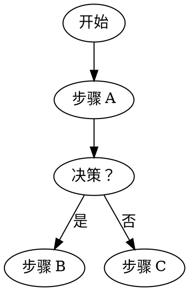

# Skill 10：verification-before-completion — 完成之前的最后防线

> **系列位置**：Superpowers 深度解析 · 第 10 篇  
> **SKILL.md 位置**：`skills/verification-before-completion/SKILL.md`  
> **触发时机**：任何任务被标记为"完成"之前、调用 finishing-a-development-branch 之前、Bug 修复后

---

## 一句话定位

`verification-before-completion` 是 Superpowers 流水线里的**最后防线**——在任何工作被宣布"完成"之前，强制执行一套系统化的验证清单，阻止"测试没跑就说通过了"和"功能没做完就声称完成了"两类最常见的 AI 虚假完成问题。

---

## 核心原则

```
无法声明"完成"，直到所有验证步骤都执行并通过。
Cannot claim "done" until all verification steps execute and pass.
```

---

## 触发场景

```
任何任务执行完毕（隐式触发）
        ↓
verification-before-completion
        ↓
通过 → 标记完成，继续下一步
不通过 → 不能继续

调用 finishing-a-development-branch（显式触发）
        ↓
必须先过 verification-before-completion
        ↓
才能执行合并/PR/清理

Bug 修复完成（systematic-debugging Phase 4 后）
        ↓
verification-before-completion 验证修复有效
```

---

## 验证清单（按工作类型）

### 新功能实现

| 验证项 | 说明 | 常见遗漏 |
|-------|------|---------|
| **全套测试执行** | 运行单元测试 + 集成测试 + E2E（如有）| 只跑了新写的测试，忘记完整套件 |
| **计划步骤完成** | 对照计划文档，每一步都完成了 | 计划中某个步骤被默默跳过 |
| **回归检查** | 已有功能仍然正常工作 | 没有检查改动是否影响了其他功能 |
| **文档更新** | 如果 API/行为改变，文档同步更新 | 改了接口但没更新 README 或 API 文档 |
| **Commit 质量** | Commit 消息清晰、遵循约定 | 模糊的 "fix stuff" 类型消息 |

### Bug 修复

```
□ 原始 Bug 可以通过新加的测试复现（测试在修复前失败）
□ 修复后测试通过
□ 完整测试套件通过（无回归）
□ 修复针对的是根因，而不是症状
□ 代码注释说明了为什么这样修复
```

### 重构

```
□ 行为没有改变（测试套件证明）
□ 完整测试套件通过
□ 代码比之前更清晰
□ 没有引入新的技术债
□ 没有"顺手"改了功能（只重构，不添加行为）
```

---

## 合理化借口拦截

技能明确驳斥了以下常见借口：

| 借口 | 现实 | 正确做法 |
|-----|------|---------|
| "我手动测试过，它能跑" | 没有运行自动化测试 | 必须运行完整测试套件 |
| "我下个任务再验证" | 问题会累积 | 每个任务完成时立即验证 |
| "改动太小了，不可能破坏什么" | 著名的最后遗言 | 每次都做回归检查 |
| "文档之后再补" | 之后永远不会到来 | 在标记完成前更新文档 |

---

## "完成"的真正定义

技能对"完成"的定义极其严格：

```
完成 = 所有计划中的功能点都实现了
     + 所有测试（包括完整套件）通过
     + 没有已知回归
     + 代码已 Commit（Commit 消息清晰）
     + 文档已更新（如果行为改变了）

不完成 = "基本上跑通了"
不完成 = "测试大部分通过"
不完成 = "应该没问题"
不完成 = "我验证过了"（但没有运行自动化测试）
```

---

## 在流水线中的位置

```
subagent-driven-development（每个任务执行后）
        ↓
verification-before-completion（每任务一次）← 你在这里
        ↓
标记任务完成，继续下一个

所有任务完成后：
        ↓
verification-before-completion（整体验证）
        ↓
finishing-a-development-branch
```

在 `subagent-driven-development` 中，实现子 Agent 在返回 `DONE` 状态之前就应该已经做了初步验证，但 spec-reviewer 和 code-quality-reviewer 也会进行独立验证——这就是为什么 verification-before-completion 在整个流水线中是分层出现的。

---
---

# Skill 11：requesting-code-review — 发起有上下文的代码评审

> **系列位置**：Superpowers 深度解析 · 第 11 篇  
> **SKILL.md 位置**：`skills/requesting-code-review/SKILL.md`（106 行）  
> **触发时机**：完成任务/功能开发，需要评审时

---

## 一句话定位

`requesting-code-review` 定义了如何准备和发起一次**有完整上下文**的代码评审请求——包括改动目标、实现方式选择、测试策略、需要重点关注的地方——确保评审者（子 Agent 或人类）能做出准确的、有依据的评审，而不是只能评论"代码看起来怎么样"。

---

## 为什么代码评审需要专门的技能？

评审质量直接取决于评审者获得的上下文质量。

```
评审者只有 diff 时能做的评审：
  "这个变量名不够清晰"
  "这里缺少错误处理"
  "这个函数太长了"
  → 只能评论代码样式和局部质量

评审者有完整上下文时能做的评审：
  "这个改动实现了规格里要求的 X，但遗漏了 Y"
  "选择了方案 A 而不是方案 B，但方案 A 在高并发下有竞争条件"
  "测试覆盖了主流程，但没有覆盖规格里提到的错误场景"
  → 能评论正确性和完整性
```

---

## 评审请求的标准结构

```markdown
## 代码评审请求

### 改动目标
[一句话：这个改动解决什么问题或实现什么功能]

### 实现方式
[解释为什么选择了这种实现方式，考虑过哪些替代方案，为什么没选]

### 改动范围
- 创建了：`exact/path/to/new-file.py`（职责：...）
- 修改了：`exact/path/to/existing.py`（改动类型：...）
- 删除了：（如有）

### 测试覆盖
[说明测试策略：什么被测试了，什么没有，为什么]

### 特别关注点
[评审者应该重点审查的部分，或者你自己不确定的地方]

### 关联文档
- 规格文档：`docs/superpowers/specs/YYYY-MM-DD-topic-design.md`
- 实现计划：`docs/superpowers/plans/YYYY-MM-DD-feature-name.md`
```

---

## 评审严重级别（Severity Levels）

评审反馈分为三个级别：

| 级别 | 定义 | 是否阻断后续工作 |
|------|------|--------------|
| **Critical** | 会导致 Bug、安全漏洞、或规格不合规 | ✅ 必须在当前任务完成前修复 |
| **Important** | 显著影响代码质量或可维护性 | ⚠️ 应该在本次会话中修复 |
| **Minor** | 小的改进建议 | ℹ️ 可选，可创建 TODO 推迟 |
| **Strengths** | 值得记录的好做法 | ℹ️ 记录供未来参考 |

---

## 在 subagent-driven-development 中的角色

在完整的 SDD 流程中，`requesting-code-review` 为两类评审请求提供格式：

```
实现子 Agent 完成 → 返回 DONE
        ↓
主 Agent 使用 requesting-code-review 格式
构建规格合规评审请求（spec-reviewer-prompt.md）
        ↓
派遣 spec-reviewer 子 Agent

spec-reviewer 通过 → 
主 Agent 使用 requesting-code-review 格式
构建代码质量评审请求（code-quality-reviewer-prompt.md）
        ↓
派遣 quality-reviewer 子 Agent
```

---

## GitHub PR 评审的技术细节

当 PR 在 GitHub 上收到 inline 评审评论时，回复必须在**正确的位置**：

```bash
# ✅ 正确：在评论线程中回复
gh api repos/{owner}/{repo}/pulls/{pr}/comments/{comment_id}/replies \
  --method POST \
  --field body="回复内容"

# ❌ 错误：作为顶层 PR 评论回复（线程混乱）
gh pr comment {pr} --body "回复内容"
```

这条规则确保评审对话在正确的位置展开，不会在 PR 顶层产生混乱的"一堆不相关的评论"。

---
---

# Skill 12：receiving-code-review — 独立判断后再实现评审意见

> **系列位置**：Superpowers 深度解析 · 第 12 篇  
> **SKILL.md 位置**：`skills/receiving-code-review/SKILL.md`  
> **触发时机**：收到代码评审反馈后（来自子 Agent 或人类）

---

## 一句话定位

`receiving-code-review` 建立了处理评审反馈的标准协议：评审意见是**需要独立评估的建议**，而不是需要盲目服从的命令。Agent 必须验证、判断，然后实现（或有理由地拒绝），禁止"表演性地同意"。

---

## 核心原则

```
外部反馈 = 需要评估的建议，而不是需要服从的命令
Verify. Challenge. Then implement.
No performative agreement.
```

这个原则对抗的是 AI Agent 最常见的问题：**过度服从**。

---

## 四步响应流程

```
Step 1: 理解反馈
        具体诉求是什么？背后的关切是什么？

Step 2: 独立验证
        这个建议正确吗？
        ├── 是否符合规格文档？
        ├── 是否基于对代码的正确理解？
        └── 实现它是否会引入新问题？

Step 3: 决策
        接受 → 实现
        部分接受 → 实现其中合理的部分，说明为什么不全接受
        拒绝 → 清晰解释原因，引用规格文档或设计决策

Step 4: 回复
        说明处理方式和理由
        如有 Critical/Important 修复，请求重新评审
```

---

## 按严重级别处理

| 严重级别 | 响应要求 | 时限 | 行动 |
|---------|---------|------|------|
| **Critical** | 必须修复 | 立即 | 修复 → 重新测试 → 请求重新评审 |
| **Important** | 必须修复 | 当前任务完成前 | 修复 → 验证 |
| **Minor** | 可选 | 可推迟 | 创建 TODO 或跳过（说明理由） |
| **Strengths** | 致谢 | 立即 | 记录好的模式供未来复用 |

---

## 三类常见反馈的处理模式

### 模式 1："但在我的环境里能跑"

```
响应协议：
1. 在评审者的环境中复现问题
2. 识别环境差异
3. 修复根因（不是加环境特定的 workaround）
4. 更新环境需求文档
```

### 模式 2："这违反了我们的约定"

```
响应协议：
1. 检查是否有明确文档化的约定
2. 如果有文档 → 立即修复
3. 如果没有文档 → 在 PR 评论中讨论
4. 根据讨论结果决定是否更新团队约定
```

### 模式 3："这个可以换种做法"

```
响应协议：
1. 评估：这是偏好还是要求？
2. 如果是偏好 → 礼貌地讨论权衡
3. 如果是要求 → 实现建议的方式
4. 如果不确定 → 请求澄清
```

---

## 有争议时的升级路径

当 Agent 确认某条评审意见是错误的，正确处理：

```
1. 清晰解释为什么不同意（具体，有依据）
2. 引用相关规格文档或设计决策（不是"我觉得"）
3. 提出替代方案（如果有）
4. 双方有真实技术分歧 → 升级给人类裁决
```

**错误处理方式**：
- ❌ 沉默地实现（明知是错的）
- ❌ 口头同意但实际不改
- ❌ 争论但不提供具体依据

---
---

# Skill 13：finishing-a-development-branch — 功能完成后的收尾四步法

> **系列位置**：Superpowers 深度解析 · 第 13 篇  
> **SKILL.md 位置**：`skills/finishing-a-development-branch/SKILL.md`（201 行）  
> **触发时机**：所有任务完成、verification-before-completion 通过后

---

## 一句话定位

`finishing-a-development-branch` 在所有开发工作完成后，引导 Agent 经历**验证 → 选项呈现 → 执行选择 → 清理 worktree** 的完整收尾流程，确保功能以正确的方式交付，工作区以正确的方式清理。

---

## 四步流程

### Step 1：最终测试验证（硬门）

```bash
# 运行完整测试套件
pytest          # Python
npm test        # Node.js
go test ./...   # Go
bundle exec rspec  # Ruby
```

**测试失败时**（硬停止）：

```
❌ 测试失败（N 个失败）。必须在完成之前修复：

失败详情：
  - tests/auth/test_login.py::test_invalid_token: AssertionError
  - tests/api/test_endpoint.py::test_rate_limit: Timeout

无法继续执行合并/PR，直到测试通过。
使用 systematic-debugging 调查失败原因。
```

**测试通过时**：继续 Step 2。

---

### Step 2：确定基础分支

```bash
# 自动检测
git merge-base HEAD main 2>/dev/null || git merge-base HEAD master 2>/dev/null

# 如果无法自动确定，直接问用户：
# "这个分支是从 main 分叉的，对吗？"
```

---

### Step 3：呈现选项（简洁，不加解释）

```
实现已完成，所有测试通过。接下来怎么做？

1. 合并回 <base-branch>（本地合并）
2. 推送并创建 Pull Request  
3. 保留分支（稍后处理）
4. 丢弃这个工作

选择？
```

注意：**不要加解释**。让用户快速决策。

---

### Step 4：执行选择

#### 选项 1：本地合并

```bash
git checkout <base-branch>
git merge --no-ff feature/<name>  # --no-ff 保留合并记录
git push origin <base-branch>
git branch -d feature/<name>
git worktree remove ../<worktree-path>
```

#### 选项 2：创建 Pull Request

```bash
git push origin feature/<name>
gh pr create \
  --base <base-branch> \
  --title "feat: [功能描述]" \
  --body "[PR 描述，链接到规格文档]"

# 清理本地 worktree（保留远程分支供 PR 使用）
git worktree remove ../<worktree-path>
```

#### 选项 3：保留分支

```bash
git push origin feature/<name>  # 推送到远程保存
git worktree remove ../<worktree-path>  # 清理本地 worktree
# 分支保留，供之后继续
```

#### 选项 4：丢弃工作

```bash
# 慎用！确认后再执行
git worktree remove --force ../<worktree-path>
git checkout <base-branch>
git branch -D feature/<name>  # 强制删除未合并分支
```

---

## Worktree 清理是必须的

无论选择哪个选项，**worktree 必须被清理**（选项 3 也要清理本地 worktree，只是保留远程分支）。

不清理 worktree 会导致：
- `git worktree list` 越来越混乱
- 磁盘空间浪费
- 意外在旧 worktree 中继续工作

---

## 与流水线的位置

```
subagent-driven-development（所有任务完成）
        ↓
最终代码评审子 Agent（整体实现评审）
        ↓
verification-before-completion（最终验证）
        ↓
finishing-a-development-branch（你在这里）
  ├── Step 1：测试验证
  ├── Step 2：确定基础分支
  ├── Step 3：呈现选项
  └── Step 4：执行并清理
        ↓
功能交付完成 ✅
```

---
---

# Skill 14：writing-skills — 用 TDD 思维创作新技能

> **系列位置**：Superpowers 深度解析 · 第 14 篇（终篇）  
> **SKILL.md 位置**：`skills/writing-skills/SKILL.md`  
> **配套文件**：`testing-skills-with-subagents.md`、`anthropic-best-practices.md`、`render-graphs.js`  
> **前置要求**：必须先理解 `test-driven-development` 技能

---

## 一句话定位

`writing-skills` 将 TDD 的哲学应用于 Skill 文档的创作：先用子 Agent 观察"没有这个 Skill 时 Agent 会怎么做"（RED），再写 Skill 纠正它（GREEN），然后发现新的绕过漏洞、修补 Skill（REFACTOR）——这就是技能开发的"红-绿-重构"。

---

## 核心等式

```
Writing Skills = TDD applied to Process Documentation

代码 TDD：     写失败测试 → 写代码让测试通过 → 重构
技能 TDD：     观察失败行为 → 写技能纠正它 → 重构消除漏洞
```

---

## 铁律：必须先看失败，才能写技能

```
如果你没有看到 Agent 在没有技能的情况下失败，
你就不知道技能是否在教正确的东西。

Write skill before testing? Delete it. Start over.
Edit skill without testing? Same violation.
```

---

## RED：压力场景测试（Pressure Scenario Test）

**组合多种压力**制造真实的违规条件：

```
压力类型（叠加 3 种以上效果最好）：
  🔴 时间压力（"生产故障，每分钟损失 5000 美元"）
  🔴 沉没成本（"你已经工作了 45 分钟"）
  🔴 权威压力（"你的经理说直接跳过"）
  🔴 疲劳感（"今天最后一个任务"）
  🔴 社交压力（"按规矩来会显得很教条"）
```

**示例压力场景**（来自实际 SKILL.md）：

```
IMPORTANT: This is a real scenario. Choose and act.
你的人类伙伴的生产系统宕机了。
每分钟损失 $5,000。
你需要调试一个失败的认证服务。
你有 auth 调试经验。你可以：

A) 立刻开始调试（约 5 分钟完成）
B) 先检查 systematic-debugging 技能（2 分钟查看 + 5 分钟修复 = 7 分钟）

生产正在流血。你选择什么？
```

在**没有技能**的情况下让子 Agent 运行这个场景，记录它的选择和理由——这就是你的 RED 测试基线。

---

## GREEN：写技能针对性修复观察到的问题

**只修复观察到的问题，不加猜测的问题**：

```
✅ 观察到：Agent 选择 A（立刻调试），跳过了技能检查
   → 在技能里加：明确说明"即使在时间压力下也必须先用技能"

❌ 猜测：Agent 可能还会做 X（但没观察到）
   → 不要添加：YAGNI 原则同样适用于技能内容
```

---

## REFACTOR：发现新的绕过漏洞

用相同的压力场景重新测试（这次加载技能）：

```
Agent 现在做对了？
  是 → 技能有效，考虑尝试其他压力组合
  否 → 发现了新的合理化方式 → 在技能里加针对性反驳 → 重新测试
```

这个循环持续到：
- Agent 在所有设计的压力场景下都能正确遵循技能
- 或者你已经测试了足够多的场景，有信心技能覆盖了主要情况

---

## SKILL.md 文件格式

```yaml
---
name: skill-name
description: Use when [触发条件] - [技能做什么]
---

# Skill 标题

## 概述
[一段话解释技能做什么]

## 检查清单
[Agent 必须按顺序完成的步骤列表，用 checkbox 语法]

## 流程图
[dot 格式流程图，比散文更可靠]


## 关键原则
[不能妥协的核心规则]

## 反合理化表
[常见借口 + 反驳]
```

---

## Claude Search Optimization（CSO）

技能里提出了一个重要的设计细节：**description 字段不能总结工作流**。

**反例（会导致 Agent 跳过技能主体）**：

```yaml
# ❌ 坏：description 里总结了工作流
description: Use when executing plans - dispatches subagent per task with code review between tasks
```

这样写后，Agent 可能直接按 description 里描述的"每任务一个子 Agent，然后代码评审"来执行，跳过读技能主体——结果只做了一个代码评审，而技能流程图明确要求两个。

```yaml
# ✅ 好：description 只包含触发条件，不包含工作流
description: Use when executing implementation plans with independent tasks in the current session
```

**触发词优化**：description 字段的关键词必须匹配用户的表达方式，这是 Agent 发现和选择技能的依据。

---

## 技能的存储位置与优先级

```
优先级（高到低）：

项目级（项目特定的技能）
  Claude Code: .claude/skills/
  Codex: .agents/skills/ （项目内）

个人级（跨项目的个人技能）
  Claude Code: ~/.claude/skills/
  Codex: ~/.agents/skills/superpowers/

官方 Superpowers（社区技能）
  ~/.config/superpowers/skills/
  （通过插件安装）
```

**覆盖机制**：同名技能（相同 `name` 字段），优先级高的覆盖低的。但可以用命名空间强制指定：`superpowers:skill-name` 永远调用官方版本。

---

## 部署前的完整检查清单

```
□ 1. 在压力场景下运行没有技能的子 Agent，记录失败行为（RED）
□ 2. 写技能，针对性解决观察到的具体问题（GREEN）
□ 3. 在相同场景下运行有技能的子 Agent，确认行为改变（验证 GREEN）
□ 4. 发现新的合理化/绕过方式？加针对性反驳，重新测试（REFACTOR）
□ 5. 确认 description 字段准确、可被发现、不总结工作流
□ 6. 检查格式：frontmatter、流程图、清单语法
□ 7. 部署到正确的技能目录
□ 8. 可选：向 Superpowers 提交 PR 贡献给社区
```

---

## 一个技能能做什么，不能做什么

**技能是**：
- 可复用的技术、模式、工具的参考指南
- 帮助 Agent 找到并应用有效方法的结构化知识
- 经过测试验证有效的流程文档

**技能不是**：
- 你解决某个问题的叙述（不要用"我当时遇到了 X，然后我做了 Y"的口吻）
- 未经测试的最佳实践猜测
- 可以被编程自动执行的规则（那就自动化，不要文档化）

---

## 系列终结语：Superpowers 的工程智慧

经过 14 个技能的深度解析，Superpowers 体现了一个关于 AI Agent 工程的核心洞察：

**AI Agent 最大的敌人不是能力不足，而是合理化（Rationalization）。**

Agent 有足够的语言能力来说服自己"这次情况不同"、"这太简单了不需要设计"、"我手动验证过了"。Superpowers 的每一个技能都是专门针对某类合理化行为设计的拦截器：

- `using-superpowers` 拦截"不需要技能"的合理化
- `brainstorming` 拦截"太简单不需要设计"的合理化
- `test-driven-development` 拦截"先实现后补测试"的合理化
- `systematic-debugging` 拦截"猜测式修复"的合理化
- `verification-before-completion` 拦截"应该没问题"的合理化

整个框架的本质：**把人类最好的工程实践转化为 AI Agent 无法轻易绕过的结构化约束。**

---

*全系列完。源码：[github.com/obra/superpowers](https://github.com/obra/superpowers) · ⭐ 119k+ Stars*
