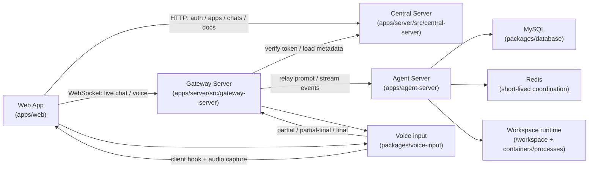
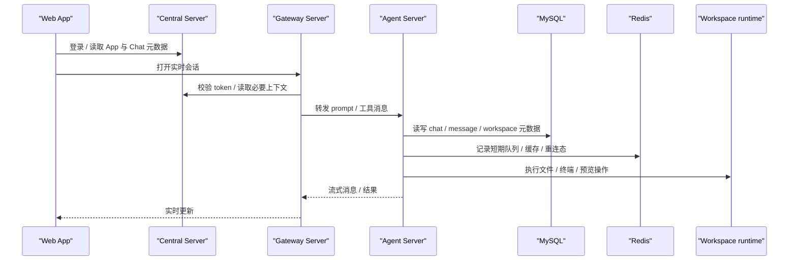

# TapTap Maker 架构速览

本文是当前代码现实的单一事实源，面向 AI / agent 使用。
如果代码和旧文档冲突，以这里和源码为准。

## Monorepo 结构

```text
apps/
  web/            # React 19 + Vite 前端
  server/         # Central Server + Gateway Server
  agent-server/   # Manager / workspace runtime
packages/
  config/         # 环境变量与配置加载
  database/       # MySQL + Drizzle schema
  logger/         # 日志输出与封装
  shared/         # UUID、display filter、通用工具
  types/          # API / SDK 共享类型
  voice-input/    # 语音输入客户端、服务端、共享协议
docs/             # 文档
```

最值得优先信任的源码入口是：

- `apps/server/src/central-server/index.ts`
- `apps/server/src/gateway-server/index.ts`
- `apps/agent-server/src/bin/Manager.ts`
- `packages/database/src/schema.ts`
- `packages/config/src/config.ts`
- `packages/voice-input/src/server/index.ts`

## 运行时职责

| 目录                             | 角色           | 核心职责                                                                                    |
| -------------------------------- | -------------- | ------------------------------------------------------------------------------------------- |
| `apps/web`                       | Web App        | 登录、App / Chat UI、实时对话、语音输入、预览和发布面板                                     |
| `apps/server/src/central-server` | Central Server | TapTap OAuth、JWT、App / Chat 元数据、docs / assets / shares / admin 等 HTTP API            |
| `apps/server/src/gateway-server` | Gateway Server | 前端实时连接、消息转发、token 校验、workspace / Docker 协调、语音 WebSocket                 |
| `apps/agent-server`              | Agent Server   | workspace runtime、文件 / 终端 / 预览、容器或进程管理、队列、任务路由                       |
| `packages/database`              | 数据层         | MySQL + Drizzle ORM，存储 users / apps / chats / sessions / messages 等核心表               |
| `packages/config`                | 配置层         | 从环境变量生成统一配置，所有服务共享                                                        |
| `packages/shared`                | 共享工具       | UUID 转换、display filter、通用辅助函数                                                     |
| `packages/voice-input`           | 语音输入包     | `_taptap/voice/*` 协议、ASR、LLM 润色、前端 hook，当前主线是 `DashScope`，`FunASR` 保留兼容 |

### Central Server

Central Server 运行在 `apps/server/src/central-server`，由 `Hono` 提供 HTTP API。
它主要负责“系统事实”而不是“实时对话流”。

- 认证与会话：TapTap OAuth、JWT、refresh token
- 元数据：App、Chat、Share、Docs、User、Admin、Assets
- 数据持久化：读取和写入 MySQL
- 健康检查：`/api/health`

它不是 workspace runtime，也不是前端 WebSocket 的主消息总线。

### Gateway Server

Gateway Server 运行在 `apps/server/src/gateway-server`，是实时会话的门口。

- 监听前端 WebSocket，默认前端连接端口是 `3344`
- 提供 HTTP 入口，默认端口是 `3366`
- 校验 access token 时会回查 Central Server
- 负责会话转发、消息路由、短期状态和重连相关逻辑
- 负责语音输入链路中 `packages/voice-input` 的服务端接入
- 负责部分 workspace / Docker 协调逻辑

它更像“实时消息闸门”，不是长期事实存储。

### Web App

Web App 运行在 `apps/web`。

- 用 React 19 + TypeScript + Vite 构建
- 通过 HTTP 访问 Central Server 的管理接口
- 通过 WebSocket 访问 Gateway Server 的实时会话
- 复用 `packages/voice-input/client` 做语音输入

### Agent Server / workspace runtime

`apps/agent-server` 是 workspace runtime 的主入口，包名是 `@taptap-code/agent-server`。

- `Manager` 负责启动和编排
- `Connector`、`Processor`、`Coder` 等二进制面向不同 runtime 阶段
- workspace 目录位于 `WORKSPACES_ROOT`
- `/workspace` 是 runtime 内的标准工作目录
- `routes/manager/*` 负责用户空间、队列、预览等管理接口
- `routes/connector/*` 负责 workspace 内部能力暴露
- `routes/processor/*` 负责文件和终端等底层操作

这里保存的是“怎么跑 workspace”，不是“哪个聊天线程说了什么”。

### 数据库与 Redis

数据库是 MySQL，不是 SQLite。

- `packages/database` 里用 Drizzle 定义 schema
- UUID 主键使用 `binary(16)`，统一走 `packages/shared/uuid`
- 核心表包括 `users`、`apps`、`chats`、`sessions`、`messages`
- `chats.sdkSessionId` 保存可恢复的 SDK 会话标识

Redis 只承担短期协调，不是事实源。

- 网关和 Agent Server 都会用到 Redis
- 用途通常是队列、缓存、重连态、临时映射
- 不要把 Redis 当作唯一持久化来源

## 关键链路

### 系统架构图



### 请求 / 消息链路图



## 哪些历史文档可能过期

下面这些内容已经被删除或并入主文档，不应再作为信息来源：

- 旧部署文档
- 旧迁移文档
- 大多数 `voice-input-*` 历史修复文档
- 旧的分析 / 测试记录

经验规则：

- 只要文档里出现旧的单服务拓扑、SQLite、迁移计划、修复总结、测试记录，就不要再把它当现状。
- 如果文档描述的是行为，先去源码入口确认。
- 如果文档描述的是命令或端口，优先看当前 `package.json` 和对应入口文件。
- 如果文档和代码不一致，先信代码。
