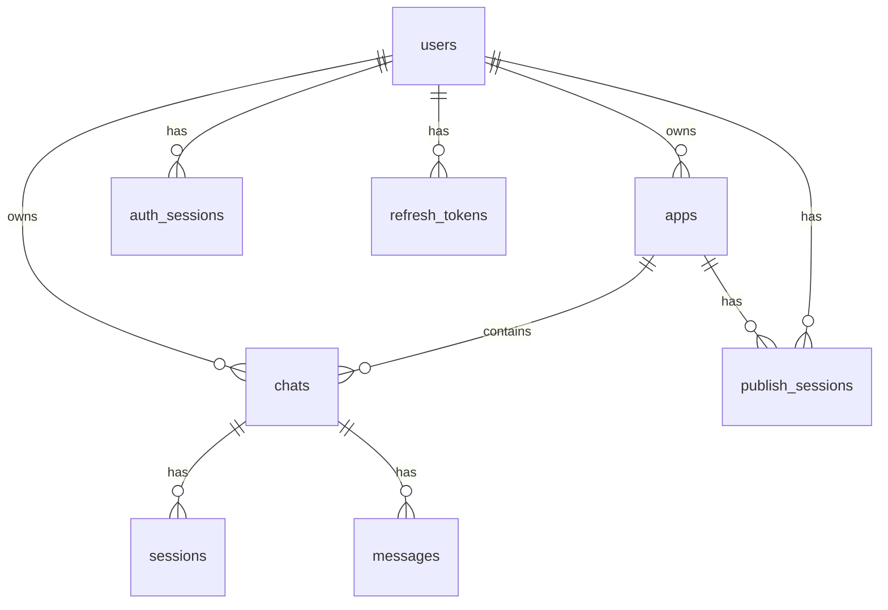

# 数据模型速览

这篇只描述当前代码里最值得信任的数据事实。
如果你要做真实修改，请同时检查：

- `packages/database/src/schema.ts`
- `packages/database/src/database.ts`
- `packages/types/src/models.ts`
- `packages/shared/src/uuid.ts`

## 当前结论

- 主数据库是 **MySQL**，不是 SQLite
- ORM 是 **Drizzle**
- 主键 UUID 在数据库中以 `binary(16)` 存储
- 运行时常用的是字符串 UUID，边界处通过 `packages/shared/src/uuid.ts` 转换
- 重点表是：
  - `users`
  - `apps`
  - `chats`
  - `sessions`
  - `messages`
  - `publish_sessions`

## 关键表关系

## 核心表

### `users`

用户事实源，保存 TapTap 登录映射和基础资料。

常见字段：

- `id`
- `taptapOpenId`
- `taptapUnionId`
- `name`
- `avatarUrl`
- `email`

### `apps`

一个 app 对应一个项目 / workspace 的元数据记录。

常见字段：

- `id`
- `userId`
- `name`
- `description`
- `icon`
- `gameType`
- `deletedAt`

### `chats`

聊天线程本身的元数据，不等于 websocket 连接。

最关键的当前字段：

- `id`
- `appId`
- `userId`
- `title`
- `chatMode`
- `sdkSessionId`

其中：

- `chatMode = normal | publish`
- `sdkSessionId` 用于恢复 SDK 会话

### `sessions`

会话连接层记录，和 chat 分开。

它更偏运行态 / 连接态，不是“聊天内容”本身。

### `messages`

消息持久化表。

当前最重要的理解：

- 它保存的是聊天消息历史
- `type` 存消息 method / 事件类型
- 部分消息链路会先经过 Redis 等短期层，再落到 MySQL
- 数据库里的消息 ID 和运行时临时 ID 不一定完全同构

### `publish_sessions`

发布面板专用的 session 映射表。

它和 `chats.chatMode = 'publish'` 一起构成 PublishPanel 的后端基础。

## UUID 与时间

### UUID

- 数据库存储：`binary(16)`
- 应用层常用：标准字符串 UUID
- 统一转换入口：`packages/shared/src/uuid.ts`

这也是为什么旧文档里大量“BLOB / SQLite / 手动转换”讨论已经不适合作为当前规范。

### 时间

当前 schema 以 Drizzle + MySQL timestamp/date 模式为主。
不要再按旧文档里 SQLite `timestamp_ms` 的假设写新代码。

## 当前最重要的领域约束

### 普通 chat 和 publish chat 是两类 chat

- 普通聊天：`chatMode = normal`
- 发布面板：`chatMode = publish`

普通列表接口会过滤掉 publish chat。

### `sdkSessionId` 是恢复能力的关键字段

如果你在改聊天恢复、prompt 续写、Agent resume，不要忽略它。

### Redis 不是事实源

Redis 仍参与队列、短期缓存和重连态，但长期事实源仍是 MySQL。

## 对 agent 的建议

- 要改 schema，先看 `packages/database/src/schema.ts`
- 要改查询 / 业务行为，先看 `packages/database/src/database.ts`
- 不要再根据旧的 SQLite 文档推断字段类型
- 如果文档和 schema 冲突，先信 schema
