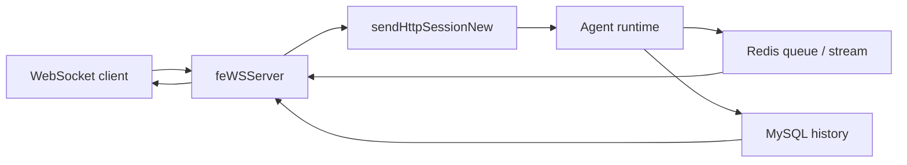
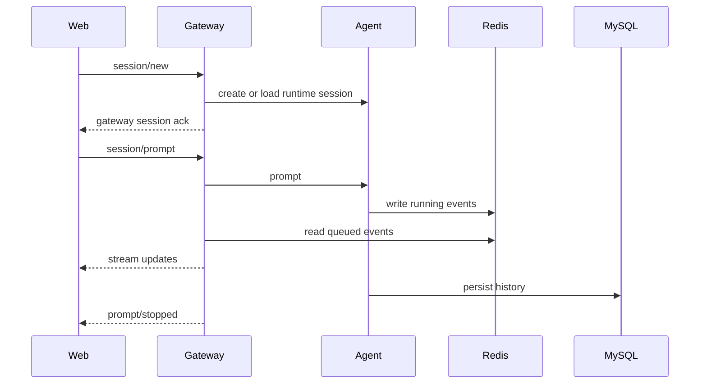

# Gateway 消息流速览

这篇只保留当前 Gateway 消息链路里最重要的事实。
实现细节请看：

- `apps/server/src/gateway-server/servers/feWSServer.ts`
- `apps/server/src/gateway-server/utils/sendHttpSessionNew.ts`
- `apps/server/src/gateway-server/utils/redis.ts`
- `apps/server/src/gateway-server/utils/dbOpt.ts`
- `apps/web/src/hooks/use-chat-messages.ts`

## Gateway 的角色

Gateway 是前端实时会话的入口，不是长期事实存储。

它负责：

- 接收前端 WebSocket
- 建立 / 加载 session
- 把 prompt 发给 runtime
- 把运行中的消息转给前端
- 协助处理重连增量加载

## 当前链路

## 最关键的几个事实

### 1. Gateway 要同时面对两类数据源

- **Redis**：更偏进行中、短期、重连时增量可见的数据
- **MySQL**：更偏已持久化的历史数据

所以 session/load 时，Gateway 不是只查一个地方。

### 2. `afterMessageId` 可能不是数据库 UUID

当前前端的 `lastMessageIdRef` 在重连场景里，可能保存的是 Redis Stream 风格 ID。
因此 Gateway 读取历史时，不能只按“去数据库找同名 UUID”来理解。

这也是旧文档里最有价值、但最容易写过头的部分。

### 3. Gateway 状态消息不等于 agent 消息

前端会收到一些 `role: "gateway"` 的消息，例如：

- session 初始化反馈
- userspace ready
- 某些状态更新

这些消息不应和 agent 生成内容混为一谈。

### 4. `prompt/stopped` 是轮次结束信号

对前端和某些业务面板来说，这个事件是收尾动作的触发器。

## 一次普通交互

## 重连时要怎么想

只记住这几个判断就够了：

- 如果是短暂断线，前端倾向于走增量加载
- 如果断线较久，前端可能清空后做完整重载
- Gateway 会结合 `afterMessageId`、Redis、MySQL 一起判断该补什么消息
- `gateway` 角色消息不应污染 agent 消息的增量游标

## 对 agent 的建议

- 如果你在改重连逻辑，不要只看前端，也不要只看 Gateway
- 至少同时检查：
  - `use-chat-messages.ts`
  - `sendHttpSessionNew.ts`
  - `redis.ts`
  - `dbOpt.ts`
- 不要把旧文档里的每一个边界 case 表格继续当作规范复制下去；先看当前实现
