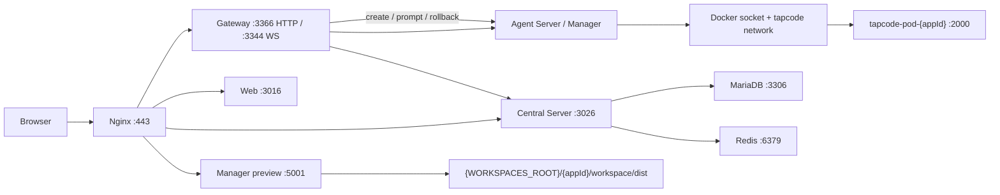
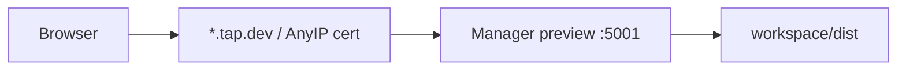

# 本地开发指南

这篇是本仓库给 AI / agent 的本地开发单一事实源。  
如果你只想先把系统跑起来，先看这里；其余本地开发专题文档已经合并或退役。

## 快速认知

本仓库的本地开发分成两层：

- `infra/docker-compose.yml` 负责 MySQL、Redis、Nginx、Agent Manager、`sce-urhox-mcp`
- `pnpm dev` 负责 Central、Gateway、Web、Agent Server（`Manager` 入口）



## 建议启动顺序

1. 复制本地环境变量模板。

```bash
cp .env.example .env
```

2. 检查主机 IP 相关配置。

- `CENTRAL_URL` 和 `CENTRAL_SERVER_URL` 保持一致
- `HTTP_AGENT_SERVER_URL` 和 `MANAGER_PORT` 保持一致
- `VITE_WS_BASE_URL` 必须带 `/ws`
- 从远程浏览器访问时，不能把 `localhost` 写进前端可见的 URL

3. 如果你要跑完整 Agent 流程，先准备依赖仓库并构建用户镜像。

```bash
git clone git@github.com:taptap/sce-tools.git sce-tools
docker build -f docker/agent-userpod/Dockerfile -t tapcode-userpod:latest .
```

4. 启动基础设施。

```bash
cd infra && docker compose --env-file ../.env up -d
```

5. 首次本地启动时创建数据库。

MariaDB 容器不会自动帮你创建 `MYSQL_DATABASE` 指向的库名。
如果你沿用 `.env.example` 里的默认值，这一步需要手动创建 `tap_code`：

```bash
docker exec mysql-server mariadb -h 127.0.0.1 -uroot -p"$MYSQL_ROOT_PASSWORD" \
  -e "CREATE DATABASE IF NOT EXISTS tap_code CHARACTER SET utf8mb4 COLLATE utf8mb4_unicode_ci;"
```

6. 安装依赖并启动宿主机上的应用进程。

如果你已经通过 compose 启动了 `agent-manager`，这里不要再跑 `pnpm dev`，否则会再启动一个本地 `agent:dev`，和 compose 里的 Manager 抢同一个端口。

```bash
pnpm install
pnpm central:dev
pnpm gateway:dev
pnpm web:dev
```

如果你明确想改成“宿主机直跑 Manager”模式，再单独运行：

```bash
pnpm agent:dev
```

7. 如果没有桌面浏览器或想快速登录，直接启用 fake-login。

```bash
curl -X POST http://localhost:3026/api/auth/fake-login
```

浏览器里也可以直接打开：

```text
http://{YOUR_IP}:3016?fake-login=true
```

8. 如果要看用户项目预览，先申请证书。

```bash
./scripts/setup-preview-cert.sh
```

## 端口与配置

常用的本地配置基线如下：

| 项目                             | 常见值                                             | 备注                                    |
| -------------------------------- | -------------------------------------------------- | --------------------------------------- |
| `CENTRAL_PORT`                   | `3026`                                             | Central Server                          |
| `CENTRAL_URL`                    | `http://{YOUR_IP}:3026`                            | 前端和服务端都可能读取                  |
| `CENTRAL_SERVER_URL`             | `http://{YOUR_IP}:3026`                            | Gateway 仍会读取                        |
| `MANAGER_PORT`                   | `5000` 或 `3377`                                   | 取决于你是直接跑 Manager 还是走 compose |
| `HTTP_AGENT_SERVER_URL`          | `http://127.0.0.1:5000` 或 `http://127.0.0.1:3377` | 要和 `MANAGER_PORT` 对齐                |
| `HTTP_AGENT_SERVER_CALLBACK_URL` | `http://127.0.0.1:3366/agent/callback/`            | Gateway 回调                            |
| `REDIS_URL`                      | `redis://127.0.0.1:6379/0`                         | 共享缓存 / 队列                         |
| `WORKSPACES_ROOT`                | 绝对路径                                           | Nginx 要挂载它                          |
| `MYSQL_URL`                      | `mysql://...`                                      | Agent Server 直接连库时需要             |
| `JWT_SECRET`                     | 随机长字符串                                       | 所有服务必须一致                        |

如果你在用 `infra/docker-compose.yml` 的默认映射，host 侧通常会是 `3377`。  
如果你选择直接在宿主机上跑 Manager 而不是走 compose，你也可能看到 `5000`。

## 本地预览

用户项目预览不是 `web:preview`，而是 Manager 提供的独立 HTTPS 预览服务。



设置方法：

```bash
TAPCODE_PREVIEW_DOMAIN={ip-label}.tap.dev:5001
```

预览常见失败点：

- `WORKSPACES_ROOT` 不是绝对路径
- 没有正确申请 per-IP 证书
- `workspace/dist` 还没生成
- 预览域名和 IP label 不匹配

## 常用命令

```bash
pnpm central:dev
pnpm gateway:dev
pnpm agent:dev
pnpm web:dev
pnpm web:preview
pnpm stop
pnpm restart
pnpm db:migrate
pnpm db:migrate:status
pnpm db:health
```

## Workspace 初始化脚本（init-workspace）

用户容器首次创建时，Manager 通过 `curl + node` 从 Cloudflare R2 下载 `init-workspace.cjs` 并执行，将 `ai-dev-kit.zip` 和 `skill-creator.zip` 解压到 workspace 目录。

### 相关环境变量

| 变量                 | 必需 | 说明                                                          |
| -------------------- | ---- | ------------------------------------------------------------- |
| `INIT_CDN_BASE`      | 是   | ai-dev-kit / skill-creator 的 CDN 基础 URL（必须 `https://`） |
| `INIT_SCRIPT_URL`    | 否   | 覆盖 R2 默认 URL，用于测试自定义构建                          |
| `INIT_SCRIPT_SOURCE` | 否   | 遗留，指向自定义 bash 脚本 URL                                |

### 自动更新

修改 `packages/init-workspace/src/cli.ts` → push 到 main → GitHub Actions 自动构建并上传到 R2（`.github/workflows/deploy-init-workspace.yml`）。新创建的容器自动拉取最新版本。

需要 GitHub Secrets：`CLOUDFLARE_ACCOUNT_ID`、`CLOUDFLARE_API_TOKEN`（R2 写权限）。

### 手动更新

```bash
pnpm --filter @taptap-maker/init-workspace build
wrangler r2 object put maker/maker-scripts/init-workspace.cjs \
  --file packages/init-workspace/dist/cli.js \
  --content-type application/javascript --remote
```

### 验证

```bash
# 确认 R2 上文件可访问
curl -sfI https://pub-3400c214c54b4d54898a3d3ae68a2e5f.r2.dev/maker-scripts/init-workspace.cjs

# 创建新 App 后检查 workspace 目录
ls ${WORKSPACES_ROOT}/<appId>/workspace/
# 应包含：engine-docs/ examples/ urhox-libs/ templates/ schemas/ lua-tools/
```

## 常见故障

- `ENOSPC` / watcher 不够：提高 `fs.inotify.max_user_watches`
- `localhost` 访问失败：改用开发机实际 LAN IP
- `VITE_WS_BASE_URL` 连接失败：确认路径是 `/ws`
- `JWT verification failed`：检查所有服务是否共用同一个 `JWT_SECRET`
- `Agent` 相关报错：确认 Docker daemon 和 `/var/run/docker.sock`
- `Unable to acquire a connection`：补齐 `MYSQL_URL`
- 预览 `403 / 404`：检查证书、`WORKSPACES_ROOT` 和 `workspace/dist`

## 参考入口

- `docs/technical-debt.md`：当前已知风险
- `docs/skillhub-design.md`：SkillHub 设计
- `docs/publish-panel-implementation.md`：发布面板实现

旧的本地开发专题已经合并或退役，不要再把 `deployment.md`、`docker-deployment.md`、`production-deployment.md`、`directory-tree.md`、`sqlite-to-postgres-migration.md` 当成当前事实来源。
