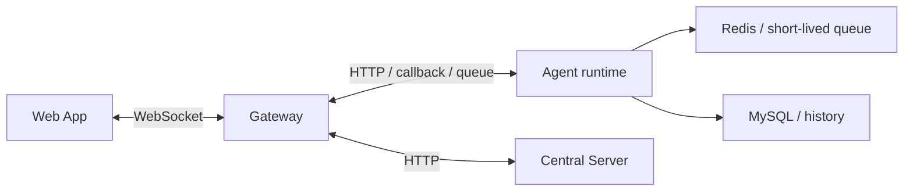
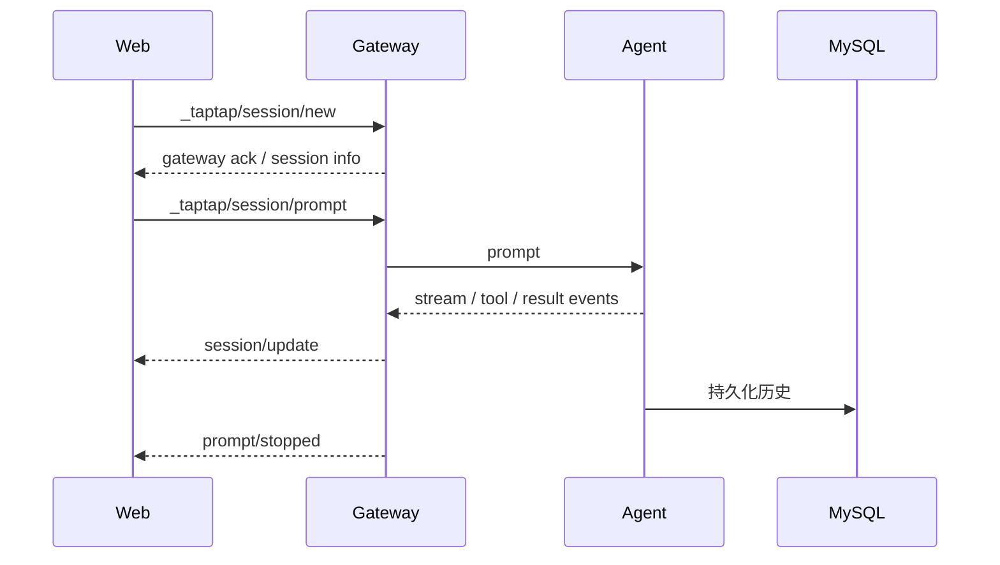

# 消息模型速览

这篇描述的是前端与 Gateway 当前真正会遇到的消息形状，而不是历史上的完整转换理论。

优先检查这些文件：

- `apps/web/src/types/agent-protocol.ts`
- `apps/web/src/hooks/use-chat-messages.ts`
- `apps/web/src/hooks/use-chat-session.ts`
- `apps/server/src/gateway-server/servers/feWSServer.ts`
- `apps/server/src/gateway-server/utils/sendHttpSessionNew.ts`

## 当前现实

- 前端主通道是 **WebSocket**
- 消息中心是 **Gateway**
- Agent / runtime 会通过 Gateway 把消息推给前端
- 前端真实消费的消息结构，以 `apps/web/src/types/agent-protocol.ts` 为准

旧文档里那种“SDK / ACP 统一转换成 BrowserMessage 再由 Agent-Server 持久化”的说法，已经不适合作为当前事实源。

## 关键消息类别

当前前端最关心的是这些事件：

- `_taptap/session/new`
- `_taptap/session/load`
- `_taptap/session/prompt`
- `_taptap/session/cancel`
- `session/update`
- `prompt/stopped`
- `status/update`
- 语音相关 `_taptap/voice/*`

## 消息参与者

## 前端实际处理规则

### 1. 不是所有消息都应该推进 `lastMessageIdRef`

`apps/web/src/hooks/use-chat-messages.ts` 里最关键的现实是：

- 只有 agent 知道的消息，才应该更新 `lastMessageIdRef`
- `gateway` 角色的状态消息不应推进它

这直接影响重连增量加载是否正确。

### 2. `prompt/stopped` 是一个很重要的边界事件

它通常表示本轮 agent 回复结束。

前端很多逻辑都挂在这个事件上，例如：

- 停止 loading / waiting 状态
- 刷新 credits
- PublishPanel 回读 `project.json`

### 3. `session/new` / `session/load` 是连接与恢复入口

- `session/new` 创建新运行态 session
- `session/load` 用于恢复和补消息

对前端来说，session 层和 chat 层不是一回事。

## 当前消息形状的简单理解

### Gateway 状态消息

常见特征：

- `role: "gateway"`
- method 常见为 `_taptap/session/new` 或 `status/update`

这类消息主要用于：

- 告知 session 已建立
- 告知 userspace / runtime 状态

### Agent 内容消息

前端最终渲染时，会看到这些语义片段：

- 用户消息
- assistant 文本
- tool call / tool result
- plan
- result / stop

但内部流式拼接与临时状态，主要由 `use-chat-messages.ts` 管理，而不是由一篇长文档定义死。

## 一条典型链路

## 对 agent 最有用的约束

- 想理解“前端为什么这么显示”，先看 `agent-protocol.ts` 和 `use-chat-messages.ts`
- 想理解“消息是怎么送进 runtime 的”，看 `sendHttpSessionNew.ts`
- 想理解“停止事件 / 重连增量加载”，看 `use-chat-messages.ts` 和 Gateway 的 Redis / DB 读取逻辑
- 不要再把旧的 `BrowserMessage` 文档当作唯一事实源
