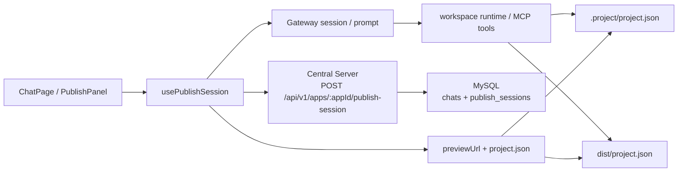
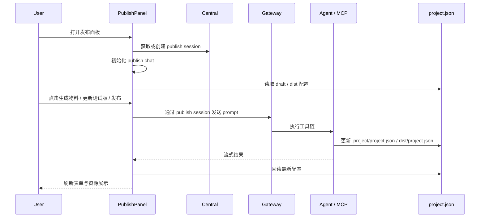

# PublishPanel 实现速览

这篇文档只保留当前实现里对 AI / agent 有用的部分。
如果细节和代码冲突，以这些入口为准：

- `apps/web/src/components/chat/PublishPanel.tsx`
- `apps/web/src/hooks/use-publish-session.ts`
- `apps/web/src/lib/publish-session.ts`
- `apps/server/src/central-server/chats.routes.ts`
- `packages/database/src/schema.ts`
- `apps/server/src/gateway-server/systemPrompts/publish-mode.md`

## 目标

PublishPanel 是聊天页里的一个长生命周期侧面板，用来完成 TapTap 发布相关操作：

- 选择厂商
- 生成或上传发布物料
- 更新测试版本
- 确认发布
- 处理实机视频与方形宣传图

它不是独立产品页，而是挂在 `ChatPage` 里的工作流面板。

## 当前架构



## 核心事实

### 1. 发布面板走隐藏的 publish chat

- Central Server 通过 `POST /api/v1/apps/:appId/publish-session` 返回或创建一个 publish chat。
- `packages/database/src/schema.ts` 里有两组关键结构：
  - `chats.chat_mode = normal | publish`
  - `publish_sessions`
- 这个 chat 不显示在普通聊天列表里，但消息和 session 是持久化的。

### 2. 前端不是自己拼发布逻辑，而是通过 publish session 驱动

- `usePublishSession` 负责拿 publish chat、初始化 session、发 prompt、等待结果、回读配置。
- 真正执行发布动作的仍是 Agent / MCP 工具链。
- Gateway 不再需要为 publish 模式维护大量特殊逻辑；publish chat 基本走统一会话链路。

### 3. `project.json` 是发布面板的事实源

当前前端依赖两个版本：

| 文件                    | 用途                            |
| ----------------------- | ------------------------------- |
| `.project/project.json` | 草稿态，给编辑和 agent 工具使用 |
| `dist/project.json`     | 构建 / 发布后的产物态           |

前端会反复回读配置，而不是把面板表单当成唯一事实源。

### 4. 前端优先消费 URL 字段，不直接消费本地文件路径

`assets.icon`、`assets.screenshots` 这类本地路径是给 workspace / MCP 用的。
前端展示时应优先看：

- `icon_url`
- `screenshot_urls`
- `promotional_image_url`
- `square_promotional_image_url`

### 5. PublishPanel 关闭时隐藏，不卸载

`ChatPage` 里通过 `display` 控制显示状态，避免：

- 丢掉 publish session
- 丢掉 pending form state
- 丢掉上传 / 生成中的中间状态

这对 agent 很重要：不要轻易把它当成一次性弹窗组件。

## 当前数据重点

前端和 agent 最常碰到的字段是：

```json
{
  "version": "1.0.x",
  "taptap_publish": {
    "developer_id": 123,
    "title": "游戏名",
    "description": "描述",
    "category": "rpg",
    "screen_orientation": "landscape|portrait",
    "trial_note": "开发者的话",
    "gameplay_demo_video_source": "https://..."
  },
  "assets": {
    "icon_url": "https://...",
    "screenshot_urls": ["https://..."],
    "promotional_image_url": "https://...",
    "square_promotional_image_url": "https://..."
  },
  "test_qrcode": {
    "url": "https://...",
    "generated_at": "2026-..."
  }
}
```

## 端到端流程



## 对 agent 最重要的约束

- 不要把 PublishPanel 当作纯前端表单；它本质是一个 publish chat 的专用 UI。
- 不要假设所有字段都只存在 React state；很多状态来自 `project.json` 回读。
- 不要用旧文档里的“publish 特殊 Gateway 逻辑”当现状。
- 如果你在改发布逻辑，先同时检查：
  - `PublishPanel.tsx`
  - `use-publish-session.ts`
  - `chats.routes.ts`
  - `packages/database/src/schema.ts`
  - `publish-mode.md`

## 已过期的旧内容

这篇旧版本里大量历史内容已经移除，包括：

- 旧 v1 / v2 设计对比
- 大量 SQL 草稿和阶段性迁移说明
- 逐模块 UI 设计展开
- 逐文件改动清单

如果你需要“为什么曾经这样设计”的历史背景，请看 Git 历史，而不是再扩写这篇文档。
