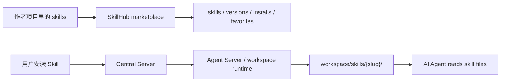

# SkillHub 设计状态

这篇文档描述的是 **设计目标和预期架构**，不是当前已经完整上线的事实源。

最重要的现实判断：

- `apps/server/src/central-server/index.ts` 里的 Skills routes 仍是注释状态
- Gateway 里“installed skills 同步”代码也仍是注释状态
- 因此，SkillHub 目前更像保留中的设计案，而不是可直接依赖的现成功能

如果 agent 要做实现，请以代码为准，不要把这篇当成“已经存在的 API 文档”。

## 目标

SkillHub 想解决的问题是：

- 让用户发布一组可复用的 Skill 文件
- 让其他用户浏览、安装、收藏、更新
- 把已安装的 Skill 同步到 workspace 的 `skills/` 目录
- 让 AI Agent 能直接读取这些 Skill

## 预期模型

## 设计上最关键的几个点

### 1. Skill 是纯文本文件包

设计上，Skill 不是二进制插件，而是一组文本文件，例如：

- `SKILL.md`
- 示例文档
- JSON 配置
- 辅助脚本

### 2. 系统 Skill 和用户 Skill 是两套来源

| 类型       | 当前理解                               |
| ---------- | -------------------------------------- |
| 系统 Skill | 随 runtime / dev-kit 一起分发          |
| 用户 Skill | 由 SkillHub 市场管理并同步到 workspace |

### 3. 目标中的数据表

旧设计里规划了这些核心表：

- `skills`
- `skill_versions`
- `user_installed_skills`
- `user_favorite_skills`

但“规划过”不等于“当前已启用”。做实现前必须先检查 `packages/database/src/schema.ts` 和迁移文件。

### 4. 目标中的同步链路

理想链路是：

1. 用户安装 Skill
2. Central 记录安装状态
3. Central / Gateway 把 Skill 文件传给 Agent
4. Agent 写入 workspace 的 `skills/{slug}/`
5. AI 在后续对话中读取这些文件

当前仓库里，这条链路还没有完整接上。

## 当前代码现实

下面这些信号说明它仍主要是设计中：

- `apps/server/src/central-server/index.ts`
  Skills routes 仍被注释掉
- `apps/server/src/gateway-server/utils/sendHttpSessionNew.ts`
  installed skills 查询与注入仍被注释掉
- 仓库里没有看到完整启用中的 `skills.routes.ts` 主线

所以如果 agent 在仓库里看到这篇文档，默认应理解为：

- 可以参考它来做实现拆解
- 不能直接假设 API、表结构、同步行为已经存在

## 对 agent 的建议

- 如果任务是“实现 SkillHub”，先把它当作产品 / 架构草案。
- 如果任务是“修复 SkillHub”，先确认到底哪些部分已经落地，不要直接按这篇文档改。
- 优先检查：
  - `apps/server/src/central-server/index.ts`
  - `apps/server/src/gateway-server/utils/sendHttpSessionNew.ts`
  - `packages/database/src/schema.ts`
  - `apps/agent-server` 里是否已有实际 skill 文件读写接口

## 为什么保留这篇

这篇仍有价值，因为它回答了两个问题：

- 团队想把 SkillHub 做成什么
- 未来如果重启实现，最重要的边界和同步方向是什么

但它已经不再适合写成长篇“仿佛全部已实现”的详细方案，因此这里保留为短版设计状态说明。
