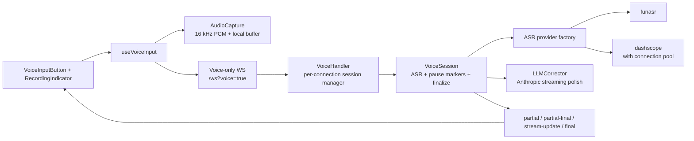
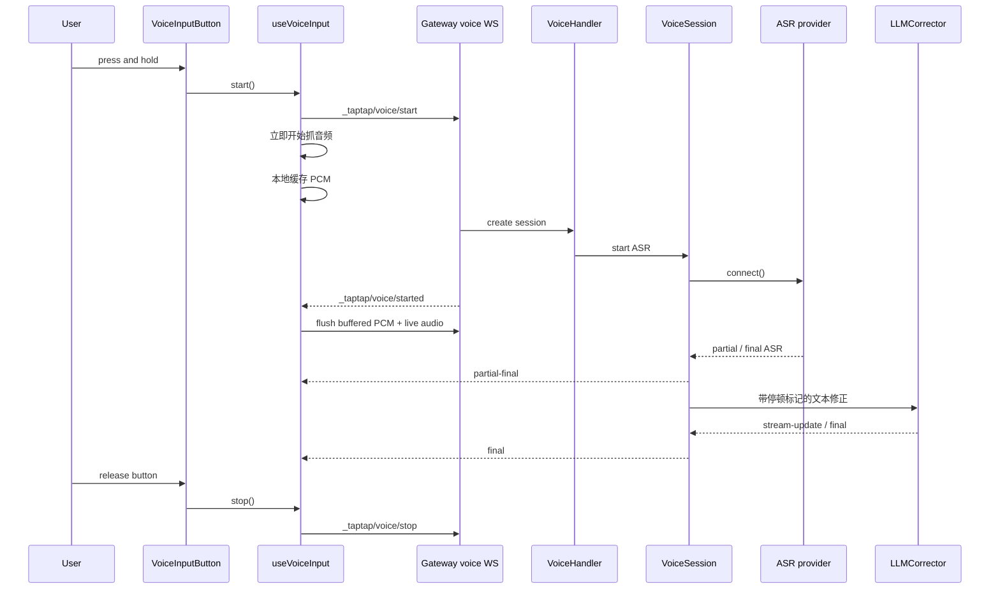

# 语音输入架构

这篇是当前语音输入链路的事实源。
旧的 `docs/voice-input-*.md` 历史修复文档已经被收敛，避免 agent 在大量过期背景里来回比对。

## 当前有哪些组件

- 前端入口：`apps/web/src/components/chat/VoiceInputButton.tsx`
- Hook 和音频采集：`packages/voice-input/src/client/use-voice-input.ts`、`audio-capture.ts`
- 状态 UI：`apps/web/src/components/chat/RecordingIndicator.tsx`
- 语音传输：`apps/server/src/gateway-server/servers/feWSServer.ts` 中的 voice-only WebSocket（`?voice=true`）
- 服务端核心：`packages/voice-input/src/server` 中的 `VoiceHandler` 和 `VoiceSession`
- ASR provider：`funasr`、`dashscope`
- LLM 修正：`LLMCorrector`（Anthropic）

## 状态流

前端的核心状态机是：

`idle -> starting -> preparing -> recording -> idle`

- `starting`：按钮已按下，正在准备语音连接
- `preparing`：音频采集已经开始，但服务端还没有返回 `STARTED`
- `recording`：服务端已就绪，音频正在实时发送

`useVoiceInput` 会先开始抓 PCM，本地缓存音频；等收到 `STARTED` 后，再把缓存冲刷出去并继续实时发送。

## 协议

语音链路使用紧凑的 JSON-RPC 风格协议：

- Client -> Server
  - `_taptap/voice/start`
  - `_taptap/voice/audio`
  - `_taptap/voice/stop`
- Server -> Client
  - `_taptap/voice/started`
  - `_taptap/voice/partial`
  - `_taptap/voice/partial-final`
  - `_taptap/voice/stream-update`
  - `_taptap/voice/final`
  - `_taptap/voice/error`

语义上：

- `partial`：实时 ASR 文本
- `partial-final`：ASR 已确认、但还没经过 LLM 润色的文本
- `stream-update`：LLM 流式替换中的文本
- `final`：这一轮语音输入的最终文本

## 运行时结构

## Provider 策略

- `funasr`：本地 / 默认 ASR 路径
- `dashscope`：托管 ASR 路径，带连接池
- `VOICE_ANTHROPIC_API_KEY` 和 `ENABLE_VOICE_CORRECTION` 控制是否启用 LLM 修正
- Gateway 当前会读取：
  - `ASR_PROVIDER`
  - `FUNASR_ENDPOINT`
  - `DASHSCOPE_API_KEY`
  - `DASHSCOPE_URL`
  - `DASHSCOPE_MODEL`
  - `VOICE_ANTHROPIC_API_KEY`

## agent 应先信什么

如果你要理解语音链路，先看这篇，再看上面列出的源码入口。

大多数旧的 `voice-input` 文档现在都只属于历史背景，它们可能还会提到：

- `alicloud`
- 旧的 `partial/final` 二段协议心智
- 早期测试计划

当前仍值得保留的唯一深一点补充，是：

- `docs/voice-input-pause-marker-architecture.md`
