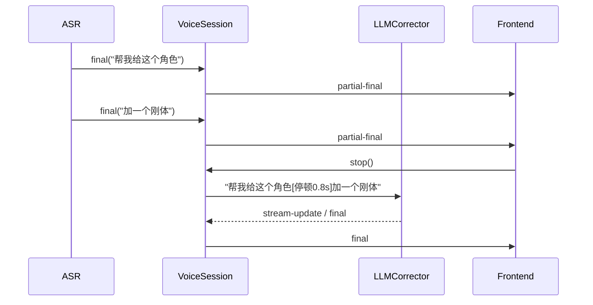

# 语音输入停顿标记补充

这是一篇保留的深度补充文档，只解释当前仍在用的停顿标记策略。更完整的总体视图请先看 [voice-input-architecture.md](./voice-input-architecture.md)。

## 当前做法

- `VoiceSession` 不再依赖定时器去猜“用户说完了没有”。
- 每个 `final` 片段都会带时间戳进入 `contextBuffer`。
- 结束录音时，`VoiceSession` 会把相邻片段按时间差拼成带 `[停顿Xs]` 的输入，再交给 `LLMCorrector`。
- `raw` 输出保留原始文本，不包含停顿标记。

## 为什么保留

这个策略的价值在于，它把“什么时候断句”交给 LLM 结合语义和停顿来判断，比旧的固定超时合并更稳，也更容易解释给 agent。

## 关键流

