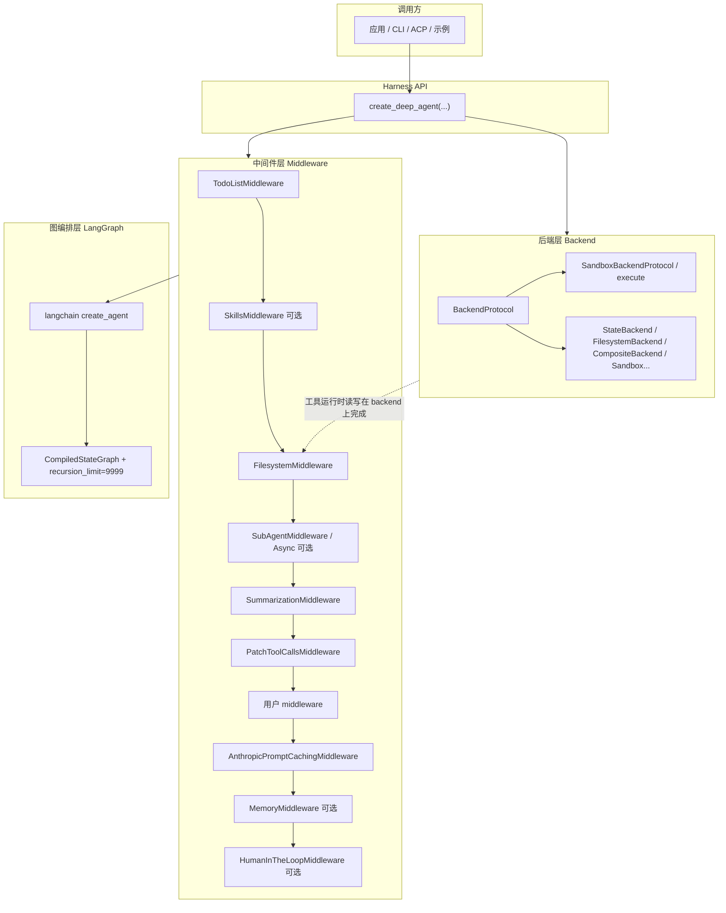

# 第 2 章：核心设计哲学与架构总览

> **主要参考源码路径**  
> - 工厂与默认栈：`libs/deepagents/deepagents/graph.py`（`create_deep_agent`）  
> - 后端协议与实现：`libs/deepagents/deepagents/backends/protocol.py`、`state.py`、`filesystem.py`、`composite.py`、`sandbox.py` 等  
> - 中间件：`libs/deepagents/deepagents/middleware/`  
> - 对外 API 聚合：`libs/deepagents/deepagents/__init__.py`  
> - 产品表述：`README.md`；威胁建模与组件映射：`libs/deepagents/THREAT_MODEL.md`

---

## 1. Harness 模式：不在 LangChain 之外「另起炉灶」

Deep Agents 的核心哲学是 **Harness（马具）**：**不**从零实现一套 Agent 运行时，而是在 LangChain 提供的 **`create_agent`** 之上，通过 **中间件（middleware）**、**后端（backend）** 与 **默认系统提示**，把「规划、文件、子智能体、上下文压缩」等能力 **层叠** 上去。

这样做的工程收益包括：

- **复用** LangGraph 的 `CompiledStateGraph` 生态（流式、checkpoint、Studio 等，`README.md` 明确强调）。  
- **组合优于继承**：行为主要通过 `create_deep_agent(...)` 的 **参数**（`tools`、`middleware`、`backend`、`subagents`、`skills`、`memory`、`interrupt_on` 等）声明，而非深继承树。  
- **边界清晰**：存储与命令执行落在 **Backend 协议**；工具注入与提示增强落在 **Middleware**；最终执行图仍由 **`create_agent` → `CompiledStateGraph`** 承担。

---

## 2. 三层架构

### 2.1 后端层（存储 + 执行）

**抽象**：`BackendProtocol` 定义智能体「文件类」能力（列表、读写、搜索等）的统一接口；`SandboxBackendProtocol` 扩展 **可执行环境**（如 shell），供 `execute` 等工具在 **有沙箱** 时真正跑命令。

**典型实现**（均在 `deepagents.backends` 包内，名称随版本演进以源码为准）：

- **`StateBackend`**：文件内容挂在 **LangGraph 状态** 中，适合 ephemeral、无本地盘暴露的场景。  
- **`FilesystemBackend`**：直接读写 **真实文件系统**（需注意路径与 `virtual_mode` 等安全语义）。  
- **`CompositeBackend`**：路径前缀 **路由** 到不同后端（例如默认状态 + `/memories/` 走存储后端）。  
- **`BaseSandbox` 等**：实现 `SandboxBackendProtocol`，对接具体沙箱实现；**合作伙伴包**（`libs/partners/*`）常在此层提供远程/隔离执行环境。

**设计含义**：同一套 **文件类中间件与工具**，可在「纯内存状态」「本地盘」「远程沙箱」间切换，Harness 上层 API 保持稳定。

### 2.2 中间件层（工具注入 + 提示/状态协作）

中间件负责把 **工具** 注册到 agent、在模型调用前后 **改写消息或状态**、以及与其它层协作（如摘要写回文件、子智能体隔离上下文）。

代表性中间件（模块位于 `libs/deepagents/deepagents/middleware/`）包括：

- **`FilesystemMiddleware`**：挂载 `ls` / `read_file` / `write_file` / `edit_file` / `glob` / `grep` 等与 backend 绑定的工具。  
- **`SubAgentMiddleware`**：提供 **`task`**，用于同步/内联子智能体规格。  
- **`AsyncSubAgentMiddleware`**：当 `subagents` 中含 **异步/远程** 规格（如带 `graph_id` 的 `AsyncSubAgent`）时启用。  
- **`SummarizationMiddleware`**（由 `create_summarization_middleware` 工厂创建）：长对话 **自动摘要**、大输出落盘等上下文治理。  
- **`MemoryMiddleware`**：在启用 `memory=` 时，把指定 **记忆文件**（如 `AGENTS.md`）注入系统提示。  
- **`SkillsMiddleware`**：在启用 `skills=` 时，从后端路径加载 **技能** 描述，扩展可复用程序性知识。  
- **`PatchToolCallsMiddleware`**：修正/规范化工具调用形态，提升与模型输出格式的兼容性。  
- **LangChain 自带**：如 `TodoListMiddleware`、`HumanInTheLoopMiddleware`；以及 **`AnthropicPromptCachingMiddleware`**（对非 Anthropic 模型可配置为 `ignore`，避免无效缓存头）。

默认 **工具集** 在 `create_deep_agent` 的文档字符串中与实现中保持一致，包括：

`write_todos`、`ls`、`read_file`、`write_file`、`edit_file`、`glob`、`grep`、`execute`（仅当 backend 支持沙箱协议时可用）、`task`。

### 2.3 图编排层（LangGraph / LangChain Agent）

`create_deep_agent` **最终调用** LangChain 的 `create_agent(...)`，并返回经 `.with_config(...)` 处理后的 **`CompiledStateGraph`**。  
其中将 **`recursion_limit` 设为 `9999`**，避免复杂多步任务过早被默认递归上限截断（具体见下文代码引用）。

---

## 3. 组合式 API：`create_deep_agent` 作为唯一总装车间

下面摘录 `graph.py` 末尾 **组装图** 的核心片段（省略部分参数传递，仅突出调用链）：

```python
return create_agent(
    model,
    system_prompt=final_system_prompt,
    tools=tools,
    middleware=deepagent_middleware,
    response_format=response_format,
    context_schema=context_schema,
    checkpointer=checkpointer,
    store=store,
    debug=debug,
    name=name,
    cache=cache,
).with_config(
    {
        "recursion_limit": 9_999,
        "metadata": {
            "ls_integration": "deepagents",
            "versions": {"deepagents": __version__},
            "lc_agent_name": name,
        },
    }
)
```

**系统提示**：若调用方传入 `system_prompt`，会与内置的 **`BASE_AGENT_PROMPT`** 拼接（字符串拼接或 `SystemMessage` 的 content blocks 合并），保证 **Deep Agent 行为基线**（简洁、少废话、先理解再行动等）始终存在。

**与其它模块的关系**：

- **`libs/cli`**：消费 SDK，构建终端产品与延迟加载策略。  
- **`libs/acp` / `libs/repl` / `examples/*`**：在同一 `CompiledStateGraph` 之上包装不同 **入口形态**（协议、REPL、业务示例）。  
- **`libs/partners`**：多通过 **Backend / 沙箱** 替换，扩展执行环境而非改写图核心。

---

## 4. 默认中间件栈顺序（必读）

下列顺序与 `graph.py` 内文档字符串及实现 **一致**（`skills` / `memory` / `interrupt_on` / 异步子智能体为 **条件插入**）：

1. **基底（Base）**  
   - `TodoListMiddleware`  
   - `SkillsMiddleware`（**仅当**传入 `skills`）  
   - `FilesystemMiddleware`  
   - `SubAgentMiddleware`  
   - `SummarizationMiddleware`（工厂生成）  
   - `PatchToolCallsMiddleware`  
   - `AsyncSubAgentMiddleware`（**仅当**存在异步类 `subagents`）  

2. **用户插入点**  
   - 调用方传入的 **`middleware=[...]`** 紧接在上述基底之后、`AnthropicPromptCachingMiddleware` 之前。

3. **尾部（Tail）**  
   - `AnthropicPromptCachingMiddleware`（`unsupported_model_behavior="ignore"` 时对非 Anthropic 模型静默）  
   - `MemoryMiddleware`（**仅当**传入 `memory`）  
   - `HumanInTheLoopMiddleware`（**仅当**传入 `interrupt_on`）  

**设计决策说明**（源码注释）：**缓存中间件放在靠后**，且 **记忆中间件在缓存之后**，是为了避免记忆更新 **破坏** Anthropic 侧 **prompt cache 前缀** 的稳定性。

**子智能体默认栈**：主智能体中的「通用子智能体」（`general-purpose`）若未由用户覆盖，会由框架注入一条 **略简化但同族** 的中间件链（含 Todo、文件系统、摘要、补丁、可选 Skills、Anthropic 缓存等），保证子调用与主智能体 **能力模型对齐**；细节见 `graph.py` 中 `general_purpose_spec` 与 `SubAgent` 预处理逻辑。

---

## 5. 架构分层示意图（Mermaid）



---

## 6. 小结：读懂 Harness 的三条线索

1. **后端换皮、工具不变**：文件类工具语义稳定，变的只是 **数据落在 state、磁盘还是远程沙箱**。  
2. **中间件顺序即策略顺序**：尤其是 **摘要、缓存、记忆、人工审批** 的相对位置，直接影响 **成本、稳定性与合规**。  
3. **图仍是 LangGraph 原生产物**：便于与生态内 checkpoint、流式、可观测性方案 **直接对接**，Deep Agents 专注把 **「像 Claude Code 一样能干活」** 的默认行为 **组件化**。

后续章节可沿 **单类中间件源码**、**Backend 协议演进** 或 **`libs/cli` 如何延迟加载并 pin SDK** 等专题继续深入。
