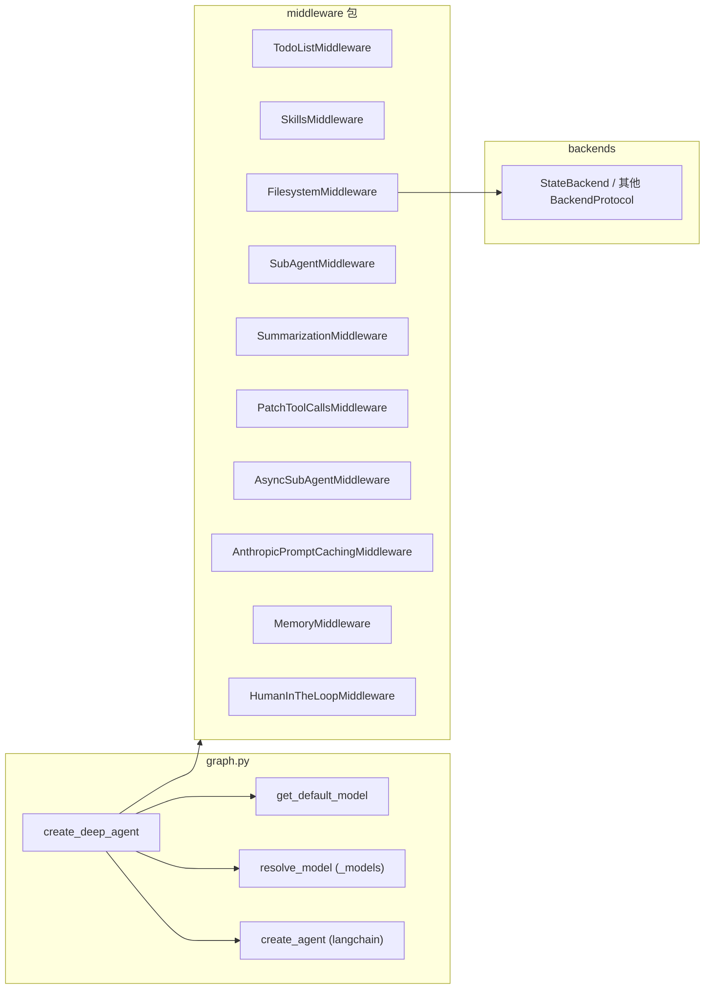

# 入口函数：`create_deep_agent()`

**源码路径：** `libs/deepagents/deepagents/graph.py`

本文从「Harness 工程」视角说明 Deep Agents 的主装配入口：如何把模型、系统提示、中间件栈、子智能体与 LangGraph 运行配置组合成可执行的 `CompiledStateGraph`。

---

## 1. 函数签名与返回类型

完整签名为：

```python
def create_deep_agent(
    model: str | BaseChatModel | None = None,
    tools: Sequence[BaseTool | Callable | dict[str, Any]] | None = None,
    *,
    system_prompt: str | SystemMessage | None = None,
    middleware: Sequence[AgentMiddleware] = (),
    subagents: Sequence[SubAgent | CompiledSubAgent | AsyncSubAgent] | None = None,
    skills: list[str] | None = None,
    memory: list[str] | None = None,
    response_format: ResponseFormat[ResponseT] | type[ResponseT] | dict[str, Any] | None = None,
    context_schema: type[ContextT] | None = None,
    checkpointer: Checkpointer | None = None,
    store: BaseStore | None = None,
    backend: BackendProtocol | BackendFactory | None = None,
    interrupt_on: dict[str, bool | InterruptOnConfig] | None = None,
    debug: bool = False,
    name: str | None = None,
    cache: BaseCache | None = None,
) -> CompiledStateGraph[AgentState[ResponseT], ContextT, _InputAgentState, _OutputAgentState[ResponseT]]:
    ...
```

**Harness 要点：** 该函数是「声明式装配面」：调用方通过参数描述能力边界（工具、后端、子智能体、人机协同等），内部统一转成 `langchain.agents.create_agent` 可消费的结构，最后再套上 LangGraph 的运行配置（递归深度、元数据）。

---

## 2. 默认模型与模型解析

### 2.1 默认模型

当 `model is None` 时，使用 `get_default_model()`：

```python
def get_default_model() -> ChatAnthropic:
    return ChatAnthropic(
        model_name="claude-sonnet-4-6",
    )
```

- 需要环境中配置 `ANTHROPIC_API_KEY`。
- 这是 Deep Agent 的「开箱即用」默认，体现产品与 Anthropic 生态的默认绑定。

### 2.2 `resolve_model()`

否则执行 `resolve_model(model)`（定义于 `libs/deepagents/deepagents/_models.py`）：

- 若已是 `BaseChatModel` 实例，原样返回。
- 若为 `provider:model` 形式的字符串，经 `langchain.chat_models.init_chat_model` 解析；OpenRouter 等路径还包含版本检查与归因头等策略。

**设计含义：** Harness 把「字符串配置」与「已构造模型对象」统一成单一下游类型，便于在中间件与子智能体中复用同一套 `BaseChatModel` 假设。

---

## 3. 后端默认值

```python
backend = backend if backend is not None else StateBackend()
```

未显式传入 `backend` 时，文件与工具所见存储落在 **LangGraph 状态通道** 中（线程内持久、跨线程不共享），详见后端章节对 `StateBackend` 的说明。

---

## 4. 系统提示拼装：`BASE_AGENT_PROMPT`

### 4.1 拼装规则

- `system_prompt is None`：仅使用 `BASE_AGENT_PROMPT`。
- `system_prompt` 为 `str`：用户内容在前，`BASE_AGENT_PROMPT` 以 `"\n\n"` 拼接在后。
- `system_prompt` 为 `SystemMessage`：在 `content_blocks` 末尾追加一段文本块，内容为 `BASE_AGENT_PROMPT`。

**Harness 解读：** 用户指令永远「前缀化」深度代理的通用行为契约；基座提示不可被单独省略，从而保证工具使用、语气与任务推进策略一致。

### 4.2 `BASE_AGENT_PROMPT` 涵盖主题（语义摘要）

源码中 `BASE_AGENT_PROMPT` 为长文本，可概括为四类约束：

1. **核心行为：** 简洁直接、避免多余开场白；歧义时先问再动；若用户问「怎么做」可先解释再执行。
2. **专业客观性：** 准确优先、可礼貌纠正用户错误、避免过度奉承或情绪化迎合。
3. **任务执行流：** 先理解（读文件、看模式）→ 再实现 → 再对照需求验证；长任务要迭代而非一次声称完成；失败时分析原因而非盲目重试；真正阻塞时再交还用户。
4. **进度更新：** 长任务中间给出简短进度句（已完成什么、下一步做什么）。

---

## 5. 中间件栈装配顺序

主智能体 `deepagent_middleware` 的构建顺序如下（与源码一致）。

| 顺序 | 中间件 | 条件 |
|------|--------|------|
| 1 | `TodoListMiddleware` | 始终 |
| 2 | `SkillsMiddleware` | `skills is not None` |
| 3 | `FilesystemMiddleware` | 始终（传入 `backend`） |
| 4 | `SubAgentMiddleware` | 始终（内联/编译子智能体列表） |
| 5 | `SummarizationMiddleware` | 始终（`create_summarization_middleware(model, backend)`） |
| 6 | `PatchToolCallsMiddleware` | 始终 |
| 7 | `AsyncSubAgentMiddleware` | 存在异步子智能体（见下节） |
| 8 | 用户 `middleware` | `middleware` 非空时 extend |
| 9 | `AnthropicPromptCachingMiddleware` | 始终（`unsupported_model_behavior="ignore"`，非 Anthropic 模型则静默跳过缓存头） |
| 10 | `MemoryMiddleware` | `memory is not None` |
| 11 | `HumanInTheLoopMiddleware` | `interrupt_on is not None` |

**设计决策（注释原意）：** `AnthropicPromptCachingMiddleware` 与 `MemoryMiddleware` 放在尾部，是为了避免记忆注入破坏 Anthropic 提示缓存前缀的有效性。

---

## 6. 子智能体：内联、编译与异步

### 6.1 分流逻辑

对 `subagents` 迭代时：

- 若 spec 含 `graph_id` → 视为 `AsyncSubAgent`，进入 `async_subagents`，由 `AsyncSubAgentMiddleware` 处理（非阻塞、远程/后台任务语义）。
- 若含 `runnable` → `CompiledSubAgent`，原样进入 `SubAgentMiddleware`。
- 否则视为声明式 `SubAgent`：补全 `model`（`resolve_model`）、默认中间件栈（Todo + Filesystem + Summarization + Patch + 可选 Skills + Anthropic 缓存）、合并 `tools` 与 `interrupt_on` 继承规则后进入内联列表。

### 6.2 默认 `general-purpose` 子智能体

若内联子智能体列表中**没有**名为 `general-purpose` 的项，则在列表**头部**插入一份默认规格：

- 基于 `GENERAL_PURPOSE_SUBAGENT` 展开；
- `model` 与主智能体相同；
- `tools` 为主调用传入的 `tools`（或空）；
- 中间件：Todo、`FilesystemMiddleware`、`create_summarization_middleware`、`PatchToolCallsMiddleware`，若主智能体有 `skills` 则再加 `SkillsMiddleware`，最后加 `AnthropicPromptCachingMiddleware`；
- 若顶层配置了 `interrupt_on`，会写入该默认子智能体规格。

**Harness 要点：** 这样保证 `task` 工具始终有一个「通用子代理」可用，同时允许用户通过同名 spec **覆盖**默认行为。

---

## 7. 收尾：`create_agent` 与 `with_config`

最终调用：

```python
return create_agent(
    model,
    system_prompt=final_system_prompt,
    tools=tools,
    middleware=deepagent_middleware,
    response_format=response_format,
    context_schema=context_schema,
    checkpointer=checkpointer,
    store=store,
    debug=debug,
    name=name,
    cache=cache,
).with_config(
    {
        "recursion_limit": 9_999,
        "metadata": {
            "ls_integration": "deepagents",
            "versions": {"deepagents": __version__},
            "lc_agent_name": name,
        },
    }
)
```

- **`recursion_limit=9999`：** 显式抬高 LangGraph 递归/步数上限，避免复杂任务过早被图运行时截断。
- **`metadata`：** 为 LangSmith 等可观测性集成预留标识（集成名、库版本、逻辑 agent 名）。

---

## 8. 模块关系小结



---

## 9. 参考与延伸阅读

- 后端契约：`libs/deepagents/deepagents/backends/protocol.py`
- 各中间件实现：`libs/deepagents/deepagents/middleware/`
- 模型解析：`libs/deepagents/deepagents/_models.py`
