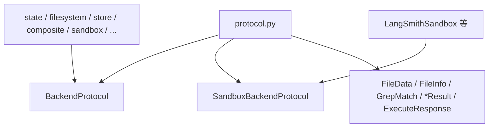

# 后端协议：`BackendProtocol` 与 `SandboxBackendProtocol`

**源码路径：** `libs/deepagents/deepagents/backends/protocol.py`

本章描述 Deep Agents 的「存储与文件操作」抽象边界：所有后端实现同一套同步/异步 API，供 `FilesystemMiddleware` 等 harness 层调用。该模块同时定义批量传输、执行结果与错误码等数据结构。

---

## 1. `BackendProtocol`：抽象基类与契约

`BackendProtocol` 继承 `abc.ABC`（注释说明使用 `@abstractmethod` 的替代方案以避免仅实现子集的子类被破坏），语义上仍是**统一后端协议**：

- 文件可落在状态、磁盘、对象存储、远程沙箱等任意实现，但对上层暴露相同的 `ls` / `read` / `write` / `edit` / `grep` / `glob` / `upload_files` / `download_files` 形状。
- 文档约定逻辑上的 `FileData` 结构（见下文）；并说明遗留数据可能仍为 `content: list[str]`（按 `\n` 拆行），实现侧应兼容并可能发出 `DeprecationWarning`。

### 1.1 核心方法（同步）

| 方法 | 职责摘要 |
|------|----------|
| `ls(path)` | 列出目录项，返回 `LsResult` |
| `read(file_path, offset=0, limit=2000)` | 按行窗口读取，返回 `ReadResult`（内含格式化后的可读文本或错误） |
| `write(file_path, content)` | 新建文件（已存在则失败），返回 `WriteResult` |
| `edit(file_path, old_string, new_string, replace_all=False)` | 精确字符串替换，返回 `EditResult` |
| `grep(pattern, path=None, glob=None)` | **字面量**子串搜索（非正则），返回 `GrepResult` |
| `glob(pattern, path="/")` | 路径 glob，返回 `GlobResult` |
| `upload_files(files)` | 批量上传 `(path, bytes)`，返回 `list[FileUploadResponse]` |
| `download_files(paths)` | 批量下载路径列表，返回 `list[FileDownloadResponse]` |

### 1.2 异步变体

每个主要同步方法对应 `a*` 版本（如 `als`、`aread`、`awrite`），默认实现为 `asyncio.to_thread` 包装同步方法，子类可按需覆盖以实现真异步 I/O。

### 1.3 弃用适配层

为实现平滑迁移，仍保留 `ls_info`、`glob_info`、`grep_raw` 等旧名：内部转发到新 API 并发出 `DeprecationWarning`，计划在 v0.7 移除。

---

## 2. `SandboxBackendProtocol`：在执行环境中扩展

```python
class SandboxBackendProtocol(BackendProtocol):
    @property
    def id(self) -> str: ...
    def execute(self, command: str, *, timeout: int | None = None) -> ExecuteResponse: ...
    async def aexecute(self, command: str, *, timeout: int | None = None) -> ExecuteResponse: ...
```

- 在普通文件协议之上增加 **`execute` / `aexecute`**：在隔离环境（容器、VM、远程主机）中运行 shell 命令。
- 要求提供 **`id`**：实例的稳定标识，便于观测与关联。
- `execute_accepts_timeout(cls)` 使用 `lru_cache` 对 `execute` 签名做内省，判断子类是否支持 `timeout` 关键字（兼容旧版后端包）。

**与 harness 的关系：** 仅当后端实现 `SandboxBackendProtocol` 时，中间件暴露的 `execute` 工具才能真实执行命令；否则工具返回错误说明（见 `create_deep_agent` 文档字符串）。

---

## 3. 关键数据类型

以下名称均来自 `protocol.py`，类型以源码为准。

### 3.1 `FileData`（`TypedDict`）

- `content: str`：UTF-8 文本或 base64 承载的二进制。
- `encoding: str`：如 `"utf-8"` / `"base64"`。
- `created_at` / `modified_at`：`NotRequired[str]`，ISO 8601 时间戳。

### 3.2 `FileInfo`（`TypedDict`）

- 必填：`path`。
- 可选：`is_dir`、`size`、`modified_at`（后端可尽力而为）。

### 3.3 `GrepMatch`（`TypedDict`）

- `path`、`line`（1 基行号）、`text`（匹配行内容）。

### 3.4 `ReadResult`（`dataclass`）

- `error: str | None`
- `file_data: FileData | None`

### 3.5 `WriteResult`（`dataclass`）

- `error`、`path`、`files_update` 字段；构造函数仍接受已弃用的 `files_update`，会触发 `DeprecationWarning`（状态更新现由后端内部处理）。

### 3.6 `EditResult`（`dataclass`）

- `error`、`path`、`files_update`（同上）、`occurrences`（替换次数或失败时为 `None`）。

> **说明：** 编辑的「前后文 diff」若需展示，由中间件或工具层基于返回信息构造；协议层的 `EditResult` 本身不承载 `old_content` / `new_content` / `diff` 字段。

### 3.7 `LsResult` / `GrepResult` / `GlobResult`（`dataclass`）

- 统一为 `error` + 成功载荷（`entries` / `matches`）。

### 3.8 `FileDownloadResponse` / `FileUploadResponse`（`dataclass`）

- 下载：`path`、`content: bytes | None`、`error`。
- 上传：`path`、`error`。
- 二者均支持批量操作中的**部分成功**：按输入顺序一一对应，通过 `error` 字段区分。

### 3.9 `ExecuteResponse`（`dataclass`）

当前源码定义为：

- `output: str`：**合并后的标准输出与标准错误**（便于 LLM 消费）。
- `exit_code: int | None`
- `truncated: bool`：输出是否被后端截断。

> 若文档其它处出现 `stdout` / `stderr` 分列或 `TypedDict` 表述，应以本文件实现为准。

---

## 4. `FileFormat` 版本

```python
FileFormat = Literal["v1", "v2"]
```

- **`v1`（遗留）：** `content` 为 `list[str]`（按 `\n` 分行），无 `encoding` 字段。
- **`v2`（当前）：** `content` 为单个 `str`，并带 `encoding`（`utf-8` 或 `base64`）。

**Harness 意义：** 状态后端等可在构造时选择格式，便于迁移与兼容旧 checkpoint。

---

## 5. `FileOperationError` 字面量

```python
FileOperationError = Literal[
    "file_not_found",
    "permission_denied",
    "is_directory",
    "invalid_path",
]
```

用于上传/下载等可恢复错误的**规范化编码**，便于模型理解并重试或换策略；无法归一化时 `error` 也可为后端特定字符串。

---

## 6. `BackendFactory` 与 `BACKEND_TYPES`

```python
BackendFactory: TypeAlias = Callable[[ToolRuntime], BackendProtocol]
BACKEND_TYPES = BackendProtocol | BackendFactory
```

- `BackendFactory`：按运行时上下文惰性构造后端（例如依赖 `ToolRuntime` 中的配置）。
- 在 API 演进中，工厂形式可能标记为弃用或受限；调用 `create_deep_agent(..., backend=...)` 时以当前包内文档与类型为准。

---

## 7. 设计决策小结

1. **统一表面、多样实现：** 中间件只依赖协议，不感知磁盘与远程沙箱的差异。
2. **同步优先 + 默认线程卸载：** 降低实现门槛；高性能后端可重写异步路径。
3. **批量与部分成功：** 上传/下载返回列表，契合工具链与 LLM 批处理习惯。
4. **执行能力分层：** `BackendProtocol` 管文件；`SandboxBackendProtocol` 管 shell，避免非沙箱环境误暴露执行面。
5. **版本化文件载荷：** `FileFormat` 明确 v1/v2，减轻状态迁移成本。

---

## 8. 模块关系



**延伸阅读：** `libs/deepagents/deepagents/backends/` 下各实现类。
