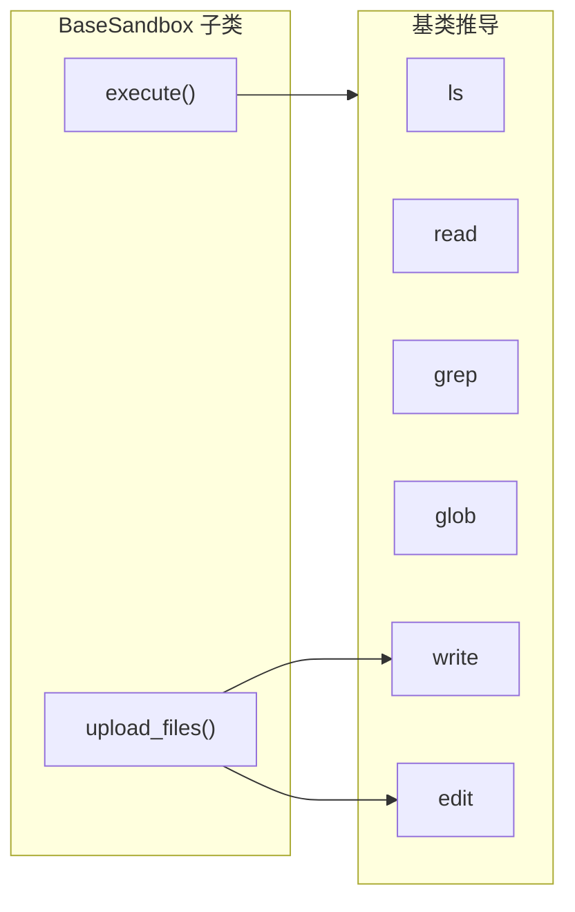

# 后端实现详解

**源码目录：** `libs/deepagents/deepagents/backends/`  
**包导出：** `libs/deepagents/deepagents/backends/__init__.py`

本章梳理 Deep Agents 提供的全部后端实现、各自职责、Harness 使用场景，以及「从执行推导文件操作」这一关键抽象。

---

## 1. 总览与导出

`__all__` 公开类型包括：

| 符号 | 模块 | 角色 |
|------|------|------|
| `StateBackend` | `state.py` | 默认；LangGraph 状态内 ephemeral 文件 |
| `FilesystemBackend` | `filesystem.py` | 本地磁盘真实读写 |
| `StoreBackend` | `store.py` | LangGraph `BaseStore` 命名空间持久化 |
| `CompositeBackend` | `composite.py` | 按路径前缀路由到不同后端 |
| `LocalShellBackend` | `local_shell.py` | 磁盘 + 本机无隔离 shell |
| `LangSmithSandbox` | `langsmith.py` | 远程沙箱（LangSmith API） |
| `BackendProtocol` | `protocol.py` | 协议基类 |
| `BackendContext` / `NamespaceFactory` | `store.py` | 存储后端命名空间构造 |

辅助模块 `utils.py` 提供 grep/glob/字符串替换等共享逻辑，各后端复用。

---

## 2. `StateBackend`（`state.py`）

### 2.1 语义

- 文件内容存放在 **LangGraph Agent 状态** 的 `files` 通道中。
- **同一线程/会话内**随 checkpoint 持久；**跨线程**不共享。
- `create_deep_agent()` 在未传 `backend` 时使用 `StateBackend()`。

### 2.2 Harness 机制：`CONFIG_KEY_READ` / `CONFIG_KEY_SEND`

- 通过 `langgraph.config.get_config()` 取得当前运行配置。
- 使用 LangGraph 内部的 `CONFIG_KEY_READ`、`CONFIG_KEY_SEND`，在工具/中间件执行上下文中**读取**当前 `files` 快照，并通过 **send** 将更新排队为正规 channel 写入，而不是返回遗留的 `files_update` 字典。

### 2.3 行为要点

- 必须在图执行上下文中使用；否则抛出明确错误，提示通过 `invoke(..., files={...})` 预填。
- 支持 `FileFormat`：`v1` / `v2`（构造参数 `file_format`）。

**设计决策：** 将「代理工作区」与主机文件系统解耦，适合 API、多租户或不愿暴露真实路径的场景。

---

## 3. `FilesystemBackend`（`filesystem.py`）

### 3.1 语义

- 对 **真实磁盘** 做读写、`grep`/`glob`（借助 `wcmatch` 等）、元数据来自 `os.stat`。
- `root_dir` 控制解析根；`virtual_mode` 影响路径语义及一定的 traversal 防护（**不等于**沙箱或进程隔离）。
- 文档中强调：**适合本地 CLI/可信开发环境**；不适合直接暴露给不可信 Web 流量。

### 3.2 安全与运维提示

- 可读到密钥、`.env` 等；配合 `HumanInTheLoopMiddleware` 或隔离环境使用。
- `max_file_size_mb` 等限制减轻大文件风险。

**模块关系：** `LocalShellBackend` 继承本类以复用全部文件 API。

---

## 4. `StoreBackend`（`store.py`）

### 4.1 语义

- 基于 LangGraph **`BaseStore`**，以 **namespace**（元组路径）存取条目，实现 **跨线程/持久** 的键值存储抽象。
- 通过 `get_store()` / `get_runtime()` 等与运行时绑定；命名空间可由 `NamespaceFactory(BackendContext) -> tuple[str, ...]` 动态生成。

### 4.2 校验

- `_validate_namespace` 限制命名空间分量字符集，降低通配符注入等风险。

**设计决策：** 把「长期记忆 / 项目知识」等与 ephemeral 状态分离；通常与 `CompositeBackend` 组合，把某前缀（如 `/memories/`）路由到存储后端。

---

## 5. `CompositeBackend`（`composite.py`）

### 5.1 语义

- `default`：未匹配任何路由时的后端。
- `routes: dict[str, BackendProtocol]`：前缀 → 后端；**按前缀长度降序**匹配，避免歧义。
- 对每个操作调用 `_route_for_path`：剥离前缀，把逻辑路径传给子后端；返回结果再把路径 **重映射** 回全局虚拟绝对路径（如 `grep`/`ls` 结果中的 `path`）。

### 5.2 根目录 `ls("/")` 的聚合行为

- 在根路径列出时，会合并 **默认后端** 的根列表与 **各路由目录**（作为虚拟子目录项），呈现统一根视图。

### 5.3 执行（`execute` / `aexecute`）

- **执行不可按路径路由**，始终委托给 **`default` 后端**。
- 仅当 `default` 实现 `SandboxBackendProtocol` 时成功；否则 `NotImplementedError` 并提示需换用支持执行的后端。

### 5.4 批量上传

- `upload_files` 按目标后端分组，**每后端批调用一次**，再按原始顺序合并结果，减少远程往返。

**Harness 示例（与官方 docstring 一致）：**

```python
CompositeBackend(
    default=StateBackend(),
    routes={"/memories/": StoreBackend(...)},
)
```

---

## 6. `LocalShellBackend`（`local_shell.py`）

### 6.1 语义

- **多重继承：** `FilesystemBackend` + `SandboxBackendProtocol`。
- 在**本机进程**中执行 shell：**无容器隔离、无资源上限**，与当前用户权限一致。

### 6.2 `execute` 行为摘要

- 默认超时常量 `DEFAULT_EXECUTE_TIMEOUT = 120`（秒）。
- 将 stdout/stderr 合并进 `ExecuteResponse.output`（与协议一致）。

**设计决策：** 把「最强能力、最弱隔离」的后端显式命名，文档中大篇幅安全警告，引导生产场景改用 `BaseSandbox` 派生或远程沙箱。

---

## 7. `BaseSandbox`（`sandbox.py`）

### 7.1 核心思想：一切文件操作由 `execute` + `upload_files` 推导

- 抽象基类实现 `SandboxBackendProtocol`。
- **子类只需实现** `execute()` 与 `upload_files()`（及 `id` 等）；`ls`、`read`、`grep`、`glob` 等通过 **在沙箱内执行 `python3 -c "..."`** 完成，参数多用 **base64 嵌入** 避免 shell 转义问题。
- **`write`：** 先 `execute` 做存在性检查与建目录，再通过 `upload_files` 传内容（大文件不塞进命令行参数）。
- **`edit`：** 小负载用内联 JSON+heredoc；超过 `_EDIT_INLINE_MAX_BYTES`（50_000 字节）则 **上传临时文件** 再在远端脚本中替换，规避部分沙箱对请求体大小的限制。

### 7.2 Harness 价值

该模式是 **远程执行环境** 的统一适配层：只要远程能跑 shell 且能上传字节流，就能在不变更中间件的前提下提供完整文件工具集。



---

## 8. `LangSmithSandbox`（`langsmith.py`）

### 8.1 语义

- 继承 `BaseSandbox`，包装 LangSmith SDK 的 `Sandbox` 实例。
- `execute`：调用 `sandbox.run(command, timeout=...)`，把 stdout/stderr 拼成 `ExecuteResponse.output`。
- **重写 `write`：** 大内容走 SDK 的 `write`（HTTP body），避免 `BaseSandbox.write` 走命令行触发 **ARG_MAX** 限制。
- **重写 `download_files` / 相关：** 使用 SDK 的 `read` 与异常类型，映射到 `FileOperationError`。

### 8.2 默认超时

- 实例默认 `30 * 60` 秒，可被 `execute(..., timeout=...)` 覆盖。

**设计决策：** 在「通用沙箱推导」与「平台 SDK 能力」之间做针对性覆盖，兼顾可靠性与性能。

---

## 9. 实现矩阵（便于选型）

| 后端 | 持久性 | 真实磁盘 | `execute` | 典型用途 |
|------|--------|----------|-----------|----------|
| `StateBackend` | 线程内 checkpoint | 否 | 否 | 默认、API、隔离工作区 |
| `FilesystemBackend` | 是 | 是 | 否 | 本地开发助手 |
| `StoreBackend` | 跨线程 store | 否 | 否 | 长期记忆、共享知识库 |
| `CompositeBackend` | 依子后端 | 依子后端 | 依 **default** | 前缀分流 |
| `LocalShellBackend` | 磁盘持久 | 是 | 是（本机） | 可信本机 CLI |
| `LangSmithSandbox` | 远程环境 | 沙箱内 | 是 | 托管远程执行 |

---

## 10. 小结：Harness 工程师应记住的三点

1. **默认路径是状态后端**，不是磁盘；预填文件用 `invoke` 的 `files` 字段。
2. **执行能力与文件能力正交**：由 `SandboxBackendProtocol` 与中间件共同裁剪；`CompositeBackend` 只在默认后端上执行命令。
3. **`BaseSandbox` 是远程沙箱的枢纽设计**：以 shell 与上传为最小原语，推导全套文件工具，降低新后端接入成本。

---

## 11. 参考路径

- `libs/deepagents/deepagents/backends/protocol.py` — 协议与类型
- `libs/deepagents/deepagents/backends/state.py`
- `libs/deepagents/deepagents/backends/filesystem.py`
- `libs/deepagents/deepagents/backends/store.py`
- `libs/deepagents/deepagents/backends/composite.py`
- `libs/deepagents/deepagents/backends/local_shell.py`
- `libs/deepagents/deepagents/backends/sandbox.py`
- `libs/deepagents/deepagents/backends/langsmith.py`
