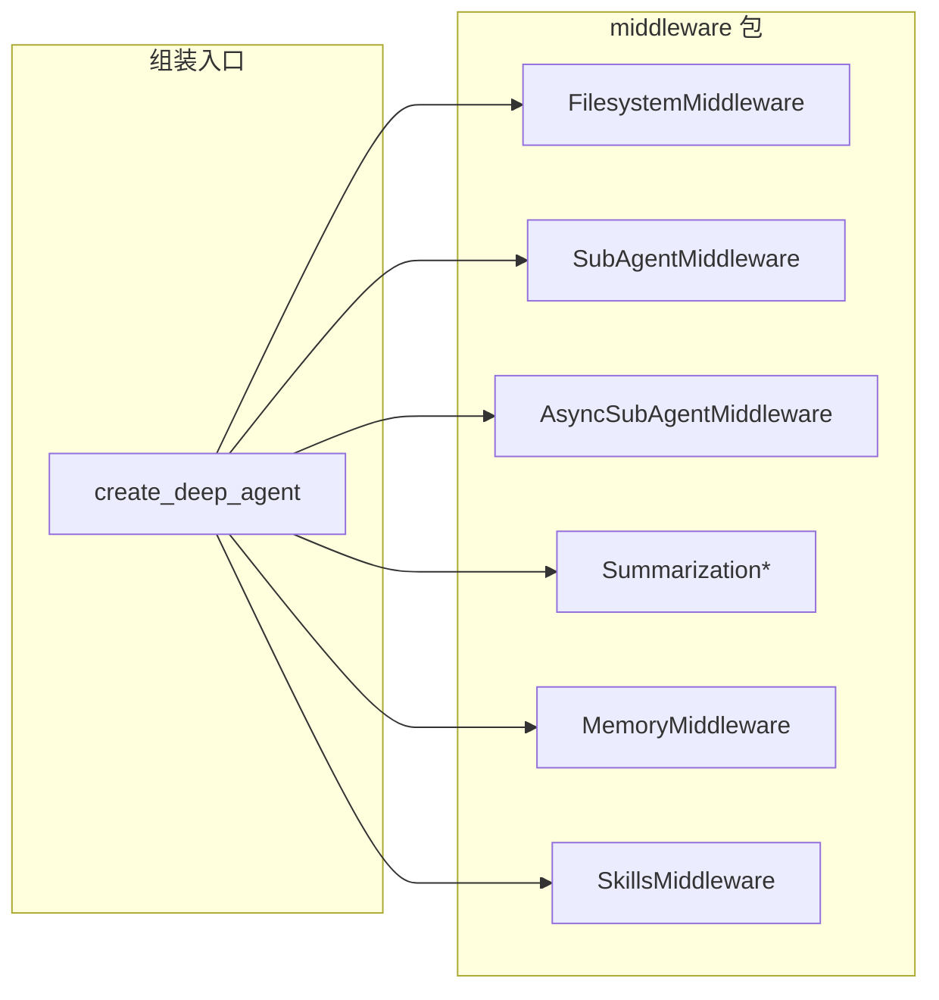

# 中间件体系总论

## 源码位置

- `libs/deepagents/deepagents/middleware/__init__.py`（包说明与公共导出）
- 各具体中间件：`libs/deepagents/deepagents/middleware/` 下各模块

---

## 1. LLM 侧「工具」的两条路径

在 Deep Agents 的设计里，模型最终看到的工具集合由两条路径合并而成（详见 `middleware/__init__.py` 顶部文档字符串）：

1. **SDK 中间件（本包）**：由中间件注册的 `tools`、对系统提示的注入，以及通过钩子对每次请求的拦截；任何通过 `create_deep_agent` 等 SDK 入口构建的 Agent 都会自动带上这套能力。
2. **调用方传入的普通工具**：通过 `create_deep_agent(..., tools=[...])` 等形式传入的可调用对象，更偏「集成方定制、轻量、与具体 CLI/应用绑定」。

二者在 `create_deep_agent()` 组装阶段被合并为模型最终可见的工具列表。

---

## 2. `AgentMiddleware` 与 `wrap_model_call()`

中间件继承 LangChain 侧的 `AgentMiddleware`，典型用法是**重写 `wrap_model_call()`（及异步的 `awrap_model_call()`）**：在**每一次**发往 LLM 的请求真正发出之前，对 `ModelRequest` 进行改写（系统消息、工具列表、消息列表等），再交给下游 `handler`。

这与「普通工具函数」有本质区别：**普通工具只能在被模型选中并调用时执行**，无法在「模型调用前」统一改写请求。

---

## 3. 中间件相对普通工具能做什么

| 能力 | 说明 | 典型例子 |
|------|------|----------|
| **按次过滤工具** | 根据运行时解析出的 backend 等条件，动态从本次请求中移除某些工具 | `FilesystemMiddleware`：当 backend 未实现 `SandboxBackendProtocol` 时，从请求中去掉 `execute` |
| **注入系统提示** | 每次调用前把说明追加进 system 消息，让模型知道如何用配套工具 | `MemoryMiddleware`、`SkillsMiddleware` |
| **变换消息** | 在进模型前裁剪、替换、统计 token 等 | `SummarizationMiddleware`：统计 token、截断旧工具参数、在上下文将满时用摘要替换历史 |
| **跨轮状态** | 配合带 reducer 的 state schema，在多轮对话间保留结构化状态 | 摘要相关事件、异步任务表等 |

**普通工具**不具备上述「请求前拦截」能力，也通常不承担「整段对话级」的状态机职责。

---

## 4. 何时用中间件、何时用普通工具

**优先中间件**，当需要：

- 按调用动态修改系统提示或工具列表；
- 在多轮之间维护与「请求管线」相关的状态；
- 希望能力对**所有 SDK 消费者**默认可用（而非仅某个 CLI）。

**优先普通工具**，当：

- 逻辑无状态、自包含；
- 不需要改系统提示、不需要在每次 LLM 调用前做统一预处理；
- 工具仅服务于某一集成方或单一应用场景。

---

## 5. `middleware/__init__.py` 导出的完整公共 API

以下符号在 `__all__` 中列出，属于 Deep Agents 对外承诺的中间件相关入口：

```61:73:libs/deepagents/deepagents/middleware/__init__.py
__all__ = [
    "AsyncSubAgent",
    "AsyncSubAgentMiddleware",
    "CompiledSubAgent",
    "FilesystemMiddleware",
    "MemoryMiddleware",
    "SkillsMiddleware",
    "SubAgent",
    "SubAgentMiddleware",
    "SummarizationMiddleware",
    "SummarizationToolMiddleware",
    "create_summarization_tool_middleware",
]
```

导入关系（同文件）将各实现类从子模块集中 re-export，便于调用方单点导入。

---

## 6. 模块关系（简图）



主图组装逻辑见 `libs/deepagents/deepagents/graph.py`；各中间件在 `wrap_model_call` 中与 `create_agent` 的工具合并、消息流水线协同工作。

---

## 7. 设计要点小结

- **中间件 = 请求管线扩展点**：以「每次模型调用」为粒度做横切能力（工具可见性、提示词、消息形态、状态）。
- **普通工具 = 模型决策后的执行单元**：适合业务动作，不适合替代「调用前」的策略与状态管理。
- **以 `__init__.py` 的 `__all__` 为准**判断哪些类型属于稳定对外 API；其余子模块中的符号可能更偏内部实现。
