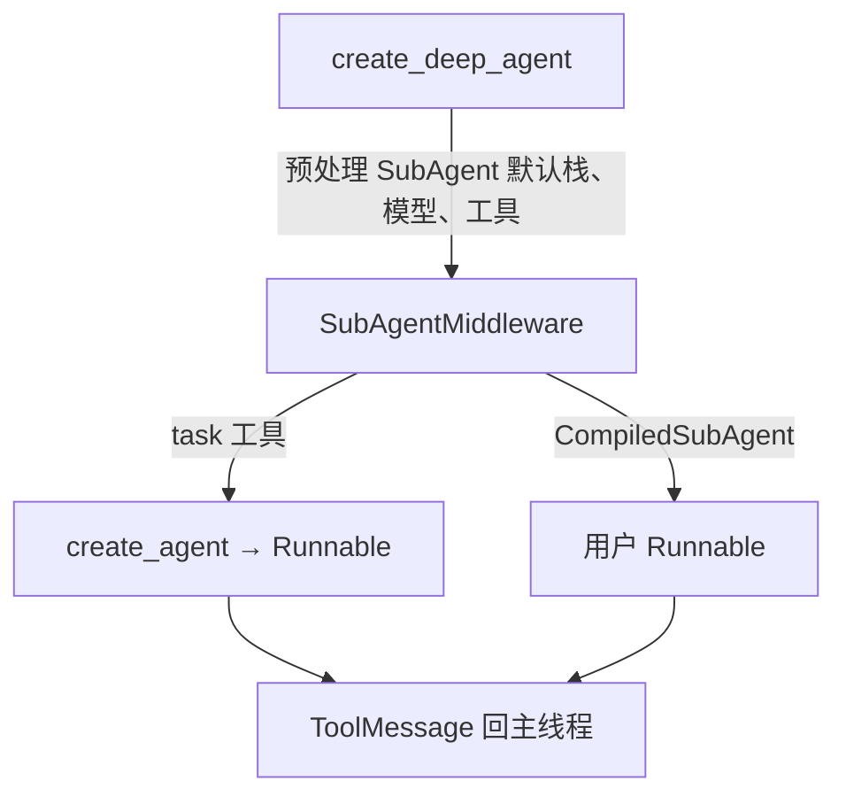

# SubAgentMiddleware：子代理中间件

## 源码位置

- **主实现**：`libs/deepagents/deepagents/middleware/subagents.py`
- **与主图集成、子代理默认中间件栈**：`libs/deepagents/deepagents/graph.py`（`create_deep_agent`）
- **异步远程子代理**（对照）：`libs/deepagents/deepagents/middleware/async_subagents.py`

---

## 1. 三种子代理规格（TypedDict）

### 1.1 `SubAgent`：声明式同步子代理

包含 `name`、`description`、`system_prompt`；可选 `tools`、`model`、`middleware`、`interrupt_on`、`skills`。文档说明在通过 `create_deep_agent` 使用时，会自动获得默认中间件栈（见下文第 4 节）。

```21:53:libs/deepagents/deepagents/middleware/subagents.py
class SubAgent(TypedDict):
    """Specification for an agent.

    When using `create_deep_agent`, subagents automatically receive a default middleware
    stack (TodoListMiddleware, FilesystemMiddleware, SummarizationMiddleware, etc.) before
    any custom `middleware` specified in this spec.
    ...
    Optional fields:
        tools: Tools the subagent can use.
        ...
        middleware: Additional middleware for custom behavior, logging, or rate limiting.
        interrupt_on: Configure human-in-the-loop for specific tools.
        skills: Skill source paths for SkillsMiddleware.
```

### 1.2 `CompiledSubAgent`：预编译 Runnable

提供 `name`、`description` 与 **`runnable`**（`langchain_core.runnables.Runnable`）。约定子代理结束时的状态里必须包含 `messages`，最后一条消息文本会作为 `ToolMessage` 返回主代理。

### 1.3 `AsyncSubAgent`（`async_subagents.py`）

用于远程、后台任务（`graph_id`、`url`、`headers` 等），由 `AsyncSubAgentMiddleware` 暴露 `start_async_task` 等工具，**不走**本文的同步 `task` 工具路径。

---

## 2. `SubAgentMiddleware` 与 `wrap_model_call()`

该类向 Agent 注册 **`task` 工具**，并在 `wrap_model_call()` / `awrap_model_call()` 中把「如何使用子代理」的说明追加到系统消息（通过 `append_to_system_message`）。

```520:529:libs/deepagents/deepagents/middleware/subagents.py
    def wrap_model_call(
        self,
        request: ModelRequest[ContextT],
        handler: Callable[[ModelRequest[ContextT]], ModelResponse[ResponseT]],
    ) -> ModelResponse[ResponseT]:
        """Update the system message to include instructions on using subagents."""
        if self.system_prompt is not None:
            new_system_message = append_to_system_message(request.system_message, self.system_prompt)
            return handler(request.override(system_message=new_system_message))
        return handler(request)
```

**设计要点**：子代理的「调度策略」写在系统提示里，工具本体负责按 `subagent_type` 分发；两者配合降低模型误用概率。

---

## 3. `task` 工具行为

- **入参**：`TaskToolSchema` —— `description`（任务说明）、`subagent_type`（子代理名称）。
- **分发**：根据名称在预构建的 `subagent_graphs` 中选取 `Runnable`，准备子状态（从父状态过滤 `_EXCLUDED_STATE_KEYS`），将任务描述封装为 `HumanMessage`，调用 `invoke` / `ainvoke`。
- **返回**：子代理最终状态若含 `messages`，取**最后一条**文本，strip 后作为 `ToolMessage` 写回父图（`Command` 更新）。

`CompiledSubAgent` 直接使用调用方提供的 `runnable`；声明式 `SubAgent` 在 `SubAgentMiddleware._get_subagents` 中通过 `create_agent()` 编译为 `Runnable`（此处要求 spec 已带 `model` 与 `tools` —— 通常由 `create_deep_agent` 预处理填入）。

---

## 4. 默认 `GENERAL_PURPOSE_SUBAGENT`

若用户提供的同步子代理列表中**没有**名为 `general-purpose` 的项，`create_deep_agent` 会自动插入默认通用子代理配置：

```282:287:libs/deepagents/deepagents/middleware/subagents.py
GENERAL_PURPOSE_SUBAGENT: SubAgent = {
    "name": "general-purpose",
    "description": DEFAULT_GENERAL_PURPOSE_DESCRIPTION,
    "system_prompt": DEFAULT_SUBAGENT_PROMPT,
}
```

插入逻辑（节选）：

```347:351:libs/deepagents/deepagents/graph.py
    if not any(spec["name"] == GENERAL_PURPOSE_SUBAGENT["name"] for spec in inline_subagents):
        # Add a general purpose subagent if it doesn't exist yet
        inline_subagents.insert(0, general_purpose_spec)
```

**设计意图**：保证主代理始终有一个「与主能力对齐的隔离上下文」可选，用于复杂检索、多步推理等，而无需用户重复配置。

---

## 5. `create_deep_agent` 中的子代理中间件栈继承

对**声明式 `SubAgent`**（非 `CompiledSubAgent`、非 `AsyncSubAgent`），`graph.py` 在传入 `SubAgentMiddleware` 之前会拼接默认栈：**TodoList → Filesystem → Summarization → PatchToolCalls →（可选）SkillsMiddleware → 用户 `middleware` → AnthropicPromptCaching**。

```321:333:libs/deepagents/deepagents/graph.py
            # Build middleware: base stack + skills (if specified) + user's middleware
            subagent_middleware: list[AgentMiddleware[Any, Any, Any]] = [
                TodoListMiddleware(),
                FilesystemMiddleware(backend=backend),
                create_summarization_middleware(subagent_model, backend),
                PatchToolCallsMiddleware(),
            ]
            subagent_skills = spec.get("skills")
            if subagent_skills:
                subagent_middleware.append(SkillsMiddleware(backend=backend, sources=subagent_skills))
            subagent_middleware.extend(spec.get("middleware", []))
            # "ignore" skips caching for non-Anthropic models (see comment above).
            subagent_middleware.append(AnthropicPromptCachingMiddleware(unsupported_model_behavior="ignore"))
```

**与 `SubAgent` 文档一致**：用户写在 spec 里的 `middleware` 接在默认栈与 Skills 之后，便于扩展而不必重写整套 Deep Agent 行为。

---

## 6. `interrupt_on` 传播规则

以下行为以 `create_deep_agent` 的文档与实现为准（与源码一致）：

- **声明式 `SubAgent`**：`subagent_interrupt_on = spec.get("interrupt_on", interrupt_on)` —— 默认继承顶层 `interrupt_on`，子代理若显式提供 `interrupt_on` 则**覆盖**继承值。
- **`CompiledSubAgent`**：**不继承**顶层 `interrupt_on`；人机协作需在 runnable 内部自行配置。
- **`AsyncSubAgent`**：**不继承**顶层 `interrupt_on`；审批逻辑应在远端图或部署侧实现。

在 `SubAgentMiddleware._get_subagents` 中，若声明式 spec 上存在 `interrupt_on`，会追加 `HumanInTheLoopMiddleware(interrupt_on=...)`（需配合 checkpointer 使用）。

---

## 7. 模块关系简图



---

## 8. 小结

- **统一入口**：`task` + 系统提示中的类型列表，构成主代理对子代理的编排面。
- **两种 Runnable 来源**：`create_agent()`（声明式）或用户 `CompiledSubAgent.runnable`。
- **默认通用子代理**：无 `general-purpose` 时自动注入，降低使用门槛。
- **栈继承在 `graph.py`**：`SubAgentMiddleware` 本身只消费「已加工」的 spec；深度默认行为由 `create_deep_agent` 负责，避免中间件与入口重复逻辑。
