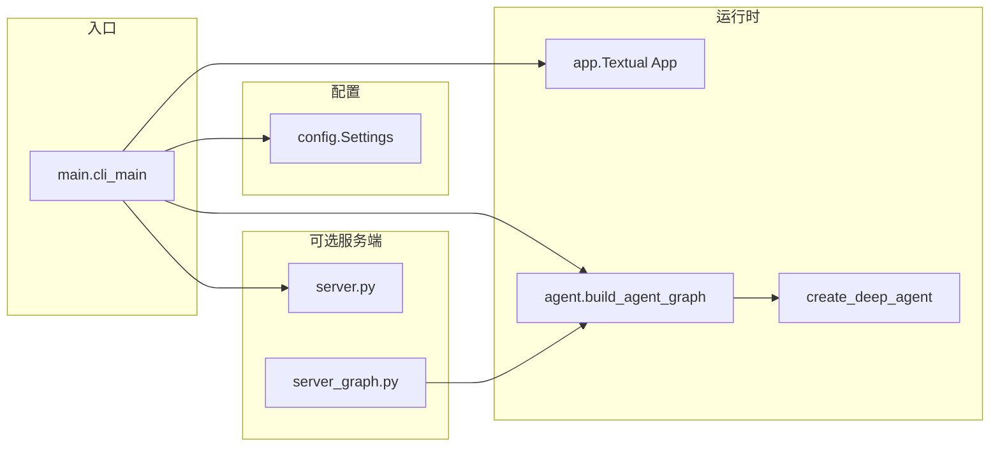

# 第 14 章：CLI 架构与入口

## 源码路径

- 本章分析目录：`libs/cli/deepagents_cli/`
- 包配置与入口声明：`libs/cli/pyproject.toml`

---

## 包与安装

- **PyPI 包名**：`deepagents-cli`（见 `libs/cli/pyproject.toml` 中 `[project].name`）。
- **安装**：`pip install deepagents-cli`。
- **控制台脚本**（`[project.scripts]`）：
  - `deepagents` → `deepagents_cli:cli_main`
  - `deepagents-cli` → `deepagents_cli:cli_main`  
  二者指向同一入口，便于用户习惯不同命令名。

**设计取舍**：双入口名称降低迁移成本；实际逻辑集中在 `cli_main`，避免重复实现。

---

## 核心模块职责

| 模块 | 路径 | 职责概要 |
|------|------|----------|
| 入口 | `deepagents_cli/main.py` | `cli_main()`：参数解析、模式分发（交互 TUI、无头、ACP、skills 子命令等） |
| TUI 应用 | `deepagents_cli/app.py` | 基于 Textual 的终端 UI、会话与消息流 |
| Agent 构建 | `deepagents_cli/agent.py` | 组装中间件、后端、工具，调用 `create_deep_agent`（约第 1202 行） |
| 配置 | `deepagents_cli/config.py` | `Settings` 数据类、`from_environment()`、`create_model()`、`ModelResult` 等 |
| 服务端生命周期 | `deepagents_cli/server.py` | 启动/停止 LangGraph 开发服务器、生成 `langgraph.json` 等 |
| 服务端图 | `deepagents_cli/server_graph.py` | 供 `langgraph dev` 加载的图入口；与 `ServerConfig` 环境变量约定对齐 |

**模块关系（简图）**：

---

## 调用链与启动路径

典型交互路径可概括为：

1. **`cli_main()`**（`main.py`）被 console script 调用。
2. **`parse_args()`** 解析命令行；部分快速路径（如 `--version`）在重依赖导入前返回。
3. 在需要完整配置的路径上，通过 **`deepagents_cli.config`** 的 `settings` / **`Settings.from_environment()`** 拉取环境与文件配置。
4. **`agent.py`** 中逻辑构造模型、中间件、后端（含本地/沙箱分支），最终调用 **`create_deep_agent(...)`**（SDK）得到可执行图/代理。
5. 交互模式由 **`app.py`** 中的 Textual 应用承载会话；无头或服务模式走 **`non_interactive.py`**、`server_manager` / **`server.py`** 等分支。

**设计取舍**：`main.py` 在 `parse_args` 之后再导入 `console`/`settings`，使 `--help` 不必承担完整配置引导成本（见 `cli_main` 内注释）。

---

## `__init__.py` 与延迟导入

`deepagents_cli/__init__.py` 通过 **`__getattr__`** 在首次访问 `cli_main` 时才执行 `from deepagents_cli.main import cli_main`。

**目的**：避免在仅引用子模块（如 `config`、`widgets`）时加载 `main.py` 及其 argparse、信号处理等启动栈，从而优化冷启动与测试导入性能。

---

## 配置体系：`Settings` 与环境

`config.py` 中的 **`Settings`**（`@dataclass`）集中描述 API Key、模型、项目根、Shell 白名单、技能目录扩展等。

- **`Settings.from_environment(cls, *, start_path=...)`**：从环境检测并构造实例；与一次性 bootstrap（dotenv、LangSmith 等）配合使用。
- **`create_model(...)`** 与 **`ModelResult`**：将模型规格解析为可调用模型实例并携带元数据（如 profile、标签来源），供 agent 构建与中间件使用。

### 环境变量前缀 `DEEPAGENTS_CLI_`

规范登记在 **`deepagents_cli/_env_vars.py`**：凡 CLI 读取且以 `DEEPAGENTS_CLI_` 开头的变量应在此定义常量，并有漂移检测测试约束裸字符串使用。

示例语义（非穷举）：

- `DEEPAGENTS_CLI_LANGSMITH_PROJECT`：覆盖代理轨迹所用的 LangSmith 项目名。
- `DEEPAGENTS_CLI_SHELL_ALLOW_LIST`：本地模式下 Shell 命令白名单相关配置。
- `DEEPAGENTS_CLI_EXTRA_SKILLS_DIRS`：技能路径容器的额外允许根目录。

另有 **`resolve_env_var`** 机制：对第三方 API Key 等支持 `DEEPAGENTS_CLI_{NAME}` 优先于 `{NAME}` 的覆盖策略（详见 `_env_vars.py` 文档字符串）。

### TOML：`~/.deepagents/config.toml`

用于持久化用户级配置（如模型 profile、`[skills].extra_allowed_dirs` 等），与命令行、环境变量按文档约定合并优先级。

### dotenv

`config.py` 在 bootstrap 阶段加载项目目录与全局路径下的 `.env`（`override=False`，shell 已导出变量优先）。

### LangSmith 项目分离

Bootstrap 可将 **`LANGSMITH_PROJECT`** 临时改为代理专用项目（来自 `DEEPAGENTS_CLI_LANGSMITH_PROJECT`），同时保留用户原始项目名供子 Shell/用户代码追踪使用（见 `cli_main` 与 `Settings` 字段 `user_langchain_project` / `deepagents_langchain_project`）。

---

## 无头模式（非交互）

**`deepagents_cli/non_interactive.py`** 提供 `run_non_interactive`：单次任务、流式输出、通过 LangGraph 子进程与远程客户端协作；支持 **`--quiet`** 将控制台噪声与标准输出分离，以及 **`--shell-allow-list`** 控制非交互场景下的 Shell 策略。

**设计取舍**：无头路径与 TUI 解耦，便于 CI、脚本与自动化流水线复用同一 agent 构建逻辑。

---

## 网络搜索集成

依赖 **Tavily**（`TAVILY_API_KEY` 等）；`Settings` 暴露 `has_tavily` 等能力位。工具层在 **`deepagents_cli/tools.py`**（如 `web_search`）与 **`server_graph.py`** 中按配置条件挂载，使服务端图与本地逻辑行为一致。

---

## 服务端模式概要

- **`server.py`**：管理 `langgraph dev` 子进程、健康检查、端口与配置落盘。
- **`server_graph.py`**：模块级 `make_graph()`，通过 **`ServerConfig.from_env()`** 与 CLI 侧 **`ServerConfig.to_env()`** 共享 schema，保证父子进程配置一致。

---

## 小结

`deepagents-cli` 以 **`cli_main`** 为单一事实入口，用延迟导入与分阶段加载控制启动成本；**`Settings` + TOML + dotenv + `DEEPAGENTS_CLI_*`** 形成分层配置；**`agent.py`** 在本地与远程沙箱分支上收敛到 SDK 的 **`create_deep_agent`**；**`server.py` / `server_graph.py`** 将同一套 agent 能力暴露为可托管的远程图。以上设计使「终端交互、脚本无头、LangGraph 服务」共享核心构建路径，又各自优化边界行为。
