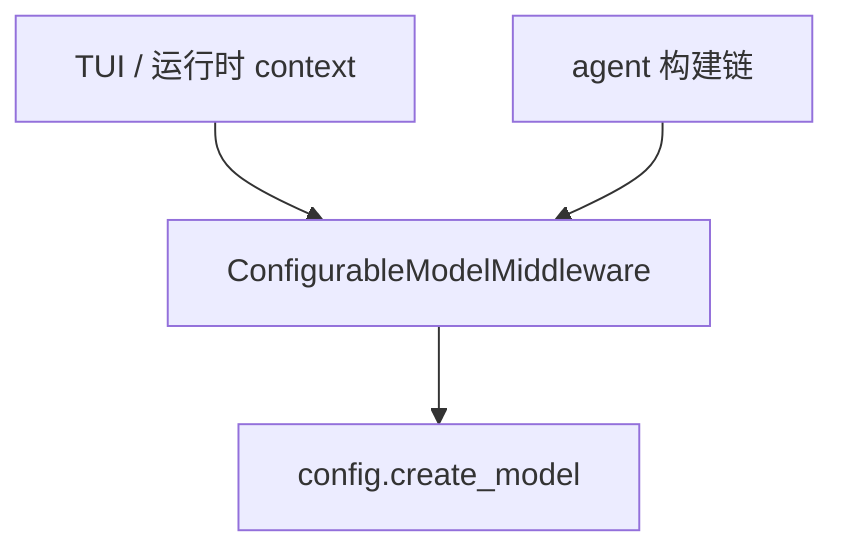

# 第 15 章：CLI 沙箱与集成工厂

## 源码路径

- 本章重点目录：`libs/cli/deepagents_cli/integrations/`
- 关联文件：
  - `deepagents_cli/integrations/sandbox_factory.py`
  - `deepagents_cli/integrations/sandbox_provider.py`
  - `deepagents_cli/configurable_model.py`
  - `deepagents_cli/agent.py`（后端组合、CLI 专属中间件）
- 可选依赖声明：`libs/cli/pyproject.toml` 中 `[project.optional-dependencies]`（`daytona`、`modal`、`runloop`、`agentcore` 等）

---

## 沙箱工厂：`sandbox_factory.py`

**`create_sandbox(provider, ...)`** 是统一上下文管理入口：按 **provider 名称** 解析具体 **`SandboxProvider`**，创建或连接沙箱，可选执行用户 setup 脚本（支持 `${VAR}` 展开），并在退出时按是否「本次新建」决定是否清理。

**支持的 provider 类型**（与代码中映射一致，实际可用性取决于可选依赖是否安装）包括但不限于：

- **`daytona`** → 动态导入 **`langchain_daytona`**（包名 `langchain-daytona`）
- **`modal`** → **`langchain_modal`**（`langchain-modal`）
- **`runloop`** → **`langchain_runloop`**（`langchain-runloop`）
- **`agentcore`** → **`langchain_agentcore_codeinterpreter`**
- 另有 **`langsmith`** 等路径用于特定托管场景

**`_get_provider`** 将字符串名称映射到 `(模块名, 工厂属性)`，在缺少依赖时给出可读的安装提示。

**设计取舍**：

- **工厂 + Provider 抽象**：CLI 与具体云沙箱 SDK 解耦，新增供应商时主要扩展映射与可选依赖组。
- **延迟 import**：仅在用户选择对应后端时才加载重依赖，缩短默认本地模式的启动时间。

---

## `ConfigurableModelMiddleware`：`configurable_model.py`

该类实现 **运行时模型切换**：在 LangGraph 运行时上下文中注入 **`CLIContext`** 风格的 `model` / `model_params` 时，中间件在 **`ModelRequest`** 链上调用 **`create_model`** 解析新实例并 **`request.override()`**。

**跨厂商切换**时剥离 Anthropic 专属字段（如 `cache_control`），并同步修补系统提示中的模型身份段落，避免残留不兼容参数。

**与 CLI 的关系**：配合 TUI 中的 **`/model`** 等路径，使用户无需重编译图即可更换 LLM，同时保持与 `config.create_model` 单一解析入口一致。

**模块关系**：

---

## `CompositeBackend` 在 CLI 中的用法：`agent.py`

在 **本地模式**（`sandbox is None`）下，CLI 在默认工作区后端之外，再挂接两个 **虚拟 `FilesystemBackend`** 分区：

- 前缀 **`/large_tool_results/`**：大型工具输出落盘，避免污染用户工作目录。
- 前缀 **`/conversation_history/`**：会话历史相关 offload，与摘要等中间件协同。

二者通过 **`CompositeBackend(default=..., routes={...})`** 做 **路径前缀路由**；**远程沙箱模式**下通常 **`routes={}`**，由沙箱后端统一承载。

**说明**：此处「会话/大结果」后端在实现上是 **带 `virtual_mode` 的 `FilesystemBackend` 临时目录**，而非名称上的 `StateBackend`；语义上仍属于「按路径前缀隔离存储」的组合后端模式。

**设计取舍**：

- 默认后端仍是 **`LocalShellBackend` 或 `FilesystemBackend`**（视是否启用 Shell），复合路由只解决 **体量与历史** 的隔离。
- 沙箱模式简化路由，避免与远程文件语义冲突。

---

## CLI 在 SDK 中间件栈之上的扩展

`agent.py` 在调用 **`create_deep_agent`** 前组装的 `agent_middleware` 典型包含（按配置开关）：

- **`MemoryMiddleware`**：用户/项目 `AGENTS.md` 等记忆源。
- **`SkillsMiddleware`**：多路径技能发现（内置、用户、项目等）。
- **`LocalContextMiddleware`**：可执行后端上的 git/目录树等本地上下文。
- **`ShellAllowListMiddleware`**：在 **restrictive shell allow list** 激活时限制 Shell 工具可执行命令集合；与 **`interrupt_on`** 策略联动（白名单模式下以工具错误消息拒绝非法命令，保持单次 LangSmith trace 连续）。
- **`create_summarization_tool_middleware`**：与 **`composite_backend`** 绑定，服务上下文压缩与 offload。
- **`ConfigurableModelMiddleware`**：运行时换模。
- 以及 HITL、询问用户、子代理等 CLI 场景所需中间件。

**设计取舍**：在 SDK 默认能力之上，CLI 聚焦 **终端安全（Shell）**、**上下文体积** 与 **交互式模型切换**，而不重复实现核心 agent 图逻辑。

---

## 本地模式下的 Shell 安全：允许列表

环境常量 **`DEEPAGENTS_CLI_SHELL_ALLOW_LIST`**（见 `_env_vars.py`）与设置中的解析结果，用于定义 **非交互/受限模式** 下允许的 Shell 命令集合（如 `recommended`、`all` 或显式列表）。

**`ShellAllowListMiddleware`** 在 agent 管道内执行策略，disallowed 命令以 **ToolMessage 错误** 形式返回，而非依赖额外人机轮次。

**设计取舍**：将策略放在中间件层，使 **策略与 UI（是否 auto-approve）** 可组合，且 trace 行为可预测。

---

## 与 `sandbox_provider.py` 的关系

**`SandboxProvider`** 协议封装 **`get_or_create`** 等生命周期；**`sandbox_factory`** 负责脚本执行、工作目录映射（如各 provider 默认 cwd）、错误消息与 Rich 控制台输出。

---

## 小结

**`integrations/`** 将 **Daytona / Modal / Runloop / AgentCore** 等伙伴包收敛为统一 **`create_sandbox`** 工厂；**`configurable_model.py`** 把 **动态选模** 做成标准中间件；**`agent.py`** 用 **`CompositeBackend`** 做 **大结果与对话历史的路径隔离**，并叠加 **Shell 白名单** 等 CLI 专属中间件。整体上，CLI 在复用 deepagents SDK 核心的同时，把 **远程执行环境** 与 **终端安全/上下文治理** 固化在集成层。
