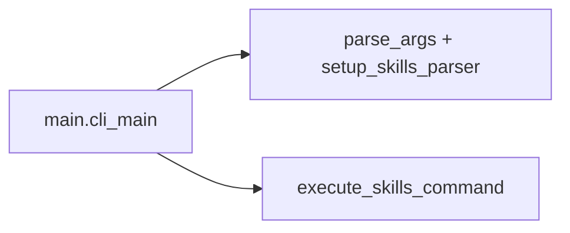
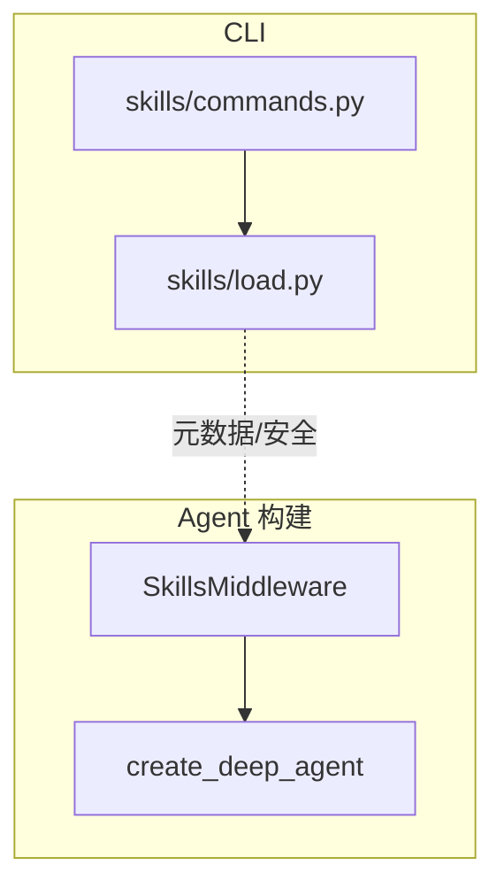

# 第 16 章：CLI 技能系统与 Slash 命令

## 源码路径

- 内置技能资源：`libs/cli/deepagents_cli/built_in_skills/`
- 技能子命令与加载：`libs/cli/deepagents_cli/skills/`（含 `commands.py`、`load.py`、`invocation.py` 等）
- Slash 命令注册：`libs/cli/deepagents_cli/command_registry.py`
- 终端组件：`libs/cli/deepagents_cli/widgets/`（如 `chat_input.py`、`messages.py`）
- Agent 侧挂载：`libs/cli/deepagents_cli/agent.py`（`SkillsMiddleware`）
- 入口 wiring：`libs/cli/deepagents_cli/main.py`

---

## 内置技能：`built_in_skills/`

目录内随 CLI 分发 **预打包技能**（每个技能通常含 **`SKILL.md`** 及可选 `scripts/`）。例如：

- **`remember`**：与会话记忆、技能更新相关的引导内容。
- **`skill-creator`**：创建新技能的规范与辅助脚本（如 `init_skill.py`、`quick_validate.py`）。

**设计取舍**：内置技能作为 **只读模板与规范源**，保证离线可用与版本一致性；用户扩展仍落在用户/项目标准目录。

---

## 技能模块：`skills/`

### `setup_skills_parser` 与 `execute_skills_command`（`skills/commands.py`）

- **`setup_skills_parser`**：向主 argparse 树注册 **`deepagents skills`** 子命令（`list` / `create` / `info` / `delete` 等），统一 CLI 参数与校验逻辑。
- **`execute_skills_command`**：根据解析后的 **`argparse.Namespace`** 执行对应子命令；在 `main.py` 的技能分支中调用。

**`skills/__init__.py`** 导出上述符号，便于 `main` 延迟导入。

**与 `main.py` 的关系**：

### 加载与 SDK 集成：`load.py` / `invocation.py`

- **`load.py`**：扩展元数据、路径安全（与 `Settings` 中 **extra_allowed_dirs** 协同）等，为 **发现与读取 `SKILL.md`** 提供 CLI 侧能力；底层与 **`deepagents.middleware.skills.SkillsMiddleware`** 的约定对齐。
- **`invocation.py`**：处理运行期技能调用相关逻辑（与消息、工具展示配合）。

**设计取舍**：CLI 负责 **文件系统布局、路径校验与 UX**；**`SkillsMiddleware`** 负责 **在 agent 运行时** 将技能注入为模型可见能力。

---

## `SkillsMiddleware` 与技能发现：`agent.py`

启用技能时，`agent.py` 按 **优先级从低到高** 拼接 `sources` 列表，通常包括：

1. **内置技能目录** `settings.get_built_in_skills_dir()`
2. 用户 **`~/.deepagents`** / **`~/.agents`** 下技能目录
3. 项目下 **`.deepagents` / `.agents`**（若存在）
4. 实验性 **Claude Code** 技能目录（若存在）

**`SkillsMiddleware`** 使用 **`FilesystemBackend`** 作为后端，`sources` 为上述路径列表，从而在 **`create_deep_agent`** 之前完成与 SDK 的对接。

**模块关系**：

---

## Slash 命令注册：`command_registry.py`

**`COMMANDS`** 为元组，元素为 **`SlashCommand` 数据类**（`name`、`description`、`bypass_tier`、`aliases`、`hidden_keywords` 等）。

**`BypassTier`** 枚举描述命令在 UI **忙态/队列** 下是否可插队执行，例如：

- **`QUEUED`**：需排队。
- **`IMMEDIATE_UI`**：立即打开界面（如模型选择），重活可延后。
- **`SIDE_EFFECT_FREE`**：轻量侧效可立即执行。

**设计取舍**：**单一注册表**生成自动补全与 bypass 元数据，避免在多个文件中硬编码命令字符串导致漂移。

---

## 与 Slash 集成的 Widget：`widgets/`

### `chat_input.py`

- 基于 **Textual** 的 **`TextArea`** 等组件实现聊天输入。
- 集成 **`SlashCommandController`**（见 `widgets/autocomplete.py`）与 **`SLASH_COMMANDS`**，在输入 **`/`** 时提供 **模糊匹配、描述搜索、别名**。
- 绑定 **`HistoryManager`**（`widgets/history.py`）持久化命令历史（默认 `~/.deepagents/history.jsonl`）。

### `messages.py`

- 负责 **消息列表渲染**、工具调用展示、流式更新等与对话主视图相关的 UI（与 `message_store.py`、`tool_renderers.py` 等协同）。

**设计取舍**：输入与展示分离，便于单独测试自动补全与消息管线；Slash 行为与 **`command_registry`** 共享数据源。

---

## 应用层分发：`app.py`

Textual 应用在 **`ChatInput`** 提交行中识别 **`/command`** 形式，按注册表 **路由到具体处理器**（部分技能相关命令带参数，如文档中的 **`/skill:...`** 交互模式）。

**设计取舍**：Slash 层是 **纯 UI 侧快捷方式**；真正 **技能能力** 仍由 **`SkillsMiddleware` + 模型** 在 agent 内消费 `SKILL.md`。

---

## 与 SDK `SkillsMiddleware` 的衔接

| 层次 | 职责 |
|------|------|
| **CLI `skills/`** | 子命令管理、磁盘布局、名称校验、路径 containment、用户文档与错误信息 |
| **CLI `agent.py`** | 组装 `sources` 列表并实例化 `SkillsMiddleware` |
| **SDK** | 解析 `SKILL.md`、向 agent 暴露技能工具与提示注入 |

---

## 小结

**`built_in_skills/`** 提供 **版本化、可复现** 的起步技能；**`skills/commands.py`** 通过 **`setup_skills_parser` / `execute_skills_command`** 把技能管理纳入主 CLI；**`command_registry.py`** 统一 **Slash 命令元数据与队列策略**；**`widgets/chat_input`** 与 **`messages`** 在 Textual 中落地 **输入补全与消息视图**；**`agent.py`** 将多源目录交给 **`SkillsMiddleware`**，与 **`create_deep_agent`** 形成闭环。整体上，CLI 在 **「文件与 UX」** 层扩展 SDK 的 **「运行时技能」** 能力，并保持单一数据源以避免命令名与描述不一致。
