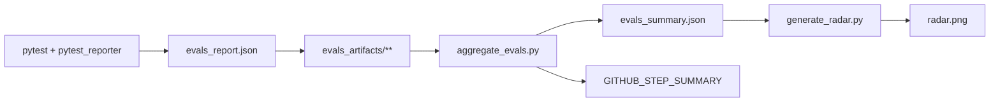

# 第 18 章：评估报告与指标系统

**主要源码路径**

- `libs/evals/tests/evals/pytest_reporter.py`
- `libs/evals/deepagents_evals/radar.py`
- `.github/scripts/aggregate_evals.py`

本章说明一次 pytest 评估跑完后，终端摘要、JSON 报告、核心指标定义、雷达图生成，以及 GitHub Actions 中如何聚合多份 `evals_report.json`。

---

## 1. pytest 报告插件（`pytest_reporter.py`）

该文件作为 pytest 插件注册（见 `conftest.py` 中的 `pytest_plugins`），在收集、运行与收尾阶段维护全局状态并写出制品。

### 1.1 会话结束后的终端摘要

`pytest_sessionfinish` 中通过 `terminalreporter` 输出 **`deepagents evals summary`** 分隔块，包括：

- `created_at`、`sdk_version`、`model`
- 通过 / 失败 / 跳过 / 总数
- 聚合指标（见下文）
- 若存在多条 LangSmith 实验链接，单独一节列出（含可选 `public_url`）

### 1.2 JSON 报告路径

- **CLI**：`--evals-report-file <路径>`
- **环境变量**：若未传 CLI，默认读取 `DEEPAGENTS_EVALS_REPORT_FILE`

写入内容为 **排序键的 JSON**（`indent=2`），父目录不存在时会创建。该文件是 CI 聚合脚本的输入之一。

### 1.3 LangSmith 实验预创建

当设置环境变量 **`LANGSMITH_TEST_SUITE`** 时，`pytest_sessionstart` 会尝试在首轮测试前调用 LangSmith 内部 API（`_start_experiment` 等）**预先创建实验**，并把实例注册到 `_LangSmithTestSuite._instances`，以便后续 `@test` 装饰器复用同一实验，从而在跑测开始即可在终端打印对比链接（含数据集 `compare?selectedSessions=` URL）。

**设计说明**：依赖 LangSmith 私有内部 API，失败时以 stderr 警告形式降级，不阻塞整次 pytest。

### 1.4 其他钩子要点

- `pytest_configure`：将 `tests.evals.utils._on_efficiency_result` 设为向 `_EFFICIENCY_RESULTS` 追加回调，与 `run_agent` 内的效率记录衔接。
- `pytest_collection_modifyitems`：建立 `nodeid -> eval_category` 映射，供分类正确率统计。
- `pytest_runtest_logreport`：在 `when == "call"` 时累加计数、时长，并回填最近一条 `EfficiencyResult` 的 `duration_s` 与 `passed`。

**注意**：插件在 `session.exitstatus == 1` 时将 `exitstatus` 置为 `0`，以便在「有失败用例」时仍能完成报告写出（具体策略以仓库 CI 约定为准）。

---

## 2. 核心指标定义

以下字段由 `pytest_sessionfinish` 组装的 `payload` 给出（与 JSON 报告一致）。

### 2.1 `correctness`

- **含义**：`passed / total`（会话内计入摘要的测试调用总数为分母），保留两位小数。
- **解释**：在「会话级」意义上，等价于 **通过所有成功断言** 的用例比例（因失败用例由成功断言触发 `pytest.fail`）。

### 2.2 `step_ratio`

- **计算**：`_micro_step_ratio()` —— 对所有提供了 **期望步数** 的用例，计算  
  \(\sum \text{actual\_steps} / \sum \text{expected\_steps}\)，再四舍五入到两位小数。
- **缺失**：若没有任何用例带期望步数，则为 `null`（JSON 中省略或键为 `null`，视序列化而定）。

### 2.3 `tool_call_ratio`

- **计算**：与 `step_ratio` 类似，对 **期望工具调用次数** 做微平均（总和比）。

### 2.4 `solve_rate`

- **计算**：对每条 `EfficiencyResult`，若存在 `expected_steps` 与 `duration_s`：通过则用 `expected_steps / duration_s`（时长为 0 时贡献 0），失败则贡献 0；再对所有此类用例取 **算术平均**，保留四位小数。
- **直觉**：在「步数期望」存在时，刻画单位时间内相对期望步数的吞吐（仅作辅助指标，受模型延迟与任务难度影响）。

### 2.5 `median_duration_s`

- **含义**：每次测试 `call` 阶段墙钟时间（秒）的 **中位数**，保留四位小数。

### 2.6 `category_scores`

- **含义**：按 `eval_category` 标记汇总的 **分类正确率**：每个分类内 `passed / (passed + failed)`（跳过不计入该分类分母）。

---

## 3. 雷达图（`deepagents_evals/radar.py`）

### 3.1 `ModelResult`

```python
@dataclass(frozen=True)
class ModelResult:
    model: str
    scores: dict[str, float]  # 分类 -> [0, 1] 正确率
```

### 3.2 `generate_radar`

- **签名**：`generate_radar(results: list[ModelResult], *, categories=None, title=..., output=..., figsize=...)`
- **行为**：使用 **matplotlib** 极坐标图，按 `categories`（默认 `EVAL_CATEGORIES`，来自 `categories.json` 的 `radar_categories`）绘制每个模型一条封闭折线，径向范围为 \([0, 1]\)，并在点上标注百分比。
- **依赖**：需安装带图表依赖的环境（文档与 `pyproject` 中常见说明为 `uv sync --extra charts`）。

### 3.3 与分类过滤跑测的关系

命令行脚本 `libs/evals/scripts/generate_radar.py` 在汇总结果时，若各模型 `scores` 中出现的分类数 **少于 3**，会 **跳过** 绘图并以退出码 0 退出（避免窄分类筛选跑测产生无意义的低维雷达）。同时会按 `EVAL_CATEGORIES` 顺序排列已知轴，并排除仅属于 `ALL_CATEGORIES` 但不在 `EVAL_CATEGORIES` 的项（如 `unit_test`）。

### 3.4 生成入口

- **`scripts/generate_radar.py`**：支持 `--toy`、`--summary evals_summary.json`、`--results` 等数据源，输出 PNG（及可选每模型单独图）。

`load_results_from_summary` 可从聚合后的 summary JSON 数组读取 `model` 与 `category_scores` 转为 `ModelResult` 列表。

---

## 4. CI 聚合（`.github/scripts/aggregate_evals.py`）

### 4.1 输入与输出

- **扫描**：`evals_artifacts/**/evals_report.json`（递归 glob）
- **写出**：当前工作目录下的 **`evals_summary.json`**，内容为 **所有报告行的 JSON 数组**（便于多模型、多 job 合并）

### 4.2 `GITHUB_STEP_SUMMARY`

若存在环境变量 **`GITHUB_STEP_SUMMARY`**，脚本将 Markdown 写入该文件，供 GitHub Actions 界面展示，包括：

1. **Evals summary**：按 provider 分组、按正确率排序的总表（`model`, `passed`, `failed`, `skipped`, `total`, `correctness`, `solve_rate`, `step_ratio`, `tool_call_ratio`, `median_duration_s`）
2. **Ranked by correctness / solve rate**：另一排序视角
3. **Per-category correctness**：从各报告的 `category_scores` 并集构建列，表头使用 `categories.json` 的 `labels`
4. 可选脚注：当部分行缺少效率类指标时，说明 `solve_rate` / `step_ratio` / `tool_call_ratio` 仅在有期望步数/工具调用配置的用例中才有意义
5. **LangSmith experiments**：从 `experiment_links` 或退化为 `experiment_urls` 渲染链接

同时相同内容 **`print` 到 stdout**，便于日志归档。

### 4.3 模块关系示意



---

## 5. 设计小结

- **终端 + JSON 双通道**：人机可读摘要与机器可读制品并存，CI 只做聚合不加业务逻辑。
- **指标分层**：`correctness` 是会话主指标；`step_ratio` / `tool_call_ratio` / `solve_rate` 依赖用例是否声明效率期望，解释时需对照用例设计。
- **雷达图**：面向 **跨分类模型对比**，故意排除 `unit_test`；窄跑测需依赖脚本内的「最少轴数」保护避免误导性图表。
