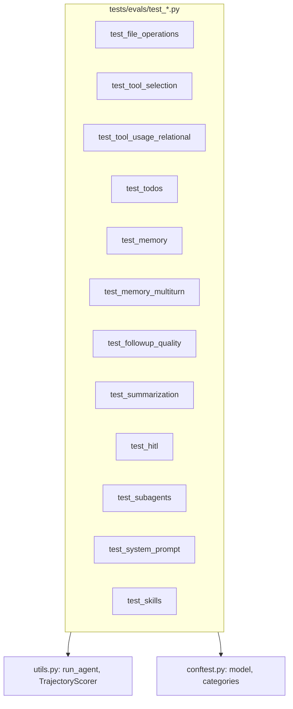

# 第 19 章：内置评估用例详解

**主要源码路径**

- `libs/evals/tests/evals/` 目录下各 `test_*.py` 文件

本章按测试文件梳理 **内置** 评估套件（不含第 20 章单独说明的外部基准与 tau2、MemoryAgentBench 目录）。每个文件均通过 `@pytest.mark.eval_category(...)` 或模块级 `pytestmark` 打上分类，供 `--eval-category` 筛选与 `category_scores` 聚合。

---

## 1. `test_file_operations.py`

**分类**：`file_operations`（多数用例）、`retrieval`（检索相关子集）

**评估焦点**

- **文件类工具**：读、写、编辑、列目录等典型工作流；并行读、并行写；在 **种子文件状态** 下完成任务。
- **检索类能力**：`grep`、`glob` 等在工作区中定位内容；与文件内容断言（`file_equals` / `file_contains` 等）结合，检查工具使用与最终结果是否一致。

**设计要点**：用 `initial_files` 与 `TrajectoryScorer` 将「工具调用形态」与「终态文件 / 最终文本」同时约束，覆盖单文件与多文件场景。

---

## 2. `test_tool_selection.py`

**分类**：`tool_use`

**评估焦点**

- 从 **自然语言意图** 中选择 **正确工具**：直接意图、间接表述、需要多步推理才能锁定工具等。
- 使用 **相互独立的 mock 工具**，降低外部依赖，突出「选型」而非业务 API 细节。

---

## 3. `test_tool_usage_relational.py`

**分类**：`tool_use`

**评估焦点**

- **多步工具链**：后一步依赖前一步结果（例如 用户 → 地理位置 → 天气 一类依赖链）。
- 验证智能体能否在 **数据依赖** 下连续调用工具并整合答案。

---

## 4. `test_todos.py`

**分类**：`tool_use`

**评估焦点**

- **待办（todo）类工具** 的使用：任务拆解、规划步骤、在执行过程中维护列表等行为是否符合预期。

---

## 5. `test_memory.py`

**分类**：`memory`

**评估焦点**

- 从 **`AGENTS.md`** 等记忆文件中 **回忆规则与行为指引**。
- **偏好持久化**、**复合后端** 等配置下记忆是否可读、可用、可影响后续行为。

---

## 6. `test_memory_multiturn.py`

**分类**：`memory`

**评估焦点**

- **多轮对话记忆**：从对话中 **隐式抽取偏好**、响应显式「请记住」类指令。
- **瞬时信息过滤**：不应长期记住的内容是否被正确区别对待。

---

## 7. `test_followup_quality.py`

**分类**：`conversation`

**评估焦点**

- 在 **用户请求欠明确** 时，**追问（follow-up）** 是否相关、有用。
- 常结合 **`llm_judge`**（见第 21 章）做语义层评判，而非仅靠关键词匹配。

---

## 8. `test_summarization.py`

**分类**：`summarization`

**评估焦点**

- **摘要中间件** 是否在合适时机触发。
- 摘要发生后智能体能否 **继续执行任务**（而非「总结完就停」）。
- **历史卸载到文件系统** 等行为是否与中间件设计一致。

---

## 9. `test_hitl.py`

**分类**：`unit_test`

**评估焦点**

- **Human-in-the-loop**：`interrupt_on` 等机制下的 **人工审批** 流程。
- **子智能体场景下的 HITL**、**自定义 interrupt 配置** 等变体。

**说明**：`unit_test` 类用例更多验证 **框架行为与编排**，与「纯模型能力」雷达维度区分（见 `categories.json` 中 `radar_categories`）。

---

## 10. `test_subagents.py`

**分类**：`unit_test`

**评估焦点**

- **子智能体委派**：主 agent 是否在合适条件下委托子任务、子 agent 结果是否回流。

---

## 11. `test_system_prompt.py`

**分类**：`unit_test`

**评估焦点**

- 智能体是否 **遵循系统提示** 中的约束（格式、角色、禁止项等）。

---

## 12. `test_skills.py`

**分类**：`unit_test`

**评估焦点**

- 从 **`SKILL.md`** 发现、读取并 **应用技能**：技能加载、按说明执行、与工具/文件交互的一致性。

---

## 13. 模块关系与共用模式

几乎所有用例路径为：**fixture 提供 `model`** → **构建 `create_deep_agent`（或变体）** → **`run_agent(..., scorer=...)`** → 成功断言决定 pytest 成败，效率断言进入 reporter 指标。

---

## 14. 表：文件 — 分类 — 摘要

| 测试文件 | 分类 | 评估侧重点 |
|----------|------|------------|
| `test_file_operations.py` | `file_operations`, `retrieval` | 文件工具链、并行 IO、grep/glob、种子工作区 |
| `test_tool_selection.py` | `tool_use` | 意图到工具的映射（mock 工具） |
| `test_tool_usage_relational.py` | `tool_use` | 多步有依赖的工具链 |
| `test_todos.py` | `tool_use` | 待办规划工具 |
| `test_memory.py` | `memory` | AGENTS.md、偏好、复合后端 |
| `test_memory_multiturn.py` | `memory` | 多轮隐式/显式记忆、过滤 |
| `test_followup_quality.py` | `conversation` | 欠指定场景下的追问质量（常 LLM 评判） |
| `test_summarization.py` | `summarization` | 摘要触发、摘要后继续任务、历史卸载 |
| `test_hitl.py` | `unit_test` | 中断与审批、子 agent HITL |
| `test_subagents.py` | `unit_test` | 子智能体委派 |
| `test_system_prompt.py` | `unit_test` | 系统提示遵循 |
| `test_skills.py` | `unit_test` | SKILL.md 发现与应用 |

外部基准（FRAMES、Nexus、BFCL v3）、MemoryAgentBench、tau2 航空域等多在独立模块或 `test_external_benchmarks.py` 中接入，见第 20 章。
