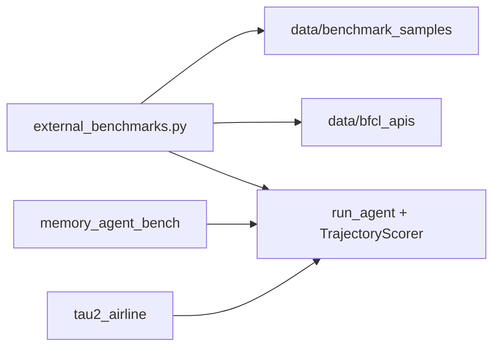

# 第 20 章：外部基准测试集成

**主要源码路径**

- `libs/evals/tests/evals/external_benchmarks.py`
- `libs/evals/tests/evals/test_external_benchmarks.py`
- `libs/evals/tests/evals/tau2_airline/`
- `libs/evals/tests/evals/memory_agent_bench/`
- 精选数据：`libs/evals/tests/evals/data/benchmark_samples/`（`frames_final.json`, `nexus_final.json`, `bfcl_v3_final.json`）

本章说明 deepagents 评估库如何集成 **外部学术与行业基准** 的子集：多跳检索、嵌套函数组合、多轮有状态工具调用、长上下文记忆评测，以及源自 τ-bench 的航空客服多轮对话任务。

---

## 1. FRAMES、Nexus、BFCL v3（`external_benchmarks.py`）

实现与数据装载集中在 **`external_benchmarks.py`**；pytest 用例在 **`test_external_benchmarks.py`** 中按分类标记（如 `retrieval`、`tool_use`）。

### 1.1 FRAMES

- **性质**：**多跳检索** 类基准子集。
- **能力**：多步 **网页/检索模拟搜索** 与 **信息综合**；智能体需在多源信息间跳转并给出合成答案。
- **数据**：从 `data/benchmark_samples/frames_final.json` 加载，按预定义 ID 过滤子集（`_FRAMES_IDS`）。

### 1.2 Nexus

- **性质**：**嵌套函数组合** 类基准。
- **能力**：考察 **复杂工具调用链**、组合调用与参数传递，而非单次简单调用。
- **数据**：`nexus_final.json`，按 `_NEXUS_IDS` 选取固定案例。

### 1.3 BFCL v3

- **性质**：**多轮、有状态** 工具调用（Berkeley Function Calling Leaderboard 一脉）。
- **实现**：Python API 实现位于 **`libs/evals/tests/evals/data/bfcl_apis/`**（如 `ticket_api`、`travel_booking`、`vehicle_control`、`trading_bot`、`message_api`、`long_context` 等），作为 **StructuredTool** 暴露给 agent。
- **评分**：结合 **状态比较** 与最终输出是否符合预期（具体断言与 `TrajectoryScorer` 在 `external_benchmarks.py` 中组织）。

### 1.4 精选 JSON 与元数据

`_load_final` 从 `*_final.json` 读取 `tasks` 或 `cases`；`_external_eval_metadata` 等为 LangSmith 记录 `case_id`、`origin_benchmark` 等字段，便于追溯来源。

---

## 2. MemoryAgentBench（ICLR 2026）

**目录**：`libs/evals/tests/evals/memory_agent_bench/`

### 2.1 目标

- **长上下文记忆** 与 **分块上下文** 上的回忆、问答。
- 仓库集成 **Conflict Resolution** 与 **Test-Time Learning** 等拆分子集所需子集（以源码注释为准）。

### 2.2 `eval_utils.py`

提供轻量评分工具，便于与字符串答案对比：

- **`normalize_answer`**：小写、去标点、去冠词、折叠空白。
- **`substring_match`**：规范化后 ground truth 是否为 prediction 的子串。
- **`substring_match_any`**：多个可接受答案任一命中即通过。

### 2.3 `test_memory_agent_bench.py`

- **分类**：`memory`（模块级 `pytestmark`）。
- 将 MemoryAgentBench 协议转为本仓库的 **`run_agent` + 断言** 流程，与内置 memory 用例共享同一分类聚合。

---

## 3. tau2-bench 航空域（`tau2_airline/`）

### 3.1 来源与许可

- 衍生自 **sierra-research/tau-bench**（**MIT License**）；目录内保留 `LICENSE` 与引用说明。
- **场景**：**多轮** 智能体—用户对话，模拟航空客服与旅客交互。

### 3.2 核心文件职责

| 文件 | 职责 |
|------|------|
| `evaluation.py` | **`TaskReward`**：`reward` 为 **DB 匹配得分** 与 **communicate 子串覆盖率** 的 **乘积**；含 `EpisodeScore` 等结构 |
| `runner.py` | 多轮对话 **执行器**（消息循环、工具调用与状态推进） |
| `user_sim.py` | **模拟用户** 行为与回复 |
| `domain.py` | 航空域 **数据模型**、工具创建、`FlightDB` 等 |
| `data/tasks.json` | **任务定义**（期望动作、communicate 信息等） |
| `test_tau2_airline.py` | pytest 入口；**分类**为 `conversation` |

### 3.3 评分逻辑（概念）

- **DB check**：在干净数据库上重放期望动作，与对话结束后的实际库状态比对。
- **Communicate check**：期望告知用户的信息是否以 **子串** 等形式出现在智能体消息中。
- **Action check**：期望工具调用是否发生（偏诊断、信息性）。

整体 **reward** 与 τ² 策略对齐：**DB 与 communicate 的乘积** 体现「既要做对后台状态，又要对用户说清楚」。

---

## 4. 精选基准数据目录

**路径**：`libs/evals/tests/evals/data/benchmark_samples/`

| 文件 | 用途 |
|------|------|
| `frames_final.json` | FRAMES 子集 |
| `nexus_final.json` | Nexus 子集 |
| `bfcl_v3_final.json` | BFCL v3 子集 |

这些文件与 `external_benchmarks.py` 中的 ID 白名单共同定义 **固定可复现** 的评估子集，避免整库全量运行成本过高。

---

## 5. 与内置评估的衔接

外部基准 **不替换** `utils.py` 中的轨迹模型：仍以 LangGraph invoke 结果构建 `AgentTrajectory`，成功断言决定成败；tau2 等则在自身 `evaluation.py` 中计算 **任务级 reward**，再与 pytest 的通过/失败策略结合（见 `test_tau2_airline.py` 具体断言）。

---

## 6. 小结

- **FRAMES / Nexus / BFCL v3**：统一在 `external_benchmarks.py` 装配 agent 与评分，数据来自 `benchmark_samples` 与 `bfcl_apis`。
- **MemoryAgentBench**：`eval_utils` 提供规范化匹配；用例归类 `memory`。
- **tau2 航空**：完整对话环与 **DB × communicate** 乘积奖励；归类 `conversation`，代码与数据在 `tau2_airline/` 自洽。

若需扩展新基准，建议优先复用 `run_agent`、元数据字典与 `eval_category` 标记，以便雷达与 CI 聚合自动收录。
