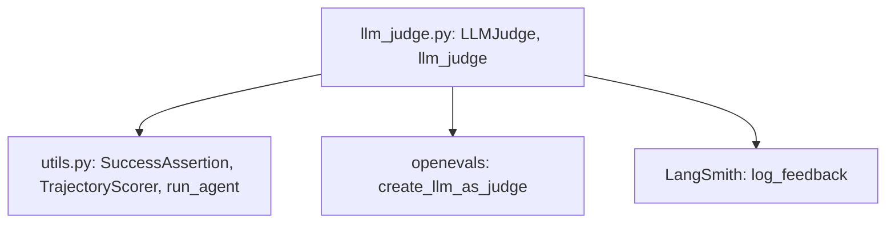

# 第 21 章：LLM-as-Judge 评估模式

**主要源码路径**

- `libs/evals/tests/evals/llm_judge.py`

本章说明 deepagents 如何将 **LLM 作为评判器（LLM-as-Judge）** 接入现有的 **`SuccessAssertion` / `TrajectoryScorer`** 体系：依赖 `openevals` 的 `create_llm_as_judge`，按条准则独立打分，**全部通过** 则断言成功。

---

## 1. 设计动机

部分评估目标难以用 **子串包含** 或 **文件字节级相等** 表达，例如：

- 语义是否正确、是否答非所问；
- 语气是否自然、是否符合角色；
- 是否覆盖要点、推理是否完整。

此类 **细粒度、主观或组合性** 标准适合交给 **独立评判模型** 按提示词判定，同时仍作为 **成功断言** 的一部分：评判不通过则 **整例测试失败**，与 `final_text_contains` 等行为一致。

---

## 2. `LLMJudge` 类

- **继承**：`SuccessAssertion`（定义见 `tests/evals/utils.py`）。
- **核心依赖**：`openevals.llm.create_llm_as_judge`。
- **字段要点**：
  - **`criteria`**：若干条人类可读的准则字符串；**每条单独调用** 评判器。
  - **`judge_model`**：评判用模型，默认 `claude-sonnet-4-6`（模块常量 `_DEFAULT_JUDGE_MODEL`）。
  - **`include_tool_calls`**：
    - `False`（默认）：评判器只看到各步 **文本回复**，适合评判「说了什么」。
    - `True`：将 **`trajectory.pretty()`** 全文（含工具名与参数）送入提示，适合准则涉及 **是否执行了某工具/写入了文件** 等 **行为证据**。

### 2.1 `check` 与 `describe_failure`

- **`check`**：对每条 criterion 运行 `evaluator(outputs=..., criterion=...)`，要求返回 dict 且含 **`score`**；**所有** `score` 为真才返回 `True`。
- **`describe_failure`**：汇总未通过准则的序号与 `comment`，便于 pytest 失败信息定位。

### 2.2 提示模板

模块内两套 prompt（`_RESPONSES_PROMPT` / `_TRAJECTORY_PROMPT`）约束评判者为 **严格评分助手**，明确输入为 **单条准则** + **序列化后的智能体输出或轨迹**。

### 2.3 LangSmith 反馈

评分结束后尝试 `t.log_feedback`，键 **`llm_judge_all_passed`**，用分数与 comment 记录「几条准则通过」，便于在 LangSmith 上过滤分析。日志失败时以 `warnings.warn` 降级，**不掩盖** 断言结果。

### 2.4 内部缓存

使用 `_last_results` 在 **`check` 与 `describe_failure` 之间复用** 同一次评判调用，避免重复计费。

---

## 3. 工厂函数 `llm_judge`

面向用例作者的 **便捷入口**：

```python
def llm_judge(
    *criteria: str,
    judge_model: str = _DEFAULT_JUDGE_MODEL,
    include_tool_calls: bool = False,
) -> LLMJudge:
    ...
```

返回配置好的 `LLMJudge`，可直接传入 `TrajectoryScorer.success(...)`。

---

## 4. 与 `TrajectoryScorer` 组合示例

```python
from tests.evals.llm_judge import llm_judge

scorer = TrajectoryScorer().success(
    llm_judge(
        "The answer mentions the capital of France is Paris.",
        "The tone is conversational, not robotic.",
    )
)
```

含义：两条准则 **都必须** 被评判模型判为通过，否则 `run_agent` 末尾的成功断言阶段触发 `pytest.fail`。

若准则需要引用工具调用证据，例如「必须调用过 `edit_file`」，应设 `include_tool_calls=True`。

---

## 5. 何时用 LLM Judge，何时用子串匹配

| 方式 | 适用场景 | 优点 | 注意 |
|------|----------|------|------|
| **子串 / 文件断言** | 事实性短答案、固定短语、精确文件内容 | 成本低、可复现、无二次模型方差 | 无法覆盖语义等价表述 |
| **LLM Judge** | 语义正确性、风格、完整性、多条件综合 | 灵活，接近人类验收标准 | 成本与延迟更高，需固定 `judge_model` 以便横向对比 |

**实践建议**：能用确定性断言处尽量不用 Judge；Judge 准则宜 **单条可判定**、表述无歧义，避免一条准则内堆砌过多要求，以便失败时 `comment` 可定位。

---

## 6. 模块关系



`run_agent` 在 `_assert_expectations` 中按顺序执行 `scorer._success`；`LLMJudge` 与其他 `SuccessAssertion` 子类 **无特殊分支**，统一走 `check` / `describe_failure` 协议。

---

## 7. 小结

- **`LLMJudge`** 是 `openevals` 与 deepagents 评估框架的 **薄适配层**，将 LLM 评判结果映射为硬性成功/失败。
- **`llm_judge(*criteria)`** 提供与 `final_text_contains` 一致的工厂风格 API。
- 通过 **`include_tool_calls`** 在「仅评文本」与「评完整轨迹」之间切换，与准则是否依赖 **工具层证据** 对齐。
