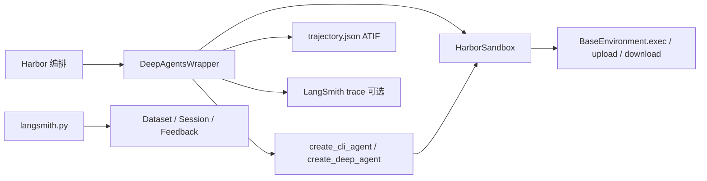

# 第 22 章：Harbor 框架集成

> **主要参考源码路径**  
> - `libs/evals/deepagents_harbor/`（Harbor 适配与 LangSmith 集成核心）  
> - `libs/evals/deepagents_harbor/deepagents_wrapper.py`  
> - `libs/evals/deepagents_harbor/backend.py`  
> - `libs/evals/deepagents_harbor/langsmith.py`  
> - `libs/evals/deepagents_harbor/metadata.py`  
> - `libs/evals/README.md`（Harbor / Terminal Bench 总述）

---

## 1. Harbor 是什么

[Harbor](https://harborframework.com/) 是一套 **面向智能体评测的编排框架**，目标是在高难度基准上 **以统一方式拉起沙箱、运行智能体、打分并落盘轨迹**，从而降低「自建评测流水线」的工程量。

典型能力包括：

| 能力 | 说明 |
|------|------|
| **沙箱环境** | 支持 Docker、Modal、Daytona、E2B、Runloop 等多种后端，任务在隔离环境中执行 |
| **自动测试与校验** | 基准自带验证器（verifier），Harbor 负责调度执行并汇总结果 |
| **奖励分数** | 通常将 **测试通过率** 映射为 **0.0～1.0** 的标量奖励（`harbor_reward` 等下游消费） |
| **轨迹记录（ATIF）** | 轨迹以 **Agent Trajectory Interchange Format（ATIF）** 序列化，便于跨工具分析与可视化（参见 Harbor 官方 trajectory 文档） |

Deep Agents 在 `libs/evals/deepagents_harbor/` 中提供 **Harbor 侧的 Agent 实现** 与 **沙箱后端桥接**，使同一套 Deep Agent（CLI 或 SDK 模式）可在 Harbor 选定的环境中复用。

---

## 2. `DeepAgentsWrapper`：Harbor 入口智能体

**文件**：`deepagents_harbor/deepagents_wrapper.py`  
**类**：`DeepAgentsWrapper(BaseAgent)`

### 2.1 职责

- 继承 Harbor 的 `BaseAgent`，在 `run(instruction, environment, context)` 中完成一次 trial 的完整执行。
- 将 **Harbor 的 `BaseEnvironment`** 封装为 **`HarborSandbox` 后端**，供 Deep Agents 的文件系统工具与（间接）命令执行使用。
- 支持两种构建路径：
  - **`use_cli_agent=True`（默认）**：`deepagents_cli.agent.create_cli_agent`，在 Harbor 中 **关闭 HITL**（`auto_approve=True`）、**关闭 memory/skills/shell**（沙箱由 `HarborSandbox` 提供执行面）。
  - **`use_cli_agent=False`**：`deepagents.create_deep_agent`，传入同一 `HarborSandbox` 与带目录上下文的 **系统提示**。
- **可观测性**：当设置环境变量 `LANGSMITH_EXPERIMENT` 时，使用 LangSmith 的 **`trace(...)`** 包裹 `ainvoke`，把单次 trial 关联到实验项目，并写入 `reference_example_id`（若启动时能从 LangSmith 数据集构建 `instruction → example_id` 映射）。

### 2.2 系统提示与「设计决策」

- 模块级 `SYSTEM_MESSAGE` 在任务开始时注入 **当前工作目录** 与 **初始文件列表（最多展示前 10 项）**，明确告诉模型：**不要为重复罗列而滥用 `ls`**，仅在状态变化或需要探索子目录时再列目录。这是对 **token 浪费与冗余工具调用** 的显式约束。
- 模型默认与 Harbor 侧对齐：若未指定 `model_name`，使用 SDK 的 `get_default_model()`，并在模型支持时应用 Harbor 传入的 `temperature`。

### 2.3 ATIF 轨迹写出

- `_save_trajectory` 将 LangGraph 返回的 `messages` 转为 Harbor 的 `Trajectory` 模型：`Step` / `ToolCall` / `Observation`，并统计 token 用量写入 `FinalMetrics`。
- `schema_version` 固定为 **`ATIF-v1.2`**；在 `agent.extra` 中附带 `framework`、`langchain_*` 版本，以及可选的 **`infrastructure`** 元数据（见下一章节的 `InfraMetadata`）。

### 2.4 CLI 启动方式

Harbor 通过 **import 路径** 加载智能体类，典型写法为：

```bash
harbor run --agent-import-path deepagents_harbor:DeepAgentsWrapper ...
```

在 `libs/evals` 目录下也可配合 `uv run` 使用（与 README 示例一致）：

```bash
uv run harbor run --agent-import-path deepagents_harbor:DeepAgentsWrapper ...
```

Makefile 中通过 `AGENT_KWARG` 传入 `--agent-kwarg use_cli_agent=...`，在 **本地 CLI 模式** 与 **CI SDK 模式** 间切换。

---

## 3. `HarborSandbox`：文件系统与执行的桥

**文件**：`deepagents_harbor/backend.py`  
**类**：`HarborSandbox(SandboxBackendProtocol)`

### 3.1 协议角色

- 实现 Deep Agents 的 **`SandboxBackendProtocol`**（异步变体）：`aexecute`、`aread`、`awrite`、`aedit`、`als`、`agrep`、`aglob`，以及批量 `aupload_files` / `adownload_files`。
- **同步方法** 一律 `NotImplementedError`，强制调用方走异步路径，与 Harbor 环境 API 一致。

### 3.2 设计决策

1. **大文件与 ARG_MAX**  
   `awrite` / `aedit` 使用 Harbor 环境的 **`upload_file` / `download_file`** 传内容，避免把巨量字符串塞进 shell 参数，规避操作系统 **`ARG_MAX`** 限制。

2. **读/搜/列目录走 shell**  
   `aread` 用 `awk` 做行区间读取；`als` / `aglob` / `agrep` 通过受控 shell 脚本解析为结构化 `LsResult` / `GlobResult` / `GrepResult`。

3. **超时与可诊断性**  
   `aexecute` 默认 **300 秒** 超时（`DEFAULT_COMMAND_TIMEOUT_SEC`），超时返回 **exit code 124**（与 GNU `timeout` 约定一致），并在输出中给出 **可操作的缩短建议**（分包安装、后台构建等）。

4. **非交互 shell 噪声过滤**  
   过滤常见于无 TTY 环境下的 bash 提示（如 job control 相关），减少污染模型观测的 stdout/stderr。

---

## 4. `langsmith.py`：数据集、实验与反馈

**文件**：`deepagents_harbor/langsmith.py`  
**CLI 薄封装**：`scripts/harbor_langsmith.py`（见第 24 章）

### 4.1 从 Harbor 任务构建 LangSmith 数据集

- `create_dataset`：经 Harbor **`RegistryClientFactory`** 下载指定数据集版本到临时目录，扫描每个任务的 `instruction.md`、`task.toml`、`solution/solve.sh` 等，生成带 **稳定 example id**（`create_example_id_from_instruction`：指令文本 + seed 的 SHA-256 → UUID）的 examples，并 **`create_examples`** 写入 LangSmith。

### 4.2 实验会话

- `create_experiment_async` / `create_experiment`：在 LangSmith 上创建 **Tracer Session**（`/sessions`），绑定 `reference_dataset_id`，返回可在 UI 中对比的 URL；实验名通常作为 **`LANGSMITH_EXPERIMENT`** 传给 Harbor 运行。

### 4.3 反馈：`harbor_reward`

- `add_feedback`：遍历某次 job 目录下各 trial，读取 `result.json` 中 **`verifier_result.rewards.reward`**，以 **`harbor_reward`** 为 key 写入 LangSmith **Feedback**。
- 通过 **`trial_name` 元数据** 在 LangSmith 中定位 **唯一根 run**，避免与错误 trial 错配；已存在同 key 反馈时 **跳过**（去重）。

---

## 5. `metadata.py` 与基础设施噪声

**文件**：`deepagents_harbor/metadata.py`

- **`InfraMetadata`**：记录编排机（host）与沙箱内（sandbox）的 CPU、内存、OS、`HARBOR_CONCURRENCY` 等，用于 **事后分析「环境抖动」对分数的影响**。
- **`collect_sandbox_metadata`**：`DeepAgentsWrapper.run` 在 trial 开始时 **尽力采集**（失败只打日志，不中断 trial），结果写入 ATIF `agent.extra.infrastructure`。

---

## 6. 模块关系小结



**一句话**：Harbor 负责「在哪跑、怎么验、多少分」；`DeepAgentsWrapper` + `HarborSandbox` 负责「把 Deep Agents 接到那个世界」；`langsmith.py` 负责「把同一批任务在 LangSmith 里变成可对比、可打分的实验资产」。
