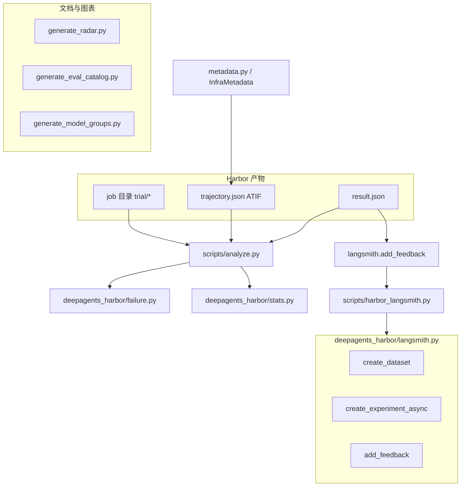

# 第 24 章：Harbor 分析与统计工具

> **主要参考源码路径**  
> - `libs/evals/scripts/analyze.py`  
> - `libs/evals/scripts/harbor_langsmith.py`  
> - `libs/evals/scripts/generate_radar.py`  
> - `libs/evals/scripts/generate_eval_catalog.py`  
> - `libs/evals/scripts/generate_model_groups.py`  
> - `libs/evals/deepagents_harbor/failure.py`  
> - `libs/evals/deepagents_harbor/stats.py`  
> - `libs/evals/deepagents_harbor/metadata.py`  
> - `libs/evals/deepagents_harbor/langsmith.py`（CLI 背后的业务实现）  
> - `libs/evals/Makefile`（`radar`、`eval-catalog`、`model-groups` 等目标）

---

## 1. 总览：评测后的「数据闭环」

Harbor job 落盘后，仓库在 `libs/evals` 内提供多层工具：

1. **作业扫描与统计**：`scripts/analyze.py` 读取 trial 目录、`trajectory.json`、`result.json` 等，结合 **失败分类** 与 **置信区间**，输出可解释的汇总。  
2. **与 LangSmith 对齐**：`scripts/harbor_langsmith.py` 管理数据集、实验会话与 **`harbor_reward` 反馈**。  
3. **报告与目录生成**：雷达图、`EVAL_CATALOG.md`、`MODEL_GROUPS.md` 等 **文档/图表产物** 由独立脚本从结构化数据再生。

本章按模块说明 **职责、设计取舍与依赖关系**。

---

## 2. `scripts/analyze.py`：Job 与 trial 的 CLI 分析器

### 2.1 职责

- 扫描 **`jobs/`** 下某次运行产生的 **trial 目录树**，解析：
  - **奖励/是否通过**（兼容多种结果文件约定，如 `reward` 文本、`result.json` 等——以脚本实现为准）；
  - **`trajectory.json`（ATIF）** 路径与工具使用统计；
  - **`exception.txt`** 等旁路文件。
- 调用 **`deepagents_harbor.failure`** 做 **基础设施 vs 能力** 归因，调用 **`deepagents_harbor.stats`** 输出 **Wilson 置信区间** 与 **最小可检测效应（MDE）** 提示。
- 可选路径下会涉及 **数据集目录中 `solution/solve.sh`** 的索引（`scan_dataset_for_solutions`），用于对比或辅助分析（详见脚本内注释与子命令）。

### 2.2 设计决策

- **失败分类输入可控**：退出码优先从 **ATIF 观测文本** 结构化提取（`extract_exit_codes`），避免在整段轨迹上盲目正则导致 **误报**；解析失败再回退原始文本扫描。
- **统计与分类解耦**：`analyze.py` 负责编排 I/O；**数学与分类规则** 留在 `failure.py` / `stats.py`，便于单元测试与复用。

---

## 3. `deepagents_harbor/failure.py`：失败类别与退出码

### 3.1 `FailureCategory`

枚举区分：

- **`CAPABILITY`**：模型能力或策略问题（答案错、未完成等），且 **无明确基础设施信号**。  
- **`INFRA_OOM`**：典型 **exit 137** / OOM 相关文案。  
- **`INFRA_TIMEOUT`**：典型 **exit 124** / 超时文案。  
- **`INFRA_SANDBOX`**：沙箱崩溃、网络不可达、`exec failed` 等。  
- **`UNKNOWN`**：有异常文本但 **无法归类** 到上述基础设施模式。

提供 **`is_infrastructure`** 属性，便于在报表中 **剥离环境噪声**。

### 3.2 `classify_failure(...)`

- **优先使用退出码**（`exit_codes` 列表）判断 OOM/超时。  
- **模式匹配仅针对 `exception.txt` 类受控文本**，刻意 **不** 对整个模型生成内容做关键字扫描，以降低误判。

### 3.3 `extract_exit_codes(trajectory_json)`

- 解析 ATIF JSON，从 **`observation.results[].content`** 收集工具输出，再在其中匹配 `exit_code` / `exit code` 等形态。  
- 若 JSON 非法或非 ATIF，则 **回退** 到 `_extract_exit_codes_raw` 对整段字符串做正则（兼容性路径）。

---

## 4. `deepagents_harbor/stats.py`：二项比例与显著性直觉

### 4.1 `wilson_ci(successes, total, z=1.96)`

- 对成功率这类 **二项比例** 计算 **Wilson 置信区间**，在小样本或比例接近 0/1 时比正态近似更稳健；注释说明与 **Anthropic 基础设施噪声研究** 的建议一致。

### 4.2 `format_ci(...)`

- 将点估计与区间格式化为人类可读字符串，例如：  
  `72.3% [68.1%, 76.2%] (95% CI, n=90)`（实现以源码为准）。

### 4.3 `min_detectable_effect(total, z=1.96, p=0.5)`

- 在 **两次独立运行、样本量相同** 的简化假设下，估计 **最小可检测效应（MDE）**：若两次成功率差距小于 MDE，则 **可能无法与噪声区分**。  
- 默认 `p=0.5` 取 **最保守（方差最大）** 的基准比例。

**设计意图**：防止在 **90 题级别** 上对 **1～2 个 task 的涨跌** 过度解读。

---

## 5. `deepagents_harbor/metadata.py`：沙箱与宿主元数据

- **`InfraMetadata`**：宿主平台、Python 版本、沙箱类型名、`nproc`/内存/`uname` 等 **尽力采集** 字段，以及 `HARBOR_CONCURRENCY` 等上下文。  
- **`collect_sandbox_metadata(backend)`**：对实现 `SandboxLike`（含 `HarborSandbox`）的后端执行短命令；**任何异常都被吞掉并打日志**，不影响 trial。  
- 元数据最终由 `DeepAgentsWrapper` 写入 ATIF（见第 22 章），供 **`analyze.py` 或外部 notebook** 做分层分析。

---

## 6. `scripts/harbor_langsmith.py` 与 `langsmith.py`

### 6.1 分工

- **`deepagents_harbor/langsmith.py`**：全部业务逻辑（数据集扫描、Harbor registry 下载、HTTP 创建 session、`result.json` → Feedback）。  
- **`scripts/harbor_langsmith.py`**：**argparse 薄封装**，加载 `.env`，根据子命令路由。

### 6.2 子命令

| 子命令 | 作用 |
|--------|------|
| `create-dataset` | 从 Harbor 拉取任务并在 LangSmith **创建数据集与 examples** |
| `ensure-dataset` | 若不存在则创建，否则打印已存在信息 |
| `create-experiment` | 绑定数据集的 **实验会话**；stdout 输出 **名称与 URL**（两行） |
| `add-feedback` | 遍历 job 目录 trial，按 **`trial_name` 元数据** 找根 run，写入 **`harbor_reward`**（0.0～1.0），并做 **去重** |

### 6.3 `add-feedback` 与 trial 对齐方式

- 使用 LangSmith 过滤条件：  
  `eq(metadata_key, "trial_name")` 且 `eq(metadata_value, "<trial_dir_name>")`  
- 要求 **恰好一条** 根 run；多条或无匹配均记为错误，避免 **错误地把分打到别的 trace 上**。

---

## 7. 其他生成类脚本（与 Harbor 并列的 evals 工具链）

下列脚本主要服务 **内置 pytest eval 套件与 CI**，但与 **「分析、报表、目录」** 同一层级，常一起出现在 `Makefile` 中：

### 7.1 `scripts/generate_radar.py`

- 依赖 **`deepagents_evals.radar`**，从 **`evals_summary.json`**、`--results` JSON 或 **`--toy`** 生成 **雷达图 PNG**。  
- 用于 **按 eval 类别** 对比多模型能力（与 Harbor 轨迹分析互补）。

### 7.2 `scripts/generate_eval_catalog.py`

- 扫描 `tests/evals` 与 `deepagents_evals/categories.json`，重写 **`EVAL_CATALOG.md`**；`--check` 用于 CI **防漂移**。

### 7.3 `scripts/generate_model_groups.py`

- 从仓库 **`.github/scripts/models.py`** 导入注册表，生成 **`MODEL_GROUPS.md`**，与 GitHub Actions eval 工作流文档对齐。

---

## 8. 模块关系图

---

## 9. 使用建议（工程化）

- **先保证轨迹与 `result.json` 完整**，再跑 `analyze.py` 与 `add-feedback`，否则统计与 LangSmith 侧会出现 **大量 fallback / 找不到 run**。  
- 解读分数时 **同时看 `format_ci` 与 `min_detectable_effect`**，并把 **`FailureCategory.is_infrastructure`** 为真的 trial **单独分层**。  
- 与第 23 章的 Terminal Bench 流程结合：**Harbor 跑分 → `add-feedback` 关联 LangSmith → `analyze.py` 本地汇总**，形成 **可重复的改进闭环**。
