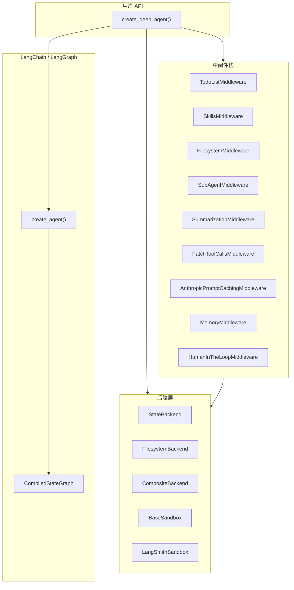

# DeepAgents Book

> 从 Harness 工程角度系统拆解 [deepagents](https://github.com/langchain-ai/deepagents) 项目

本书以 LangChain 开源项目 **Deep Agents** 为分析对象，从框架设计、SDK 内核、CLI 工程、评估体系、沙箱集成到工程实践，逐模块深入源码，帮助读者理解一个生产级 Agent Harness 的完整工程全貌。

全部内容为**中文**，共 **31 篇**，按知识点独立成文。

---

## 目录

### 第一部分：全局架构

| 编号 | 标题 | 简介 |
|------|------|------|
| 01 | [项目概览与仓库结构](01-项目概览与仓库结构.md) | Monorepo 布局、工具链、配置体系 |
| 02 | [核心设计哲学与架构总览](02-核心设计哲学与架构总览.md) | Harness 模式、三层架构、组合式 API |

### 第二部分：SDK 核心

| 编号 | 标题 | 简介 |
|------|------|------|
| 03 | [入口函数 create_deep_agent](03-入口函数-create_deep_agent.md) | 主装配函数签名、中间件栈组装、系统提示词 |
| 04 | [后端协议 BackendProtocol](04-后端协议-BackendProtocol.md) | 协议定义、数据类型、文件格式演进 |
| 05 | [后端实现详解](05-后端实现详解.md) | State/Filesystem/Composite/Sandbox 等 7 种后端 |
| 06 | [中间件体系总论](06-中间件体系总论.md) | AgentMiddleware 机制、中间件 vs 工具 |
| 07 | [FilesystemMiddleware](07-FilesystemMiddleware-文件系统中间件.md) | 文件工具集、大文件策略、结果驱逐 |
| 08 | [SubAgentMiddleware](08-SubAgentMiddleware-子代理中间件.md) | 三种子代理规格、task 工具、继承规则 |
| 09 | [AsyncSubAgentMiddleware](09-AsyncSubAgentMiddleware-异步子代理.md) | 远程异步子代理、生命周期工具 |
| 10 | [SummarizationMiddleware](10-SummarizationMiddleware-上下文压缩.md) | 自动/手动对话压缩、历史卸载 |
| 11 | [MemoryMiddleware 与 SkillsMiddleware](11-MemoryMiddleware与SkillsMiddleware.md) | 记忆加载、技能渐进披露 |
| 12 | [PatchToolCallsMiddleware](12-PatchToolCallsMiddleware与工具修复.md) | 悬空工具调用修复 |
| 13 | [模型解析与 Provider 支持](13-模型解析与Provider支持.md) | resolve_model、多 Provider 适配 |

### 第三部分：CLI 工程

| 编号 | 标题 | 简介 |
|------|------|------|
| 14 | [CLI 架构与入口](14-CLI架构与入口.md) | 包结构、Settings 配置、调用链 |
| 15 | [CLI 沙箱与集成工厂](15-CLI沙箱与集成工厂.md) | 沙箱工厂、运行时模型切换 |
| 16 | [CLI 技能系统与 Slash 命令](16-CLI技能系统与Slash命令.md) | 内置技能、命令注册、Widget |

### 第四部分：评估体系

| 编号 | 标题 | 简介 |
|------|------|------|
| 17 | [评估体系架构总览](17-评估体系架构总览.md) | 两层断言模型、核心类型、run_agent |
| 18 | [评估报告与指标系统](18-评估报告与指标系统.md) | 指标体系、Radar 图、CI 聚合 |
| 19 | [内置评估用例详解](19-内置评估用例详解.md) | 12 个测试文件逐一解析 |
| 20 | [外部基准测试集成](20-外部基准测试集成.md) | FRAMES / Nexus / BFCL v3 / tau2-bench |
| 21 | [LLM-as-Judge 评估模式](21-LLM-as-Judge评估模式.md) | LLM 裁判、语义评分 vs 子串匹配 |

### 第五部分：Harbor 与 Terminal Bench

| 编号 | 标题 | 简介 |
|------|------|------|
| 22 | [Harbor 框架集成](22-Harbor框架集成.md) | DeepAgentsWrapper、HarborSandbox |
| 23 | [Terminal Bench 2.0 评估](23-Terminal-Bench-2.0评估.md) | 90+ 任务基准、LangSmith 工作流 |
| 24 | [Harbor 分析与统计工具](24-Harbor分析与统计工具.md) | 失败分类、统计工具、LangSmith 脚本 |

### 第六部分：扩展与集成

| 编号 | 标题 | 简介 |
|------|------|------|
| 25 | [ACP Agent Client Protocol](25-ACP-Agent-Client-Protocol.md) | ACP 服务端集成 |
| 26 | [REPL 中间件](26-REPL中间件.md) | Interpreter、ReplMiddleware |
| 27 | [合作伙伴沙箱集成](27-合作伙伴沙箱集成.md) | Daytona / Modal / QuickJS / Runloop |

### 第七部分：工程实践

| 编号 | 标题 | 简介 |
|------|------|------|
| 28 | [CI/CD 与发布流程](28-CI-CD与发布流程.md) | GitHub Actions、release-please |
| 29 | [代码规范与质量保障](29-代码规范与质量保障.md) | Conventional Commits、ruff/ty、安全 |
| 30 | [编写评估用例指南](30-编写评估用例指南.md) | 五步流程、分类管理、漂移测试 |

### 第八部分：示例与实战

| 编号 | 标题 | 简介 |
|------|------|------|
| 31 | [示例项目解析](31-示例项目解析.md) | 6 个示例项目的架构模式 |

---

## 架构概览

## 分析对象

- **项目**: [langchain-ai/deepagents](https://github.com/langchain-ai/deepagents)
- **定位**: 基于 LangGraph 的 batteries-included Agent Harness
- **核心能力**: 规划 (write_todos)、文件系统操作、Shell 执行、子代理分发、上下文压缩、记忆/技能注入

## 许可

本书内容仅用于技术学习与研究，分析对象 Deep Agents 项目遵循其原始许可协议。
